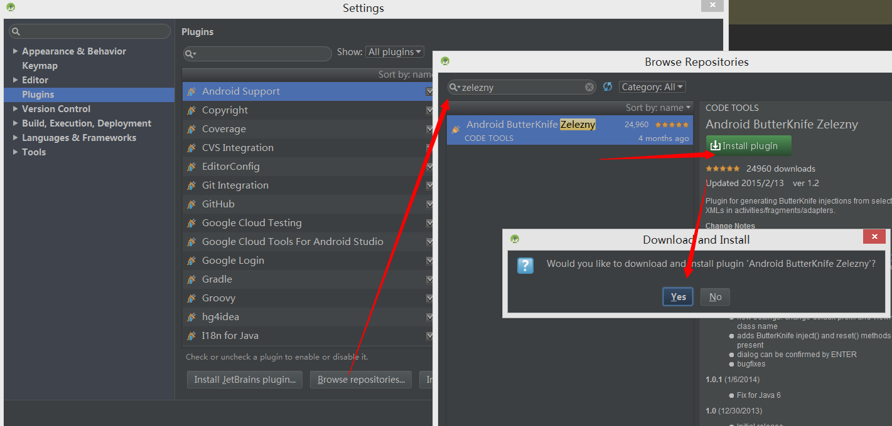
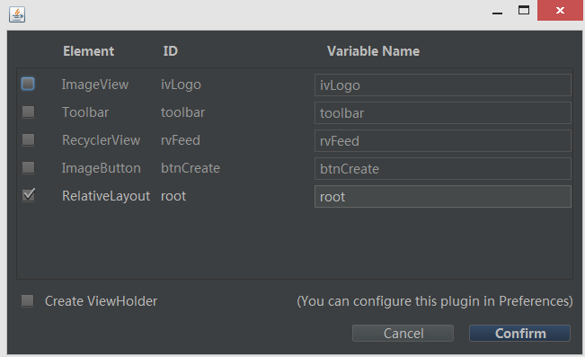

# Android Studio上方便使用butterknife注解框架的偷懒插件Android Butterknife Zelezny

来源:[www.cnblogs.com](http://www.cnblogs.com/soaringEveryday/p/4607438.html?utm_source=tuicool&utm_medium=referral)

首先提下ButterKnifey已经更新到版本7.0.1了，现在注解已经不叫@InjectView了，而叫@Bind，感觉更贴合语义。同时注册的方式也从

```
ButterKnife.inject(this);
```

变成了

```
ButterKnife.bind(this);
```

关于7.0.1的ButterKnife的各种用法和功能，可以参考ButterKnife的github上的主页：

[http://jakewharton.github.io/butterknife/](http://jakewharton.github.io/butterknife/)

 

言归正传开始说说Android Butterknife Zelezny这个插件，事实上这是个Android Studio的plugin，他可以让你在添加Butterkinfe注解时偷偷懒，直接点击几下鼠标既可以完成注解的增加，同时还是图形化的操作，可以说，大大的减轻了开发负担。尤其是当你的layout中有很多很多的view需要通过findviewbyid来获得引用时。实际上如果不用这个插件而通过手打加ButtefKnife注解的方式，要是view很多启示也挺麻烦的，不是吗？

首先看看如何在Android Studio上安装该插件，直接看图：



安装好后需要restart你的Android Studio。

在使用此插件前，需要已经导入了butterknife的jar（或者在build.gradle中已经加入：`compile 'com.jakewharton:butterknife:7.0.0'`）

 随后，在你需要导入注解的Activity或者Fragment或者ViewHolder的layout资源代码上，右击，选择 Generate 然后 `Generate ButterKnife Injections`，这时候生成类似于下列的选择框：



Element为view的类型，ID为layout中资源的id名字，Variable Name即为你在代码中引用出来的变量名，点击Confirm后即可。

下面是Android ButterKnife Zelezny的github上的一个动态使用流程图：


一个题外话，为啥这个插件名字叫Zelezny呢？其实这个是一个捷克名人的名字，他是一名标枪运动员和奥运金牌的获得者，也是标枪项目世界纪录保持者，赞一个！


下面网址中可以找到在github上另外几个用捷克名人名字命名的开和android开发有关的源项目：

[http://inmite.github.io/](http://inmite.github.io/)

[ButterKnife GitHub项目地址](https://github.com/JakeWharton/butterknife)

