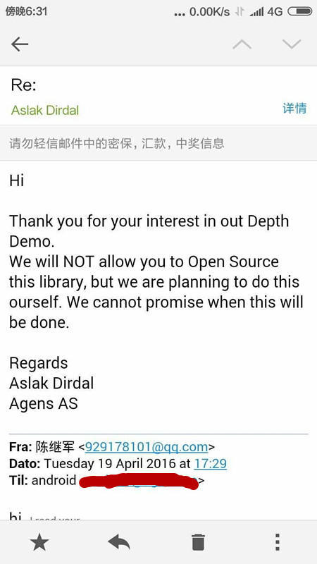
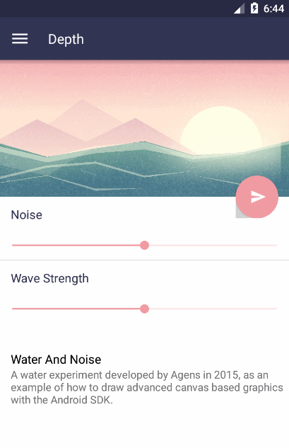
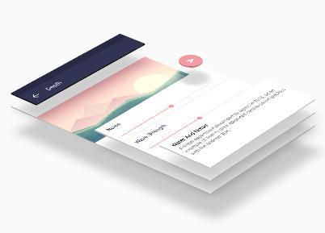
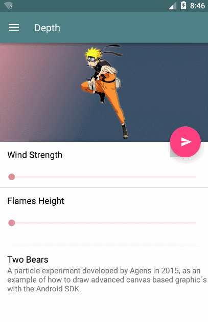

# 小说Android开源篇 第一章——终于等到你Depth-LIB-Android

来源:[http://www.jianshu.com/p/a4dabb3554c1](http://www.jianshu.com/p/a4dabb3554c1)

项目地址:[https://github.com/danielzeller/Depth-LIB-Android-](https://github.com/danielzeller/Depth-LIB-Android-)

声明：本文已独家授权微信公众号Android程序员（AndroidTrending）在微信公众号平台原创首发。

大家好，我是**小说家**。

前些日子在微信朋友圈看到一个朋友发了一个很酷的Android特效，对于喜欢酷炫效果的我来说，真的好想知道它是怎么搞出来的！于是，在知道Google商店可以下载，我反编译了这个Demo并把源码开源到Github上，当然，目的只是想让很多喜欢这个东西的朋友知道是怎么实现的。我以为只要把原作者是谁说明了，就可以开源了，果然还是太年轻了。


那天晚上，代码家的干货群就讨论了我未经作者同意开源源代码的事。我看到后，意识到自己错了，就马上删了！drakeet给了我原作者的联系方式，我也发了邮件向作者说了这件事！



没错，果然今天作者就在Github上开源了! 源码下载地址：[戳我](https://github.com/danielzeller/Depth-LIB-Android-)

因为之前就看了源码实现，也有朋友叫我写一篇分析文，今天我带大家看看它是怎么实现的！

## 一、小说界面过渡动画



### (1)点击Fab,开启过渡界面动画效果，监听事件如下：

```
root.findViewById(R.id.fab).setOnClickListener(new View.OnClickListener() {
    @Override
    public void onClick(View v) {
        root.getViewTreeObserver().addOnGlobalLayoutListener(new ViewTreeObserver.OnGlobalLayoutListener() {
            @Override
            public void onGlobalLayout() {//在一个视图树中的焦点状态发生改变时，所要调用的回调函数的接口类
                root.getViewTreeObserver().removeOnGlobalLayoutListener(this);
                TransitionHelper.startExitAnim(root);//当前界面离开时的动画
            }
        });
        WindFragment windFragment = new WindFragment();
        windFragment.setIntroAnimate(true);//设置WindFragment的动画标志 
        ((RootActivity) getActivity()).goToFragment(windFragment);//添加进入的Fragment
        /**佘略部分代码**/
    }
});
```

这里退出动画的实现是这句`TransitionHelper.startExitAnim(root)`,传入的参数是当前Fragment的视图root。`TransitionHelper`是个动画实现类，主要做了视图进入、离开、恢复这些动画。我们进去看看退出动画的实现。源码如下：

```
public static void startExitAnim(View root) {
    exitAnimate((DepthLayout) root.findViewById(R.id.root_dl), 0, 30f, 15, 190, true);
    exitAnimate((DepthLayout) root.findViewById(R.id.appbar), MOVE_Y_STEP, 20f, 30, 170, true);
    exitAnimate((DepthLayout) root.findViewById(R.id.fab_container), MOVE_Y_STEP * 2f, 20f, 45, 210, true);
    exitAnimate((DepthLayout) root.findViewById(R.id.dl2), MOVE_Y_STEP, 20f, 60, 230, true);
    exitAnimate((DepthLayout) root.findViewById(R.id.dl3), MOVE_Y_STEP * 2, 20f, 75, 250, true);
}
```

以上代码，你可以看出`startExitAnim`对当前Fragment的视图Root的每个子控件都做了不一样的动画，具体是实现是在`exitAnimate(...)`方法中，代码比较多，我就不贴了。

主要是开启了6个ObjectAnimator动画做了view的旋转、缩放、平移、阴影等动画，其中有句代码很关键`View.setCameraDistance()`,设置Camera的距离,表现出透视效果。

一个Fragment做了离开的动画，我们看看它进入的Fragment动画是怎么实现的！上文中Fab监听的代码里有这句`getActivity()).goToFragment(windFragment)`,应该就是另一个Framgen进入的逻辑实现了，跟进去看看！

```
public void goToFragment(final Fragment newFragment) {
    getFragmentManager().beginTransaction().add(R.id.fragment_container, newFragment).commit();//添加新的fragment
    final Fragment removeFragment = currentFragment;//记录要移除的Fragment
    currentFragment = newFragment;
    getWindow().getDecorView().postDelayed(new Runnable() {
        @Override
        public void run() {//延迟两秒后，删除记录删除的Fragment
            getFragmentManager().beginTransaction().remove(removeFragment).commit();
        }
    }, 2000);
}
```

握草，没看到进入的Framgent的动画，奇了怪了。我们进入`WindFragment`看具体实现！你会发现在`onCreateView`实现了。

```
@Override
public View onCreateView(LayoutInflater inflater, ViewGroup container,
                         Bundle savedInstanceState) {
    root = inflater.inflate(R.layout.fragment_wind, container, false);
    ......
    doIntroAnimation();//进入动画
    .....
    return root;
}
```

而`doIntroAnimation`方法中调用了`TransitionHelper.startIntroAnim(...)`，你会看到

```
public static void startIntroAnim(View root, AnimatorListenerAdapter introEndListener) {
        introAnimate((DepthLayout) root.findViewById(R.id.root_dl), 0, 30f, 15, 180);
        introAnimate((DepthLayout) root.findViewById(R.id.appbar), MOVE_Y_STEP, 20f, 30, 170);
        introAnimate((DepthLayout) root.findViewById(R.id.fab_container), MOVE_Y_STEP * 2f, 20f, 45, 190);
        introAnimate((DepthLayout) root.findViewById(R.id.dl2), MOVE_Y_STEP, 20f, 60, 200);
        introAnimate((DepthLayout) root.findViewById(R.id.dl3), MOVE_Y_STEP * 2, 20f, 75, 210).addListener(introEndListener);
}
```

这个逻辑有和界面离开时的参不多，开启了多个`ObjectAnimator`动画做了view的旋转、缩放、平移、阴影等动画。

细心的你会发现，我给的效果和设计图的不同啊，没错，如果只是做过渡动画，还达不到很酷炫的效果，这里还有阴影的效果。

## 二、小说绘制布局阴影



上图看到出，阴影效果很明显。我们看看Fragment的xml布局是这样的

```
<no.agens.depth.lib.DepthRendrer
    xmlns:android="http://schemas.android.com/apk/res/android"
    xmlns:app="http://schemas.android.com/apk/res-auto"
    xmlns:tools="http://schemas.android.com/tools"
    android:layout_width="match_parent"
    android:layout_height="match_parent"
    tools:context=".sample.WaterFragment"
    >

    <no.agens.depth.lib.DepthLayout
        android:id="@+id/appbar"
        android:layout_width="match_parent"
        android:layout_height="@dimen/appbar_height"
        android:background="@color/green"
        android:layerType="hardware"
        app:edge_color="@color/statusbar2"
        >

        <ImageView
            />

    </no.agens.depth.lib.DepthLayout>

    ......

    <no.agens.depth.lib.DepthLayout
        android:id="@+id/fab_container"
            ......
        >
        <android.support.design.widget.FloatingActionButton
            ......
            />
    </no.agens.depth.lib.DepthLayout>

</no.agens.depth.lib.DepthRendrer>
```

你会发现都是一个外层DepthRendrer控件里有几个DepthLayout控件，而DepthRendrer和DepthLayout都继承RelativeLayout。DepthRendrer在初始化的时候设置了视图树中的焦点状态改变时，回调函数监听，计算绘制DepthLayout阴影的范围。

```
void setup() {
    getViewTreeObserver().addOnPreDrawListener(
        new ViewTreeObserver.OnPreDrawListener() {
            @Override
            public boolean onPreDraw() {
                for (int i = 0; i < getChildCount(); i++) {//遍历子控件
                    View child = getChildAt(i);
                    if (child instanceof DepthLayout) {
                        //如果是DepthLayout控件 ，就调用DepthLayout的calculateBounds方法计算要绘制阴影的范围
                        boolean hasChangedBounds = ((DepthLayout) child).calculateBounds();
                        if (hasChangedBounds)
                            invalidate();
                    }
                }
                return true;
            }
        });
```

`invalidate`会调用DepthRendrer中的`drawChild(Canvas canvas, View child, long drawingTime)`,绘制子 控件阴影。

```
@Override
protected boolean drawChild(Canvas canvas, View child, long drawingTime) {
    if (child instanceof DepthLayout && !isInEditMode()) {
        DepthLayout dl = (DepthLayout) child;
        float[] src = new float[]{0, 0, dl.getWidth(), 0, dl.getWidth(), dl.getHeight(), 0, dl.getHeight()};
        if (dl.isCircle()) {//控件是否适圆形的
            dl.getCustomShadow().drawShadow(canvas, dl, roundSoftShadow);
            if (Math.abs(dl.getRotationX()) > 1 || Math.abs(dl.getRotationY()) > 1)
                drawCornerBaseShape(dl, canvas, src);
        } else {
            dl.getCustomShadow().drawShadow(canvas, dl, softShadow);
            if (dl.getRotationX() != 0 || dl.getRotationY() != 0) {
                if (getLongestHorizontalEdge(dl) > getLongestVerticalEdge(dl))
                    drawVerticalFirst(dl, canvas, src);
                else
                    drawHorizontalFist(dl, canvas, src);
            }
        }
    }
    return super.drawChild(canvas, child, drawingTime);
}
```

这句代码主要是针对不同的控件绘制不同的阴影，比如矩形和圆形绘制阴影的方法是不一样的。

## 三、小小总结



做到以上两步，基本上我们就可以得到上图的效果了，
你会发现，现在看来这些酷炫的效果也只是一些简单的动画组合而成，在绘制好界面，就能弄出不错的效果了，看源码中，我能看出作者对细节的设计真的很用心！至于界面中的波浪、两只小熊的效果有时间说说，你有兴趣看看源码实现，其实也挺简单的。啊对了，这个酷炫的东西最低版本支持21，低于这个版本的，只能呵呵哒了。

最后：在简书开坑写文章，呵呵，欢迎关注，最好是来批我的，这样我才能进步啊！

最后的之后：明天就是假期了，祝大家玩的开心点。


如果可以给本屌赞助一包方便面，我会付出 我全部精力写好教程的！

你可以在这些搞基的地方找到我：<br/>
微博：[小说家CJJ](http://weibo.com/chenjijun2011)<br/>
Github：[android-cjj](https://github.com/android-cjj)<br/>

你还可以加群

新手群：<br/>
Android学习交流群 438425774<br/>
Android学习交流群 304243460

进阶群：<br/>
GitHub小伙伴交流群'' 523388744

迷之群：<br/>
GitHub小伙伴交流群 477826523

