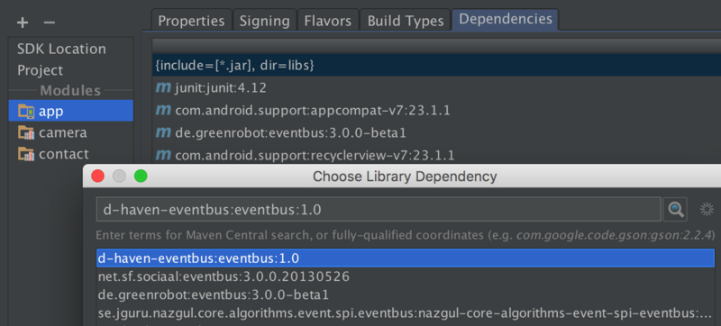
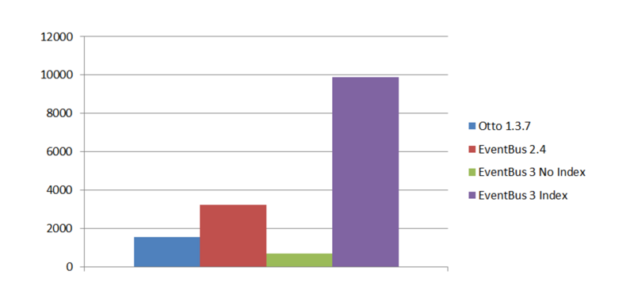

# EventBus 3.0的用法详解（一）

来源:[segmentfault.com](https://segmentfault.com/a/1190000004279679)

看到大家提出的关于Android的问题，有一部分可以用EventBus解决，而也有相当多的人推荐使用EventsBus,因为其和GreenDAO出自一家公司，并且使用它非常的简单，所以现在很多的互联网app都会使用EventsBus来进行消息传递。

基于此，有很多EventBus的文章，写的非常的好，但是由于EventBus已经出了3.0版本，而国内的大多数翻译只是停留在了2.4版本左右，对于那些刚刚接触EventBus的人，从最新版接触学习，是最理想的学习路线。

所以，在这儿，我总结下EventBus3.0的用法。

## 什么是EventBus
EventBus是一个Android端优化的publish/subscribe消息总线，简化了应用程序内各组件间、组件与后台线程间的通信。比如请求网络，等网络返回时通过Handler或Broadcast通知UI，两个Fragment之间需要通过Listener通信，这些需求都可以通过**EventBus**实现。

## EventBus框架
大家谈到EventBus，总会想到greenrobot的EventBus，但是实际上EventBus是一个通用的叫法，例如Google出品的Guava，Guava是一个庞大的库，EventBus只是它附带的一个小功能，因此实际项目中使用并不多。用的最多的是greenrobot/EventBus，这个库的优点是接口简洁，集成方便，但是限定了方法名，不支持注解。另一个库square/otto修改自 Guava ，用的人也不少。

> 这篇博文暂时只讨论greenrobot的EventBus库。

## 基本用法

很多文章会讲到Subscriber，以及Publisher和ThreadMode等概念，我觉得暂时没有必要，简单粗暴，直接上代码：

### 添加依赖库：
首先你要为你的app添加依赖库：

```
compile 'de.greenrobot:eventbus:3.0.0-beta1'
```

关于如何添加依赖库，请参考[Gradle for Android 第三篇( 依赖管理 )](http://segmentfault.com/a/1190000004237922)。

有些人会问为什么是beta版本，因为eventbus现阶段3.0版本只处于beta测试阶段。有些人会问如何找到eventbus 3.0.0版本，具体添加:



### 注册

举个例子，你需要在一个activity中注册eventbus事件，然后定义接收方法，这和Android的广播机制很像，你需要首先注册广播，然后需要编写内部类，实现接收广播，然后操作UI,在EventBus中，你同样需要这么做。

```
@Override
protected void onCreate(Bundle savedInstanceState) {
    super.onCreate(savedInstanceState);
    setContentView(R.layout.activity_main);

    EventBus.getDefault().register(this);

}
@Override
protected void onDestroy() {
    super.onDestroy();
    EventBus.getDefault().unregister(this);
}
```

### 订阅者
类似广播，但是有别于2.4版本，你不必再去约定OnEvent方法开头了（看不懂没关系）：

```
@Subscribe(threadMode = ThreadMode.MainThread)
public void helloEventBus(String message){
    mText.setText(message);
}
```

该操作很简单，定义了一个hello方法，需要传入String参数，在其中操作UI操作，注意：

我们添加了注解@Subscribe，其含义为订阅者，在其内传入了threadMode，我们定义为ThreadMode.MainThread，其含义为该方法在UI线程完成，这样你就不要担心抛出异常啦。是不是很简单？

### 发布者
既然你在某个地方订阅了内容，当然就会在某个地方发布消息。举个例子，你的这个activity需要http请求，而http请求你肯定是在异步线程中操作，其返回结果后，你可以这么写：

```
String json="";
EventBus.getDefault().post(json);
```
这样就OK了，你可以试下能否正常运行了！

### 原理初探

你订阅了内容，所以你需要在该类注册EventBus，而你订阅的方法需要传入String,即你的接收信息为String类型，那么在post的时候，你post出去的也应该是String类型，其才会接收到消息。

### 如果你post的是对象
首先你需要定义一个类似pojo类：

```
public class MessageEvent {
  public final String name;
  public final String password;
  public MessageEvent(String name,String password) {
    this.name = name;
    this.password=password;
  }
}
```

然后你post的时候：

```
EventBus.getDefault().post(new MessageEvent("hello","world"));
```

当然，你接收的方法也需要改为：

```
@Subscribe(threadMode = ThreadMode.MainThread)
public void helloEventBus(MessageEvent message){
    mText.setText(message.name);
}
```

疑问，当你post了消息之后，你的订阅者有多个，每一个都接收吗？能否做到指定接收者。

下一章，带来源码解析以及EventBus的高级用法；

如果大家有兴趣，也可带领大家编写属于自己的EventBus框架，敬请期待。


----

# EventBus 3.0的用法详解(二)

来源:[segmentfault.com](https://segmentfault.com/a/1190000004314315)

前一篇文章简单介绍了EventBus 3.0的用法，现在是时候详解其用法了。首先声明，EventBus 3.0的改动针对2.4的改动并不是特别大，但是对于其性能的提升是另外一个说法了，所以建议学习EventBus 3.0。

## 注解

### 新增的`@Subscribe`

```
threadMode = ThreadMode.MainThread
```

用注解的方式代替约定的方法名规范，是其最大的改变。在2.4中，你可能需要这么定义：

```
public void onEventMainThread(MessageEvent event) {
        log(event.message);
}
``` 
该方法为接收消息后在主线程中处理事件，而在3.0中：

```
@Subscribe(threadMode = ThreadMode.MainThread) //在ui线程执行
public void onUserEvent(UserEvent event) {
        log(event.message);
}
```

其中ThreadMode提供了四个常量：

* MainThread 主线程
* BackgroundThread 后台线程
* Async 后台线程
* PostThread 发送线程（默认）

BackgroundThread:当事件是在UI线程发出，那么事件处理实际上是需要新建单独线程，如果是在后台线程发出，那么事件处理就在该线程。该事件处理方法应该是快速的，避免阻塞后台线程。

Async：发送事件方不需要等待事件处理完毕。这种方式适用于该事件处理方法需要较长时间，例如网络请求。

### sticky = true

默认情况下，其为false。什么情况下使用sticky呢？

相信大多数使用过EventBus 2.4的同学或多或少的使用过：

```
EventBus.getDefault().postSticky(new VoteEvent(obj));
EventBus.getDefault().registerSticky(this);
```

你会发现非常的麻烦，那么在3.0中：

```
EventBus.getDefault().postSticky(new VoteEvent(obj));
EventBus.getDefault().register(this);
@Subscribe(sticky = true)
```

什么时候使用sticy,当你希望你的事件不被马上处理的时候，举个栗子，比如说，在一个详情页点赞之后，产生一个VoteEvent，VoteEvent并不立即被消费，而是等用户退出详情页回到商品列表之后，接收到该事件，然后刷新Adapter等。其实这就是之前我们用`startActivityForResult`和`onActivityResult`做的事情。

```
priority = 1
```

相信大部分人知道该用法，值越小优先级越低，默认为0。

### 建议
推荐大家在使用EventBus的时候，创建一个事件类，把你的每一个参数（或者可能发生冲突的参数），封装成一个类：

```
public class Event  {  
    public static class UserListEvent {  
        public List<User> users ;  
    }
    public static class ItemListEvent {  
        public List<Item> items;  
    }    
}
```

### 添加processor

按照Markus Junginger的说法（EventBus创作者），在3.0中，如果你想进一步提升你的app的性能，你需要添加：

```
provided 'de.greenrobot:eventbus-annotation-processor:3.0.0-beta1'
```

其在编译的时候为注册类构建了一个索引，而不是在运行时，这样的结果是其让EventBus 3.0的性能提升了一倍，相比2.4来说，其会是它的3到6倍。大家可以感受下：




