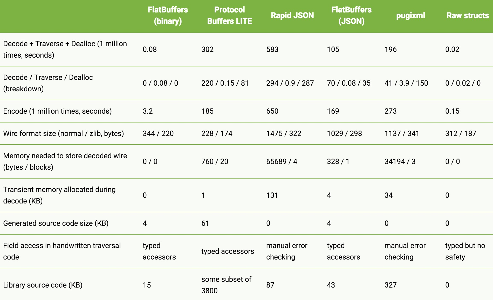

# FlatBuffers体验

来源:[www.race604.com](http://www.race604.com/flatbuffers-intro/)

## 1.背景

最近在项目中需要使用一种高效数据序列化的工具。碰巧在几篇文章中都提到了 FlatBuffers 这个库。特别是 Android 性能优化典范第四季1中两个对比图，让我对它产生浓厚的兴趣。如下：


（注：图片来自1）

可见，FlatBuffers 几乎从空间和时间复杂度上完胜其他技术，我决定详细调研一下此技术。

FlatBuffers 是一个开源的跨平台数据序列化库，可以应用到几乎任何语言（C++, C#, Go, Java, JavaScript, PHP, Python），最开始是 Google 为游戏或者其他对性能要求很高的应用开发的。项目地址在 [GitHub](https://github.com/google/flatbuffers) 上。官方的文档在[这里](http://google.github.io/flatbuffers/index.html)。

本文将介绍一下我使用 FlatBuffers 的一些感受，希望对想要了解或者使用 FlatBuffers 的同学有一点帮组。

## 2.FlatBuffer 的优点

FlatBuffer 相对于其他序列化技术，例如 XML，JSON，Protocol Buffers 等，有哪些优势呢？官方文档的说法如下：

* 直接读取序列化数据，而不需要解析（Parsing）或者解包（Unpacking）：FlatBuffer 把数据层级结构保存在一个扁平化的二进制缓存（一维数组）中，同时能够保持直接获取里面的结构化数据，而不需要解析，并且还能保证数据结构变化的前后向兼容。
* 高效的内存使用和速度：FlatBuffer 使用过程中，不需要额外的内存，几乎接近原始数据在内存中的大小。
* 灵活：数据能够前后向兼容，并且能够灵活控制你的数据结构。
* 很少的代码侵入性：使用少量的自动生成的代码即可实现。
* 强数据类性，易于使用，跨平台，几乎语言无关。

官方提供了一个性能对比表如下：



（注：来自 [官方文档](http://google.github.io/flatbuffers/flatbuffers_benchmarks.html)）

在做 Android 开发的时候，JSON 是最常用的数据序列化技术。我们知道，JSON 的可读性很强，但是序列化和反序列化性能却是最差的。解析的时候，JSON 解析器首先，需要在内存中初始化一个对应的数据结构，这个事件经常会消耗 100ms ~ 200ms2；解析过程中，要产生大量的临时变量，造成 Java 虚拟机的 GC 和内存抖动，解析 20KB 的数据，大概会消耗 100KB 的临时内存。FlatBuffers 就解决了这些问题。

## 3. 使用方法

简单来说，FlatBuffers 的使用方法是，首先按照使用特定的 IDL 定义数据结构 schema，然后使用编译工具 flatc 编译 schema 生成对应的代码，把生成的代码应用到工程中即可。下面详细介绍每一步。

首先，我们需要得到 flatc，这个需要从源码编辑得到。从 GitHub 上 Clone 代码，

```
$ git clone https://github.com/google/flatbuffers
```

在 Mac 上，使用 Xcode 直接打开 build/Xcode/ 里面项目文件，编译运行，即可在项目根目录生成我们需要的 flatc 工具。也可以使用 cmake 编辑，例如在 Linux 上，运行如下命令即可：

```
$ cmake -G "Unix Makefiles"
$ make
```

首先要使用 FlatBuffers 的 IDL 定义好数据结构 Schema，编写 Schema 的详细文档在 [这里](http://google.github.io/flatbuffers/flatbuffers_guide_writing_schema.html)。其语法和 C 语言类似，比较容易上手。我们这里引用一个简单的例子2，假设数据结构如下：

```
class Person {  
    String name;
    int friendshipStatus;
    Person spouse;
    List<Person>friends;
}
```

编写成 Schema 如下，文件名为 Person.fbs：

```
// Person schema

namespace com.race604.fbs;

enum FriendshipStatus: int {Friend = 1, NotFriend}

table Person {  
  name: string;
  friendshipStatus: FriendshipStatus = Friend;
  spouse: Person;
  friends: [Person];
}

root_type Person;  
```

然后，使用 flatc 可以把 Schema 编译成多种编程语言，我们仅仅讨论 Android 平台，所以把 Schema 编译成 Java，命令如下：

```
$ ./flatc --java Person.fbs
```

在当前目录生成如下文件：

```
.
└── com
    └── race604
        └── fbs
            ├── FriendshipStatus.java
            └── Person.java
```

Person 类有响应的函数直接获取其内部的属性值，使用非常简单：

```
Person person = ...;  
// 获取普通成员
String name = person.name();  
int friendshipStatus = person.friendshipStatus();  
// 获取数组
int length = person.friendsLength()  
for (int i = 0; i < length; i++) {  
    Person friends = person.friends(i);
    ...
}
```

下面我们来构建一个 Person 对象，名字是 "John"，其配偶（spouse）是 "Mary"，还有两个朋友，分别是 "Dave" 和 "Tom"，实现如下：

```
private ByteBuffer createPerson() {  
    FlatBufferBuilder builder = new FlatBufferBuilder(0);
    int spouseName = builder.createString("Mary");
    int spouse = Person.createPerson(builder, spouseName, FriendshipStatus.Friend, 0, 0);

    int friendDave = Person.createPerson(builder, builder.createString("Dave"),
            FriendshipStatus.Friend, 0, 0);
    int friendTom = Person.createPerson(builder, builder.createString("Tom"),
            FriendshipStatus.Friend, 0, 0);

    int name = builder.createString("John");
    int[] friendsArr = new int[]{ friendDave, friendTom };
    int friends = Person.createFriendsVector(builder, friendsArr);

    Person.startPerson(builder);
    Person.addName(builder, name);
    Person.addSpouse(builder, spouse);
    Person.addFriends(builder, friends);
    Person.addFriendshipStatus(builder, FriendshipStatus.NotFriend);

    int john = Person.endPerson(builder);
    builder.finish(john);

    return builder.dataBuffer();
}
```

基本方法就是通过 FlatBufferBuilder 工具，往里面填写数据，详细的写法可以参考官方文档3。可见，其实写法略显繁琐，不太直观。

## 4. 基本原理

如官方文档的介绍，FlatBuffers 就像它的名字所表示的一样，就是把结构化的对象，用一个扁平化（Flat）的缓冲区保存，简单的来说就是把内存对象数据，保存在一个一维的数组中。借用 Facebook 文章的一张图如下：


可见，FlatBuffers 保存在一个 byte 数组中，有一个“支点”指针（pivot point）以此为界，存储的内容分为两个部分：元数据和数据内容。其中元数据部分就是数据在前面，其长度等于对象中的字段数量，每个 byte 保存对应字段内容在数组中的索引（从支点位置开始计算）。

如图，上面的 Person 对象第一个字段是 name，其值的索引位置是 1，所以从索引位置 1 开始的字符串，就是 name 字段的值 "John"。第二个字段是 friendshipStatus，其索引值是 6，找到值为 2， 表示 NotFriend。第三个字段是 spouse，也一个 Person 对象，索引值是 12，指向的是此对象的支点位置。第四个字段是一个数组，图中表示的数组为空，所以索引值是 0。

通过上面的解析，可以看出，FlatBuffers 通过自己分配和管理对象的存储，使对象在内存中就是**线性结构化**的，直接可以把内存内容保存或者发送出去，加载“解析”数据只需要把 byte 数组加载到内存中即可，不需要任何解析，也不产生任何中间变量。

它与具体的机器或者运行环境无关，例如在 Java 中，对象内的内存不依赖 Java 虚拟机的堆内存分配策略实现，所以也是跨平台的。

## 5.使用建议

通过前面的体验，FlatBuffers 几乎秒杀了 JSON，我也尝试使用到现在的项目中，但是最后还是放弃了，下面说说 FlatBuffers 的几点缺点：

* FlatBuffers 需要生成代码，对代码有侵入性；
* 数据序列化没有可读性，不方便 Debug；
* 构建 FlatBuffers 对象比较麻烦，不直观，特别是如果对象比较复杂情况下需要写大段的代码；
* 数据的所有内容需要使用 Schema 严格定义，灵活性不如 JSON。

我最后在项目中放弃是因为上面的第 4 点，因为在我的项目中，数据结构变化很大，不方便使用 Schema 完全定义。话又说回来，FlatBuffers 这么多好处，还是很吸引我的，可能会在其他的项目中尝试。

所以，在什么情况下选择使用 FlatBuffers 呢？个人感觉需要满足以下几点：

项目中有大量数据传输和解析，使用 JSON 成为了性能瓶颈；
稳定的数据结构定义。

## 参考资料：

* [http://geek.csdn.net/news/detail/50692](http://geek.csdn.net/news/detail/50692)
* [https://code.facebook.com/posts/872547912839369/improving-facebook-s-performance-on-android-with-flatbuffers/](https://code.facebook.com/posts/872547912839369/improving-facebook-s-performance-on-android-with-flatbuffers/)
* [http://google.github.io/flatbuffers/flatbuffersguidetutorial.html](http://google.github.io/flatbuffers/flatbuffersguidetutorial.html)
* [http://frogermcs.github.io/flatbuffers-in-android-introdution/](http://frogermcs.github.io/flatbuffers-in-android-introdution/)