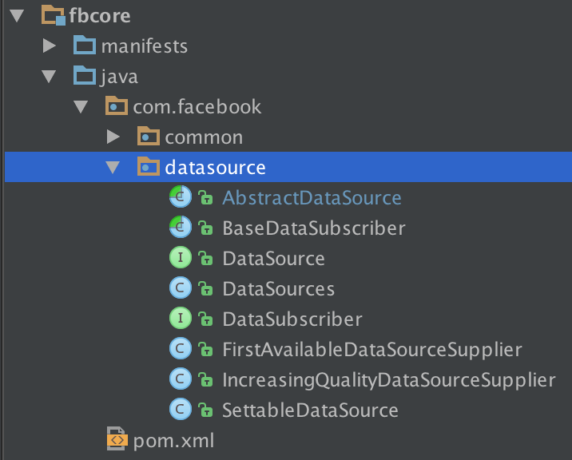
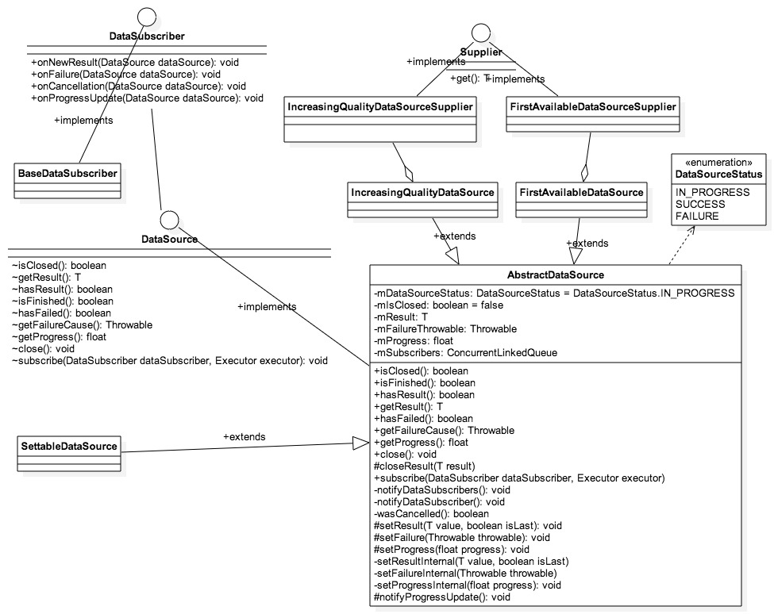

#  Fresco源码解析 - DataSource怎样存储数据

来源:[CSDN-一介码农](http://blog.csdn.net/feelang/article/details/45420999)

`datasource`是一个独立的`package`，与FB导入的`guava`包都在同一个工程内 - `fbcore`。



`datasource`的类关系比较简单，一张类图基本就可以描述清楚它们间的关系。



`DataSource`是一个`interface`， 功能与JDK中的`Future`类似，但是相比于`Future`，它的先进之处则在于**不仅仅只生产一个单一的结果，而是能够提供系列结果**。

> Unlike Futures, DataSource can issue a series of results, rather than just one.

最典型的用途就是渐进式加载图片时可以提供加载中的中间数据。

`DataSubscriber`和`DataSource`构成了一个观察者模式。

`Datasource`提供了注册方法。

```
void subscribe(DataSubscriber<T> dataSubscriber, Executor executor);
```

通过`subscribe`方法我们可以把`DataSubscriber`注册成为`DataSource`的观察者，然后当`DataSource`的数据发生变化时，在`Executor`中通知所有的观察者-`DataSubscriber`。

`DataSubscriber`会响应数据的四种变化。

* onNewResult
* onFailure
* onCancellation
* onProgressUpdate

使用`Executor`来通知观察者是比较高明的，这样做可以让回调方法的执行线程交由`DataSubscriber`来处理，增加了灵活性。

`DataSource`只是一个接口，没有提供任何实现，`AbstractDataSource`实现了`DataSource`后封装了一些基础的操作，例如 通知观察者，记录数据状态。

`Datasource`的状态记录使用了一个枚举类型。

```
private enum DataSourceStatus {
  // data source has not finished yet
  IN_PROGRESS,

  // data source has finished with success
  SUCCESS,

  // data source has finished with failure
  FAILURE,
}
```

这三种状态保存在一个成员变量(`mDataSourceStatus`)中。

```
@GuardedBy("this")
private DataSourceStatus mDataSourceStatus;
```

`AbstractDataSource`构造时，会把`mDataSourceStatus`设置为`IN_PROGRESS`。

```
protected AbstractDataSource() {
  mIsClosed = false;
  mDataSourceStatus = DataSourceStatus.IN_PROGRESS;
  mSubscribers = new ConcurrentLinkedQueue<>();
}
```

所有的观察者（订阅者）会被放在一个列表中 - `mSubscribers`。

```
private final ConcurrentLinkedQueue<Pair<DataSubscriber<T>, Executor>> mSubscribers;
```

如果当前的数据请求没有关闭并且满足`mDataSourceStatus == DataSourceStatus.IN_PROGRESS`时才能注册成功观察者，因为只有当数据发生变化的时候，观察者才有存在的意义。

```
@Override
public void subscribe(final DataSubscriber<T> dataSubscriber, final Executor executor) {
  Preconditions.checkNotNull(dataSubscriber);
  Preconditions.checkNotNull(executor);
  boolean shouldNotify;

  synchronized(this) {
    if (mIsClosed) {
      return;
    }

    if (mDataSourceStatus == DataSourceStatus.IN_PROGRESS) {
      mSubscribers.add(Pair.create(dataSubscriber, executor));
    }

    shouldNotify = hasResult() || isFinished() || wasCancelled();
  }

  if (shouldNotify) {
    notifyDataSubscriber(dataSubscriber, executor, hasFailed(), wasCancelled());
  }
}
```

如果`DataSource`有了新的数据或者请求已经结束掉或被取消掉，会通知观察者。

```
private void notifyDataSubscribers() {
  final boolean isFailure = hasFailed();
  final boolean isCancellation = wasCancelled();
  for (Pair<DataSubscriber<T>, Executor> pair : mSubscribers) {
    notifyDataSubscriber(pair.first, pair.second, isFailure, isCancellation);
  }
}

private void notifyDataSubscriber(
    final DataSubscriber<T> dataSubscriber,
    final Executor executor,
    final boolean isFailure,
    final boolean isCancellation) {
  executor.execute(
      new Runnable() {
        @Override
        public void run() {
          if (isFailure) {
            dataSubscriber.onFailure(AbstractDataSource.this);
          } else if (isCancellation) {
            dataSubscriber.onCancellation(AbstractDataSource.this);
          } else {
            dataSubscriber.onNewResult(AbstractDataSource.this);
          }
        }
      });
}
```

使用`DataSource`很重要的一点：不要产生内存泄露，也就是说，用过的资源一定要释放掉。 

使用`DataSubscriber`注册成为了观察者后，回调方法都会带回一个`DataSource`的实例，如果请求已经结束后者失败了，拿到数据后一定要把`DataSource`给`close`掉，否则很容易造成 OOM。

`BaseDataSubscriber`就是为了防止OOM，它本身的设计也很巧妙。

在毁掉方法`onNewResult`和`onFailure`中加了一个`try - catch`， 在`try`的`block`中调用子类必须重载的 `onNewResultImpl`方法，然后在`finally`的`block`中`close DataSource`。

*DataSourceSubscriber.java*

```
public abstract class BaseDataSubscriber<T> implements DataSubscriber<T> {

  @Override
  public void onNewResult(DataSource<T> dataSource) {
    try {
      onNewResultImpl(dataSource);
    } finally {
      if (dataSource.isFinished()) {
        dataSource.close();
      }
    }
  }

  @Override
  public void onFailure(DataSource<T> dataSource) {
    try {
      onFailureImpl(dataSource);
    } finally {
      dataSource.close();
    }
  }

  @Override
  public void onCancellation(DataSource<T> dataSource) {
  }

  @Override
  public void onProgressUpdate(DataSource<T> dataSource) {
  }

  protected abstract void onNewResultImpl(DataSource<T> dataSource);

  protected abstract void onFailureImpl(DataSource<T> dataSource);
}
```

`IncreasingQualityDataSourceSupplier`和`FirstAvailableDataSourceSupplier`是`DataSource`的两种不同的数据存储形式，等后面用到了再做分析。

`Supplier`是一个设计比较巧妙的借口，用途非常广泛。

> A class that can supply objects of a single type. Semantically, this could be a factory, generator, builder, closure, or something else entirely. No guarantees are implied by this interface.

`SettableDataSource`在`set`方法中使用`Guava`的`Preconditions`来做数据合法性检验，它与`DataSource`的区别也是仅此而已。

Preconditions

* checkArgument
* checkState
* checkNotNull
* checkElementIndex
* checkPositionIndex
* checkPositionIndexes

如果 check 结果为 false， 则抛出异常。Fresco 的错误处理基本上是用异常做的。