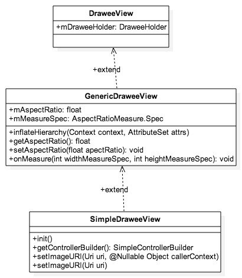

# Fresco源码解析 - DraweeView

来源:[CSDN-一介码农](http://blog.csdn.net/feelang/article/details/45200561)

`DraweeView`是`Fresco`的三大组件（`Hierarchy`、`Controller`、`View`) 之一，作为MVC模式中的`View`，主要负责显示由`Hierarchy`提供的数据（`placeholder`、`actual image`、`progress drawable`等），`Controller` 作为幕后，负责获取数据。

## 继承体系

`DraweeView`并不是是一个简单的自定义`View`，它必须要提供与`Hierarchy`和`Controller`交互的接口，`DraweeView`的继承关系如下图所示：



## 用法

一般比较常见的用法是在xml布局文件中直接定义一个`SimpleDraweeView`，这也是最简单的一种用法，因为不需要自己为 `SimpleDraweeView`提供`Hierarchy`和`Controller`。

```
<com.facebook.drawee.view.SimpleDraweeView
    android:id="@+id/my_image_view"
    android:layout_width="130dp"
    android:layout_height="130dp"
    fresco:placeholderImage="@drawable/my_drawable" />
```

`GenericDraweeView`实现了解析xml属性的功能，它提供了两种构造方式，一种是直接使用外部`hierarchy`，另一种会根据属性值在内部构建。

```
/** 使用外部hierarchy */
public GenericDraweeView(Context context, GenericDraweeHierarchy hierarchy) {
  super(context);
  setHierarchy(hierarchy);
}

public GenericDraweeView(Context context) {
  super(context);
  inflateHierarchy(context, null);
}

public GenericDraweeView(Context context, AttributeSet attrs) {
  super(context, attrs);
  inflateHierarchy(context, attrs);
}

public GenericDraweeView(Context context, AttributeSet attrs, int defStyle) {
  super(context, attrs, defStyle);
  inflateHierarchy(context, attrs);
}
```

## xml属性

`inflateHierarchy`会根据布局文件中使用的属性生成一个`Hierarchy`，如果没有设置属性并且也没有外部的 `Hierarchy`，`GenericDraweeView`会使用默认值来创建`Hierarchy`，默认值由 `GenericDraweeHierarchyBuilder`提供。

```
/**
 * Class to construct a GenericDraweeHierarchy.
 * 
 */
public class GenericDraweeHierarchyBuilder {

  public static final int DEFAULT_FADE_DURATION = 300;
  public static final ScaleType DEFAULT_SCALE_TYPE = ScaleType.CENTER_INSIDE;
  public static final ScaleType DEFAULT_ACTUAL_IMAGE_SCALE_TYPE = ScaleType.CENTER_CROP;

  // ...
}
```

`inflateHierarchy`方法使用`GenericDraweeHierarchyBuilder`生成`GenericDraweeHierarchy`。

```
GenericDraweeHierarchyBuilder builder = new GenericDraweeHierarchyBuilder(resources);
// set fade duration
builder.setFadeDuration(fadeDuration);
// set images & scale types
if (placeholderId > 0) {
  builder.setPlaceholderImage(resources.getDrawable(placeholderId), placeholderScaleType);
}
// 省略其他set
setHierarchy(builder.build());
```

## 设置长宽比（Aspect Ratio）

长宽比暂时不支持在xml中设定，只能通过调用`setAspectRatio`来设置。 

`setAspectRatio`方法会调用`requestLayout()`，然后触发`onMeasure`，根据`aspect ratio`重新计算`View`的高度和宽度。

```
/**
 * Sets the desired aspect ratio (w/h).
 */
public void setAspectRatio(float aspectRatio) {
  if (aspectRatio == mAspectRatio) {
    return;
  }
  mAspectRatio = aspectRatio;
  requestLayout();
}

/**
 * Gets the desired aspect ratio (w/h).
 */
public float getAspectRatio() {
  return mAspectRatio;
}  

@Override
protected void onMeasure(int widthMeasureSpec, int heightMeasureSpec) {
  mMeasureSpec.width = widthMeasureSpec;
  mMeasureSpec.height = heightMeasureSpec;
  AspectRatioMeasure.updateMeasureSpec(
      mMeasureSpec,
      mAspectRatio,
      getLayoutParams(),
      getPaddingLeft() + getPaddingRight(),
      getPaddingTop() + getPaddingBottom());
  super.onMeasure(mMeasureSpec.width, mMeasureSpec.height);
}
```

`onMeasure`方法中用到的`updateMeasureSpec`是`com.facebook.drawee.view.AspectRatioMeasure`的一个静态方法，实现了重现计算高度和宽度的功能。

```
 public static void updateMeasureSpec(
     Spec spec,
     float aspectRatio,
     ViewGroup.LayoutParams layoutParams,
     int widthPadding,
     int heightPadding) { 
   if (aspectRatio <= 0) { 
     return;
   } 
   if (shouldAdjust(layoutParams.height)) { 
     int widthSpecSize = View.MeasureSpec.getSize(spec.width);
     int desiredHeight = (int) ((widthSpecSize - widthPadding) / aspectRatio + heightPadding);
     int resolvedHeight = View.resolveSize(desiredHeight, spec.height);
     spec.height = View.MeasureSpec.makeMeasureSpec(resolvedHeight, View.MeasureSpec.EXACTLY);
   } else if (shouldAdjust(layoutParams.width)) { 
     int heightSpecSize = View.MeasureSpec.getSize(spec.height);
     int desiredWidth = (int) ((heightSpecSize - heightPadding) * aspectRatio + widthPadding);
     int resolvedWidth = View.resolveSize(desiredWidth, spec.width);
     spec.width = View.MeasureSpec.makeMeasureSpec(resolvedWidth, View.MeasureSpec.EXACTLY);
   } 
 }

 private static boolean shouldAdjust(int layoutDimension) {
   // Note: wrap_content is supported for backwards compatibility, but should not be used.
   return layoutDimension == 0 || layoutDimension == ViewGroup.LayoutParams.WRAP_CONTENT;
 }
```

使用`setAspectRatio`时，如果`layout_width`或`layout_height`设置成了`0dp`， 那么`MeasureSpec`的`Mode`不能是`EXACTLY`，否则`View.MeasureSpec.getSize(spec.height)`的返回值会变成在布局文件中设定的值，而不是根据长宽比计算出来的值。

如果使用了`android:layout_width="200dp"`， 只有加上`android:layout_weight`了才可以正常使用`aspect ratio`。

```
<com.facebook.drawee.view.SimpleDraweeView
    android:id="@+id/circle_img"
    android:layout_width="200dp"
    android:layout_height="0dp"
    android:layout_weight="1"
    fresco:actualImageScaleType="centerCrop" />
```

当然直接使用`wrap_content`也可以。

关于`SimpleDraweeView`的具体用法，[猛戳这里](https://github.com/LyndonChin/Mastering-Fresco)。