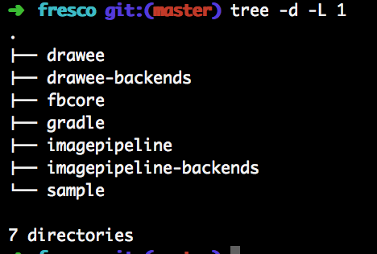
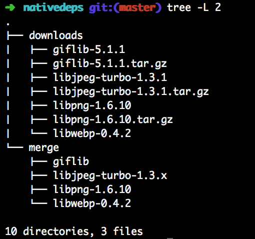
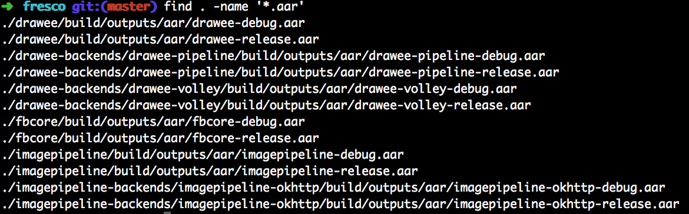

# Fresco源码解析 - 本地编译
来源:[CSDN-一介码农](http://blog.csdn.net/feelang/article/details/45083067)

[fbf8]:https://fbf8.com/
[OOM]:http://blog.csdn.net/feelang/article/details/45083067
[Tmall-HD]:http://app.mi.com/detail/89216
[fresco-github]:https://github.com/facebook/fresco
[Android-NDK]:https://developer.android.com/tools/sdk/ndk/index.html

作为专题第一篇，先从最简单的开始，顺便找找感觉。

Fresco 是 facebook 在今年的 [F8][fbf8] 大会上宣布开源的一个用于加载图片的库，它不仅支持多种图片文件格式，而且由于使用了pinned purgeables 技术，使得大图加载过程中产生[OOM][OOM]的概率大大降低，对开发者来说绝对是一件喜大普奔的事情，对于像[天猫HD][Tmall-HD]这样需要加载大量图片的APP来说也绝对是个福音。

## 下载代码

首先把源码从 [Github][fresco-github] 克隆到本地。

```
$git clone https://github.com/facebook/fresco.git
```

clone完毕后的文件结构目录如下：



## 配置NDK开发环境

由于 Fresco 用到了C写的图片解码库（下图所示），因此还需要配置NDK的开发环境。



到 Android 官网下载 [Android NDK][Android-NDK]，并配好环境变量。

## 编译代码

进入 Fresco 源码所在的目录，开始编译。

```
fresco$./gradlew build
```

下载 gradle 的 wrapper 可能需要较长的时间，耐心等待一下。

※ 注意报错

编译过程中 Gradle 可能会报错，

```
unable to expand TAR 'imagepipeline\build\downloads\libjpeg-turbo-1.3.1.tar.gz'
```

不必惊慌、不必担心，已经有人踩过[此坑](https://github.com/facebook/fresco/issues/107)，只需要把imagepipeline/build目录删掉，重新 build 一下就可以了。

## 生成aar

编译结束后，每个工程会生成对应的aar包。

