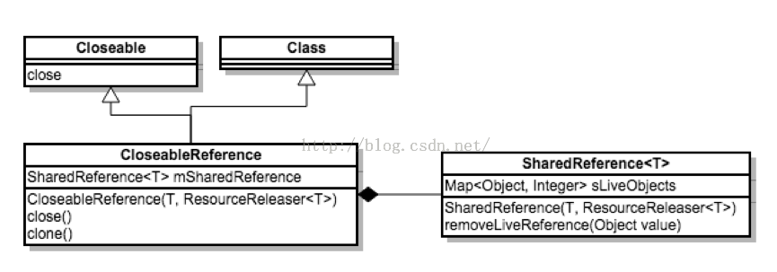
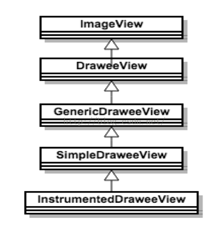
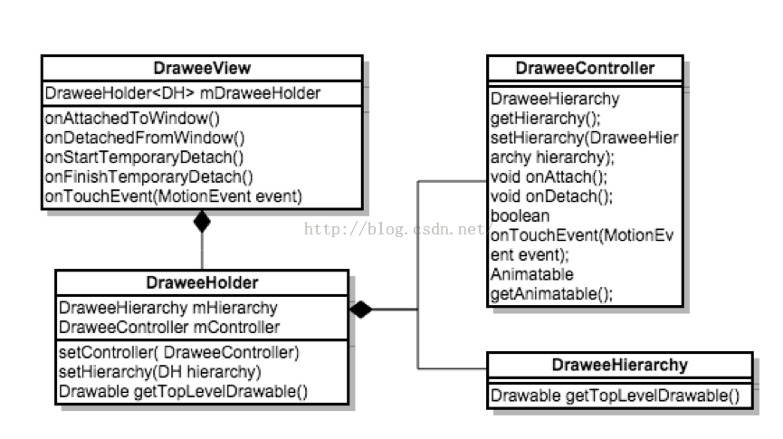
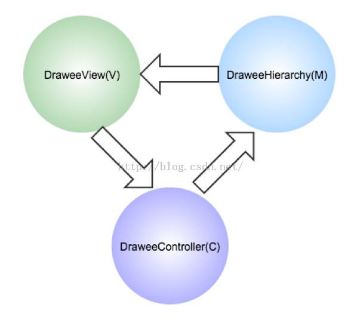

# Fresco原理分析

来源:[CSDN](http://blog.csdn.net/fu_xiuyuan/article/details/46848233)

[fresco-jcodecraeer]:http://www.jcodecraeer.com/a/anzhuokaifa/androidkaifa/2015/0402/2683.html
[fresco-md]:Fresco介绍,一个新的android图片加载库.md
[bitmap-cpp]:http://androidxref.com/5.1.0_r1/xref/frameworks/base/native/graphics/jni/bitmap.cpp

对于Fresco大家在网上搜索看到的大多数是这篇翻译的文章，英语好的同学，可以直接看原版，因为我觉得翻译的不是很好（[jcodecraeer][fresco-jcodecraeer],[Fresco介绍,一个新的android图片加载库][fresco-md]），自己根据自己的理解补充了一下，如果有错误，希望大家指正，谢谢。

首先我们来了解一下Android在各个版本上处理Bitmap的不同，在Android 3.0以后，android的bitmap的数据也存储在java heap中，所以你不用太关心内存，内存会由java虚拟机回收。Android 3.0以前，由于google觉得虚拟机性能还不够，所以bitmap的内存数据是放在Ashmen里的，需要开发者显示调用Bitmap.recycle()来回收内存（其实不调用也没事，系统也能给你处理好，比如进程死了）。

由于Bitmap是内存大户，所以Google是意识到这个问题的，为了减低内存的分配，减少GC，Google在Android3.0 以后也提供了一个特别有用的特性BitmapFactory.Options.inBitamp,这个特性呢，能让图片在同一块内存区域上解码而达到重复利用这块内存，Android 4.4之前呢要求两张图片的大小必须一样，4.4 之后呢只要保证内存比需要解码的图片大就可以了。所以我们的应用只在4.4上跑，是可以做到高效的内存管理的。

那么，Facebook为什么又要搞什么Fresco呢？很明显，他们为了寻找一个通用的解决方案，一个能在Android 各个版本中都通用的方案。

他们又有了什么发现呢？他们的发现就是NDK里提供的一个函数AndroidBitmap_lockPixel，本来Google是推荐调用AndroidBitmap_lockPixels后要调用AndroidBitmap_unlockPixels，这两个函数应该是成对出现的，但Facebook的工程师们发现其实不调用AndroidBitmap_unlockPixels也没事，对，就这么简单。

看一下fresco/imagepipeline/src/jni/Bitmaps.c，pinBitmap这个函数，并没有unlockPixels。

```
/**
 * Pins bitmap's pixels.
 *
 * <p> Throws RuntimeException ifunable to pin.
 */
static void Bitmaps_pinBitmap(
    JNIEnv* env,
    jclass clazz,
    jobject bitmap) {
  UNUSED(clazz);
  int rc =AndroidBitmap_lockPixels(env, bitmap,0);
  if (rc !=ANDROID_BITMAP_RESULT_SUCCESS) {
    safe_throw_exception(env, "Failed to pin Bitmap");
  }
}
```

在来看一下AndroidBitmap_lockPixels的代码（[/frameworks/base/native/graphics/jni/bitmap.cpp][bitmap-cpp]）,在往里面的代码，大家可以继续跟了，其实我也搞不懂，反正就这样把内存给hold住了，大体上如果调用AndroidPixelRef() 的话是在Java heap上分配内存，调用SkMallocPixelRef()的话是在Native上分配内存。

```
int AndroidBitmap_lockPixels(JNIEnv* env, jobject jbitmap, void** addrPtr) {
     if (NULL == env || NULL == jbitmap) {
        return ANDROID_BITMAP_RESULT_BAD_PARAMETER;
     }
     SkBitmap* bm = GraphicsJNI::getNativeBitmap(env, jbitmap);
     if (NULL == bm) {
        return ANDROID_BITMAP_RESULT_JNI_EXCEPTION;
      }
      bm->lockPixels();
      void* addr = bm->getPixels();
      if (NULL == addr) {
         bm->unlockPixels();
         return ANDROID_BITMAP_RESULT_ALLOCATION_FAILED;
       }
       if (addrPtr) {
          *addrPtr = addr;
       }
    return ANDROID_BITMAP_RESULT_SUCCESS;
}
```

Fresco就是基于这个原理去开发的，其实也就是回归到Android 2.3的处理方式上来，想来也简单，要兼容老的版本，就只能拿老版本的方案来解决问题了。

链接的文章里有一句话，“用C++的思想写Java代码”，大家都知道C++是要自己管理内存的，那我们写Java的时候也有这个意识，可能写出来的代码会更高。**前面讲到不调用AndroidBitmap_unlockPixels也没事，真的没事吗？等着系统帮你回收内存？Facebook的工程师们当然不会这么水了，被hold住的Bitmap不用了还是需要调用一下Bitmap.recycle()的，那么问题就来了，什么时候调用呢？**

为了解决这个问题，Fresco里有一个SharedReference这样的类，类似于C++的智能指针了，其实就是基于引用计数的，有使用到呢就加一，不用了呢就减一，引用计数为零了呢就调用Bitmap.recycle()。可是对于Java程序员去做这样的事情是比较别扭，所以又来了一个CloseableReference类继承Cloneable和Closeable这两个接口，通过clone和close这样Java化的方式来管理SharedReference，比如clone的时候就addReference()，close的时候就deleteReference()，这样我们用起来就舒服多了。



前面讲了一些原理，现在来看看上层是怎么使用Fresco的，Fresco提供了DraweeView这个View。我们在上层可以直接使用。

先来看看DraweeView这个类的继承关系，目前DraweeView是继承与ImageView的，但注释里写了，未来可能会改为继承View，所以在使用的时候尽可能不要使用到ImageView的方法。



我们在来看看DraweeView的主要代码，里面有一个重要的变量DraweeHolder，DraweeHolder里又包含DraweeHierarchy和DraweeController这两个接口变量。



通过上面的分析，很容易发现DraweeView，DraweeHierarchy，DraweeController三者的关系就是典型的MVC结构了。



这三者之间的关系是，DraweeView把事件派发给DraweeController，由DraweeController来决定DraweeHierarchy中存储的那种图片来显示（就是getTopLevelDrawable() 返回的Drawable）。

至于为什么要使用DraweeHolder，注释说了，这个就是为了解耦了，如果你不想使用DraweeView，通过DraweeHolder还是很方便使用另外两个组件的。

比如我们要使用自定义的View，我们就要处理好下面这几个函数，这样才能保证引用计数的正确性，否则可能就会引起内存泄露。其实就是要在View移除屏幕或进入屏幕去维护好引用计数了。

```
@Override
protected void onAttachedToWindow() {
  super.onAttachedToWindow();
  mDraweeHolder.onAttach();
}

@Override
protected void onDetachedFromWindow() {
  super.onDetachedFromWindow();
  mDraweeHolder.onDetach();
}

@Override
public void onStartTemporaryDetach() {
  super.onStartTemporaryDetach();
  mDraweeHolder.onDetach();
}

@Override
public void onFinishTemporaryDetach() {
  super.onFinishTemporaryDetach();
  mDraweeHolder.onAttach();
}

@Override
public boolean onTouchEvent(MotionEvent event) {
  if (mDraweeHolder.onTouchEvent(event)) {
    return true;
  }
  return super.onTouchEvent(event);
}
```

当然Fresco还有很多功能，大家可以慢慢去研究，比如开头帖子说的，“不仅仅是加载程序，它是一个管道”，有时间我在把管道的处理流程给画出来。

总的来说，Fresco的性能还是不错的，而且还兼容Android各个版本，但是也就是这个兼容性给Fresco带来了复杂性，如果我们的项目只考虑在4.4上运行，那还是有可能做到更简单和高效的。