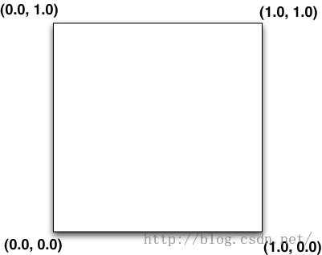

# Android平台Camera实时滤镜实现方法探讨(二)--Android-GPUImage探讨

来源:[csdn](http://blog.csdn.net/oshunz/article/details/50038915)

[android-gpuimage]:https://github.com/CyberAgent/android-gpuimage

本章介绍[android-gpuimage][android-gpuimage]实现方式，即通过在C++层实现YUV-RGB转换，通过OpenGL绘制，通过片段着色器运行Shader脚本实现图像处理，虽然将滤镜的一些处理交给GPU来执行，极大的减少了速度，但YUV-RGB过程却拖了后腿。本章将从YUV、GLSL与OpenGL开始，逐步探讨方案5。其中YUV-RGB过程上一章已有粗略探讨，本章不再赘述。

> OpenGL着色语言（OpenGL Shading Language）是用来在OpenGL中着色编程的语言，也即开发人员写的短小的自定义程序，他们是在图形卡的GPU （Graphic Processor Unit图形处理单元）上执行的，代替了固定的渲染管线的一部分，使渲染管线中不同层次具有可编程型。比如：视图转换、投影转换等。GLSL（GL Shading Language）的着色器代码分成2个部分：Vertex Shader（顶点着色器）和Fragment（片断着色器），有时还会有Geometry Shader（几何着色器）。负责运行顶点着色的是顶点着色器。它可以得到当前OpenGL 中的状态，GLSL内置变量进行传递。GLSL其使用C语言作为基础高阶着色语言，避免了使用汇编语言或硬件规格语言的复杂性。

**顶点着色器**是一个可编程单元，执行顶点变换、纹理坐标变换、光照、材质等顶点的相关操作，每顶点执行一次。顶点着色器定义了在 2D 或者 3D 场景中几何图形是如何处理的。一个顶点指的是 2D 或者 3D 空间中的一个点。在图像处理中，有 4 个顶点：每一个顶点代表图像的一个角。顶点着色器设置顶点的位置，并且把位置和纹理坐标这样的参数发送到片段着色器。下面是GPUImage中一个顶点着色器：

```
attribute vec4 position;    
attribute vec4 inputTextureCoordinate；  
  
varying vec2 textureCoordinate;  
  
void main()    
{  
    gl_position = position;  
    textureCoordinate = inputTextureCoordinate.xy;  
}  

```

attribute是只能在顶点着色器中使用的变量，来表示一些顶点的数据，如：顶点坐标，法线，纹理坐标，顶点颜色等。
varying变量是vertex和fragment shader之间做数据传递用的。一般vertex shader修改varying变量的值，然后fragment shader使用该varying变量的值。因此varying变量在vertex和fragment shader二者之间的声明必须是一致的。

```
attribute vec4 position;
```

position变量是我们在程序中传给Shader的顶点数据的位置，是一个矩阵，规定了图像4个点的位置，并且可以在shader中经过矩阵进行平移、旋转等再次变换。在GPUImage中，我们根据GLSurfaceView的大小、PreviewSize的大小实现计算出矩阵，通过glGetAttribLocation获取id，再通过glVertexAttribPointer将矩阵传入。新的顶点位置通过在顶点着色器中写入gl_Position传递到渲染管线的后继阶段继续处理。结合后面绘制过程中的glDrawArrays(GL_TRIANGLE_STRIP, 0, 4);，首先选取第三个点，与前两个点绘制成一个三角形，再选取最后一个点，与第二、第三个点绘制成三角形，最终绘制成多边形区域。

```
attribute vec2 inputTextureCoordinate；
```

inputTextureCoordinate是纹理坐标，纹理坐标定义了图像的哪一部分将被映射到多边形。如图所示，下图是OpenGL纹理坐标系统，左下角为原点，



传入此坐标，代表输出图像不会经过变换，在GPUImage中，因为输出图像与应用方向关系，需要将图像旋转90度，即坐标为

```
public static final float TEXTURE_ROTATED_90[] = {  
            1.0f, 1.0f,  
            1.0f, 0.0f,  
            0.0f, 1.0f,  
            0.0f, 0.0f,  
};
```

```
varying vec2 textureCoordinate
```

因为顶点着色器负责和片段着色器交流，所以我们需要创建一个变量和它共享相关的信息。在图像处理中，片段着色器需要的唯一相关信息就是顶点着色器现在正在处理哪个像素。

```
gl_Position = position;
```

gl_Position是用来传输投影坐标系内顶点坐标的内建变量，GPUImage在Java层已经变换过，在这里不需要经过任何变换。

```
textureCoordinate = inputTextureCoordinate.xy;
```

取出这个顶点中纹理坐标的 X 和 Y 的位置（仅需要这两个属性），然后赋值给一个将要和片段着色器通信的变量。到此，顶点着色器建立完毕。

**片段着色器：**

```
varying highp vec2 textureCoordinate;  
  
uniform sampler2D inputImageTexture;  
  
void main()    
{  
    gl_FragColor = texture2D(inputImageTexture, textureCoordinate);  
}
```

片段着色器和顶点着色器会成对出现。片段着色器扮演着显示的角色。我们的滤镜处理大部分都在片段着色器中进行。上段代码是一个无滤镜效果的片段着色器。

```
varying highp vec2 textureCoordinate;
```

对应顶点着色器中变量名相同的变量，片段着色器作用在每一个像素上，我们需要一个方法来确定我们当前在分析哪一个像素/片段。它需要存储像素的 X 和 Y 坐标。我们接收到的是当前在顶点着色器被设置好的纹理坐标。

```
uniform sampler2D inputImageTexture;
```

uniforms变量(一致变量)用来将数据值从应用程其序传递到顶点着色器或者片元着色器。该变量有点类似C语言中的常量（const），即该变量的值不能被shader程序修改。sampler2D对应2D纹理，在GPUImage中，与onPreviewFrame中经过变换过的RGB数据绑定。GPU将从该纹理中取出点进行处理。

```
gl_FragColor = texture2D(inputImageTexture, textureCoordinate);
```

这是我们碰到的第一个 GLSL 特有的方法：texture2D，顾名思义，创建一个 2D 的纹理。它采用我们之前声明过的属性作为参数来决定被处理的像素的颜色。这个颜色然后被设置给另外一个内建变量，gl_FragColor。因为片段着色器的唯一目的就是确定一个像素的颜色，gl_FragColor 本质上就是我们片段着色器的返回语句。一旦这个片段的颜色被设置，接下来片段着色器就不需要再做其他任何事情了，所以你在这之后写任何的语句，都不会被执行。

到此为止，我们的Shader就写完了。

在实际程序例如GPUImage中，操作顺序如下

* 1.创建shader

1）编写Vertex Shader和Fragment Shader源码。      
2）创建两个shader 实例：GLuint   glCreateShader(GLenum type);        
3）给Shader实例指定源码。 glShaderSource        
4）在线编译shaer源码 void   glCompileShader(GLuint shader)

```
public static int loadShader(final String strSource, final int iType) {  
    int[] compiled = new int[1];  
    int iShader = GLES20.glCreateShader(iType);  
    GLES20.glShaderSource(iShader, strSource);  
    GLES20.glCompileShader(iShader);  
    GLES20.glGetShaderiv(iShader, GLES20.GL_COMPILE_STATUS, compiled, 0);  
    if (compiled[0] == 0) {  
        Log.d("Load Shader Failed", "Compilation\n" + GLES20.glGetShaderInfoLog(iShader));  
        return 0;  
    }  
    return iShader;  
}  
```

* 2.创建program

在OpenGL ES中，每个program对象有且仅有一个Vertex Shader对象和一个Fragment Shader对象连接到它。Shader类似于C编译器。Program类似于C链接器。glLinkProgram操作产生最后的可执行程序，它包含最后可以在硬件上执行的硬件指令。

1）创建program ： GLuint   glCreateProgram(void)       
2）绑定shader到program ： void   glAttachShader(GLuint program, GLuint shader)。每个program必须绑定一个Vertex Shader 和一个Fragment Shader。       
3）链接program ： void   glLinkProgram(GLuint program)        
4）使用porgram ： void   glUseProgram(GLuint program)

```
public static int loadProgram(final String strVSource, final String strFSource) {  
    int iVShader;  
    int iFShader;  
    int iProgId;  
    int[] link = new int[1];  
    iVShader = loadShader(strVSource, GLES20.GL_VERTEX_SHADER);  
    if (iVShader == 0) {  
        Log.d("Load Program", "Vertex Shader Failed");  
        return 0;  
    }  
    iFShader = loadShader(strFSource, GLES20.GL_FRAGMENT_SHADER);  
    if (iFShader == 0) {  
        Log.d("Load Program", "Fragment Shader Failed");  
        return 0;  
    }  
  
    iProgId = GLES20.glCreateProgram();  
  
    GLES20.glAttachShader(iProgId, iVShader);  
    GLES20.glAttachShader(iProgId, iFShader);  
  
    GLES20.glLinkProgram(iProgId);  
  
    GLES20.glGetProgramiv(iProgId, GLES20.GL_LINK_STATUS, link, 0);  
    if (link[0] <= 0) {  
        Log.d("Load Program", "Linking Failed");  
        return 0;  
    }  
    GLES20.glDeleteShader(iVShader);  
    GLES20.glDeleteShader(iFShader);  
    return iProgId;  
}  
```

* 3.获取纹理坐标、顶点坐标、纹理等对应id

通过glGetAttribLocation和glGetUniformLocation获取对应的id

```
mGLAttribPosition = GLES20.glGetAttribLocation(mGLProgId, "position");  

mGLUniformTexture = GLES20.glGetUniformLocation(mGLProgId, 
				"inputImageTexture");  
				
mGLAttribTextureCoordinate = GLES20.glGetAttribLocation(mGLProgId,  
               "inputTextureCoordinate");  

```

* 4.绘制

1）首先设置背景颜色和绘制创建绘制区域、清理当前缓冲区

2）使用program(glUseProgram)，传递两个矩阵

3）通过glGenTextures(GLsizei n, GLuint *textures)产生你要操作的纹理对象的id，然后通过glBindTexture绑定并获取纹理id，告诉OpenGL下面对纹理的任何操作都是对它所绑定的纹理对象的，比如glBindTexture(GL_TEXTURE_2D,1)告诉OpenGL下面代码中对2D纹理的任何设置都是针对索引为1的纹理的。通过glTexParameteri设置一些属性。最后通过glTexImage2D根据指定参数，包括RGB数据，生成2D纹理。当第二帧绘制的时候，则不需要重新绑定纹理，使用glTexSubImage2D更新现有纹理即可。

```
public static int loadTexture(final IntBuffer data, final Size size, final int usedTexId) {  
        int textures[] = new int[1];  
        if (usedTexId == NO_TEXTURE) {  
            GLES20.glGenTextures(1, textures, 0);  
            GLES20.glBindTexture(GLES20.GL_TEXTURE_2D, textures[0]);  
            GLES20.glTexParameterf(GLES20.GL_TEXTURE_2D,  
                    GLES20.GL_TEXTURE_MAG_FILTER, GLES20.GL_LINEAR);  
            GLES20.glTexParameterf(GLES20.GL_TEXTURE_2D,  
                    GLES20.GL_TEXTURE_MIN_FILTER, GLES20.GL_LINEAR);  
            GLES20.glTexParameterf(GLES20.GL_TEXTURE_2D,  
                    GLES20.GL_TEXTURE_WRAP_S, GLES20.GL_CLAMP_TO_EDGE);  
            GLES20.glTexParameterf(GLES20.GL_TEXTURE_2D,  
                    GLES20.GL_TEXTURE_WRAP_T, GLES20.GL_CLAMP_TO_EDGE);  
            GLES20.glTexImage2D(GLES20.GL_TEXTURE_2D, 0, GLES20.GL_RGBA, size.width, size.height,  
                    0, GLES20.GL_RGBA, GLES20.GL_UNSIGNED_BYTE, data);  
        } else {  
            GLES20.glBindTexture(GLES20.GL_TEXTURE_2D, usedTexId);  
            GLES20.glTexSubImage2D(GLES20.GL_TEXTURE_2D, 0, 0, 0, size.width,  
                    size.height, GLES20.GL_RGBA, GLES20.GL_UNSIGNED_BYTE, data);  
            textures[0] = usedTexId;  
        }  
        return textures[0];  
    }  

```

4）然后使用函数glActiveTexture()来指定要对其进行设置的纹理单元，这里为GL_TEXTURE0，使用glBindTexture再次绑定，通过glUniform1i复制，最后glDrawArrays绘制。


