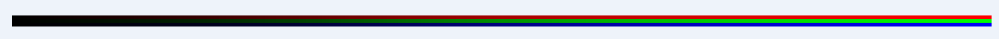

# Android平台Camera实时滤镜实现方法探讨(四)--以Hefe滤镜为例

来源:[csdn](http://blog.csdn.net/oshunz/article/details/50069027)

上文讲到如何将YUV转换成RGB，之后就可以根据自己的设计，制作自己需要的滤镜了，例如将红色变的更红，增加亮度等。本文以Instagram上的Hefe滤镜为例

滤镜的制作，基本上采用图层+曲线，结合一些其他属性的调节，例如[这篇文章](http://blog.csdn.net/trent1985/article/details/49382823)讲解了如何用PS模拟Instagram上的滤镜。

## 1.添加边框

下面是从Instagram中找到的图片资源，首先是添加边框


将图片载入bitmap，然后将图片绑定给纹理，获取纹理索引

```
GLES20.glBindTexture(GLES20.GL_TEXTURE_2D, textureHandle[0]);  
              
// Set filtering  
GLES20.glTexParameteri(GLES20.GL_TEXTURE_2D, GLES20.GL_TEXTURE_MAG_FILTER, GLES20.GL_LINEAR);  
GLES20.glTexParameteri(GLES20.GL_TEXTURE_2D, GLES20.GL_TEXTURE_MIN_FILTER, GLES20.GL_LINEAR);  
GLES20.glTexParameteri(GLES20.GL_TEXTURE_2D, GLES20.GL_TEXTURE_WRAP_S, GLES20.GL_CLAMP_TO_EDGE);  
GLES20.glTexParameteri(GLES20.GL_TEXTURE_2D, GLES20.GL_TEXTURE_WRAP_T, GLES20.GL_CLAMP_TO_EDGE);  
// Load the bitmap into the bound texture.  
GLUtils.texImage2D(GLES20.GL_TEXTURE_2D, 0, bitmap, 0);  

```

然后交给shader

```
// Set program handles  
inputUniformHandler2 = glGetUniformLocation(gProgram, "inputImageTexture2");  
// Set the active texture1 unit to texture unit 2.  
glActiveTexture(GL_TEXTURE2);  
// Bind the texture to this unit.  
glBindTexture(GL_TEXTURE_2D, inputTextureHandler2);  
// Tell the texture uniform sampler to use this texture in the shader by  
// binding to texture unit 1.  
glUniform1i(inputUniformHandler2, 2);
```

获取边框RGB

```
vec3 edge = texture2D(inputImageTexture2, textureCoordinate).rgb;
```

向量点乘，叠加，将边框加到原图之上，texel为原rgb数据

```
texel = texel * edge;  
```

在shader中，rgb数据用0.0~1.0之间表示，例如color.r=0.2代表20%的红色，例如边框中心rgb都是1，因此，中心是不变的，而边缘部分会根据边框的RGB值改变，相当于将边框覆盖到原图之上。

## 2.改变RGB值

根据设计的效果改变RGB值，类似于PS中的曲线，可以采用单独写一个函数来完成，Instagram等APP采用一个255X3像素图片来完成，3个像素从上到下分别为R/G/B，从左到右分别代表原RGB0~255所对应的值。新的R/G/B即原来的R/G/B的值在改图对应位置的值。例如原为126的R值，即在shader中为0.5，即对应的新R值为该图红色中间位置的R值。



代码如下：

```
texel = vec3(  
	texture2D(inputImageTexture3, vec2(texel.r, .16666)).r,  
	texture2D(inputImageTexture3, vec2(texel.g, .5)).g,  
    texture2D(inputImageTexture3, vec2(texel.b, .83333)).b);  
```

## 3.添加其他纹理图
下图是来自Instagram的hefe滤镜，需要根据右图进行调整

   

代码如下：

```
vec3 metal = texture2D(inputImageTexture6, textureCoordinate).rgb;  
vec3 metaled = vec3(  
                    texture2D(inputImageTexture5, vec2(metal.r, texel.r)).r,  
                    texture2D(inputImageTexture5, vec2(metal.g, texel.g)).g,  
                    texture2D(inputImageTexture5, vec2(metal.b, texel.b)).b  
                    );  
```

先取出左图的RGB值，然后根据原图（预览画面）的RGB值到右图中去取值，例如原图中某点灰色图片的RGB值为（167,173,167），预览画面为棕色（125,125,125），即新的RBG值分别为右图中坐标为(0.65,0.5),(0.678,0.5),(0.65,0.5)，将新的值绘制到屏幕中。

## 4.滤镜强度

如果需要调节滤镜强度，定义一个float变量，采用mix函数调节

```
metaled.rgb = mix(originColor.rgb, metaled.rgb, p1);  
  
gl_FragColor = vec4(metaled, 1.0);  
```

理想效果：（来自网络）

