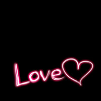
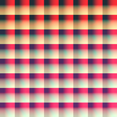

# Android平台Camera实时滤镜实现方法探讨(七)--滤镜基本制作方法(一)

来源:[csdn](http://blog.csdn.net/oshunz/article/details/50214449)

关于如何制作滤镜，[知乎的这篇问答](http://www.zhihu.com/question/20073281)中的最高票给了比较专业的回答

另外，githunb曾经有个开源项目InstagramFilters给出了Instagram中最初版本的一些滤镜代码，约不到20种，[下载地址](http://download.csdn.net/detail/oshunz/9335481)，GPUImage中也有一些图像处理算法可供学习
下面我们一起来探讨探讨滤镜的制作：

## 一.添加覆盖层：


此种边框多见于Instagram中，比较容易实现，首先将图片加载到纹理，将原RGB与该图RGB点乘即可，shader中vec点乘即对应坐标相乘，例如原图中心为（1.,1.,1.)相乘后原图中心不变，而边角例如某点为（.5,.5,.5），与图案rgb相乘后原rbg值均减半，造成变暗效果。最终原图会覆盖一个边框。



这种图片多见于国内一些滤镜，与上图不同，除了需要添加的效果外，其余部分均为黑色（0,0,0)，因此不能点乘来覆盖。可以在如下代码基础上修改

示例代码：（如果不明白可以参考GPUImage中的GPUImageAddBlendFilter等代码）

```
textureColor = 1.0 - ((1.0 - mask) * (1.0 - textureColor));   
```
## 二.曲线调整：
颜色曲线，即PS中的曲线，根据曲线将RGB从0到255每个点的值更改为对应的值，即可更改图片效果。现有的处理方法基本采用查表法来实现，下面几种方法都属于查表法。
### 1.将曲线存储在数组中，通过glTexImage2D将数据传递给纹理：
示例代码如下：

```
redCurveValue = texture2D(curve, vec2(redCurveValue, 0.0)).r;   
greenCurveValue = texture2D(curve, vec2(greenCurveValue, 0.0)).g;   
blueCurveValue = texture2D(curve, vec2(blueCurveValue, 0.0)).b;   
```

### 2.保存成宽度为256的图片，将图片传递给纹理：

示例代码如下：

```
texel = vec3(  
    texture2D(inputImageTexture3, vec2(texel.r, .16666)).r,  
    texture2D(inputImageTexture3, vec2(texel.g, .5)).g,  
    texture2D(inputImageTexture3, vec2(texel.b, .83333)).b);  
```

### 3.映射：

> [（转载自知乎）](http://www.zhihu.com/question/20073281)设计师用 Photoshop 调出来的色彩效果输出在了下面这种「格子图」上，在 App 里通过解析「格子图」得到了色彩的变化规则，然后把这个规则应用在了照片上。注意，这里只能进行颜色上的调整（曲线，色彩平衡等），其他效果调整也只限于利用图层间混合模式的更改，例如可做暗角、漏光等效果。

这些图片在一些未加密的APP种均能找到，例如:



可以参考[这篇文章](http://blog.csdn.net/oshunz/article/details/%E4%BD%BF%E7%94%A8CIColorCube%E5%BF%AB%E9%80%9F%E8%A3%BD%E4%BD%9C%E6%BF%BE%E9%8F%A1)加以理解

完整代码（来自GPUImageLookupFilter）：

```
varying highp vec2 textureCoordinate;  
  
uniform sampler2D inputImageTexture;  
uniform sampler2D inputImageTexture2; // lookup texture  
  
void main()  
{  
    lowp vec4 textureColor = texture2D(inputImageTexture, textureCoordinate);  
  
    mediump float blueColor = textureColor.b * 63.0;  
  
    mediump vec2 quad1;  
    <span style="white-space:pre">    </span>quad1.y = floor(blueColor/8.0);   
    quad1.x = floor(blueColor) - (quad1.y * 8.0);  
  
    mediump vec2 quad2;  
    quad2.y = floor(ceil(blueColor)/7.999);   
    <span style="white-space:pre">    </span>quad2.x = ceil(blueColor) - (quad2.y * 8.0);  
  
    highp vec2 texPos1;  
    texPos1.x = (quad1.x * 0.125) + 0.5/512.0 + ((0.125 - 1.0/512.0) * textureColor.r);  
    texPos1.y = (quad1.y * 0.125) + 0.5/512.0 + ((0.125 - 1.0/512.0) * textureColor.g);  
  
    highp vec2 texPos2;  
    texPos2.x = (quad2.x * 0.125) + 0.5/512.0 + ((0.125 - 1.0/512.0) * textureColor.r);  
    <span style="white-space:pre">    </span>texPos2.y = (quad2.y * 0.125) + 0.5/512.0 + ((0.125 - 1.0/512.0) * textureColor.g);  
  
    lowp vec4 newColor1 = texture2D(inputImageTexture2, texPos1);  
    lowp vec4 newColor2 = texture2D(inputImageTexture2, texPos2);  
  
    lowp vec4 newColor = mix(newColor1, newColor2, fract(blueColor));  
    gl_FragColor = vec4(newColor.rgb, textureColor.w);  
}  
```

## 三.色调（H），饱和度（S），明度（V）调整：

这3个属性的调整，可以先将RGB转换为HSV格式来快速调整，之后再转换回来

```
vec3 rgb2hsv(vec3 c)   
{  
    vec4 K = vec4(0.0, -1.0 / 3.0, 2.0 / 3.0, -1.0);   
    vec4 p = mix(vec4(c.bg, K.wz), vec4(c.gb, K.xy), step(c.b, c.g));   
    vec4 q = mix(vec4(p.xyw, c.r), vec4(c.r, p.yzx), step(p.x, c.r));   
      
    float d = q.x - min(q.w, q.y);   
    float e = 1.0e-10;   
    return vec3(abs(q.z + (q.w - q.y) / (6.0 * d + e)), d / (q.x + e), q.x);   
}   
  
vec3 hsv2rgb(vec3 c)   
{   
    vec4 K = vec4(1.0, 2.0 / 3.0, 1.0 / 3.0, 3.0);   
    vec3 p = abs(fract(c.xxx + K.xyz) * 6.0 - K.www);   
    return c.z * mix(K.xxx, clamp(p - K.xxx, 0.0, 1.0), c.y);   
}  
```