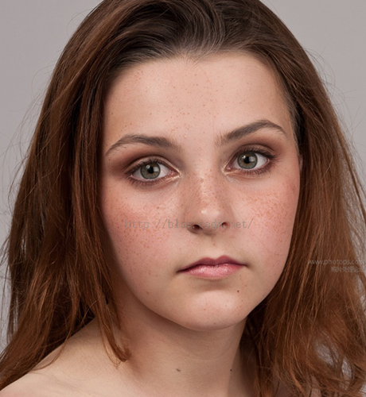
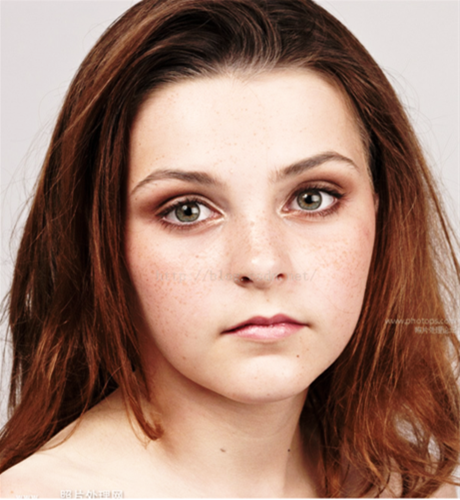

# Android平台Camera实时滤镜实现方法探讨(八)--简单美颜滤镜

来源:[csdn](http://blog.csdn.net/oshunz/article/details/50323491)

美颜包含磨皮、美白、瘦脸等效果，其中磨皮算法在很多博客中均有介绍

例如：

[双指数边缘平滑滤波器用于磨皮算法的尝试](http://www.cnblogs.com/Imageshop/p/3293300.html)

[选择性模糊及其算法的实现](http://www.cnblogs.com/Imageshop/p/4694540.html)

[基于局部均方差相关信息的图像去噪及其在实时磨皮美容算法中的应用](http://www.cnblogs.com/Imageshop/p/4679065.html)

[导向滤波磨皮](http://blog.csdn.net/hjimce/article/details/45421299)

[递归双边滤波磨皮](http://blog.csdn.net/hjimce/article/details/45421207)


以上博客均有相关代码/公式，经试验若选取合适参数均有不错的效果，可惜水平有限尚未在shader中实现不卡顿的实时效果~

观察美图秀秀和华为自带相机等相机APP，发现实时美颜效果均不如PC端和手机端后处理，可能在这一领域目前解决办法不多或者需求不高吧。

下面就探讨简单的美颜滤镜处理方法。

## 一.模糊处理

这里可以采用简单的高斯模糊或者双边滤波处理，可以简单参考GPUImage中的高斯模糊，或者可以将上述代码优化到可以实时执行的程度

## 二.将模糊后的图像灰度化

```
const mediump vec3 luminanceWeighting = vec3(0.2125, 0.7154, 0.0721);
```
 
这就是我们设置三个元素的向量，为我们的亮度来保存颜色比重的地方。这三个值加起来要为 1，这样我们才能把亮度计算为 0.0 - 1.0 之间的值。注意中间的值，就是表示绿色的值，用了 70% 的颜色比重，而蓝色只用了它的 10%。这是SONY Trinitron的数据，更加一般的系数是ITU HDTV标准 0.2125, 0.7154, 0.0721以及用于CRT显示器非线性色彩的0.299, 0.587, 0.114）。

```
lowp float luminance = dot(blurColor.rgb, luminanceWeighting);   

```
使用 GLSL 中的点乘运算，计算出这个像素综合的亮度值。

```
lowp float satura = 0.7;   
lowp vec3 greyScaleColor = vec3(luminance);    
gl_FragColor = vec4(mix(greyScaleColor, textureColor.rgb, saturation), textureColor.w);
```

创建一个三个值都是亮度信息的 vec3，把所有的片段组合起来。为了确定每个新的颜色是什么，使用 mix 函数（mix(x, y, a): x, y的线性混叠， x(1-a) + y*a;）。mix 函数会把我们刚刚计算的灰度值和初始的纹理颜色以及我们得到的饱和度的信息相结合。
PS：以上代码可以在GPUImage中找到

## 三.美白映射

找到何时的颜色曲线即可对照片进行美白处理，例如这篇文章讨论了一些美白方法。PS水平高的同学这里可以自己设计出效果。下面是一个从某APP拿出来现成的映射表。将其作为纹理传递给片段着色器。

```
byte[] arrayOfByte = new byte[1024];  
int[] arrayOfInt1 = { 95, 95, 96, 97, 97, 98, 99, 99, 100, 101, 101, 102, 103, 104, 104, 105, 106, 106, 107, 108, 108, 109, 110, 111, 111, 112, 113, 113, 114, 115, 115, 116, 117, 117, 118, 119, 120, 120, 121, 122, 122, 123, 124, 124, 125, 126, 127, 127, 128, 129, 129, 130, 131, 131, 132, 133, 133, 134, 135, 136, 136, 137, 138, 138, 139, 140, 140, 141, 142, 143, 143, 144, 145, 145, 146, 147, 147, 148, 149, 149, 150, 151, 152, 152, 153, 154, 154, 155, 156, 156, 157, 158, 159, 159, 160, 161, 161, 162, 163, 163, 164, 165, 165, 166, 167, 168, 168, 169, 170, 170, 171, 172, 172, 173, 174, 175, 175, 176, 177, 177, 178, 179, 179, 180, 181, 181, 182, 183, 184, 184, 185, 186, 186, 187, 188, 188, 189, 190, 191, 191, 192, 193, 193, 194, 195, 195, 196, 197, 197, 198, 199, 200, 200, 201, 202, 202, 203, 204, 204, 205, 206, 207, 207, 208, 209, 209, 210, 211, 211, 212, 213, 213, 214, 215, 216, 216, 217, 218, 218, 219, 220, 220, 221, 222, 223, 223, 224, 225, 225, 226, 227, 227, 228, 229, 229, 230, 231, 232, 232, 233, 234, 234, 235, 236, 236, 237, 238, 239, 239, 240, 241, 241, 242, 243, 243, 244, 245, 245, 246, 247, 248, 248, 249, 250, 250, 251, 252, 252, 253, 254, 255, 255, 255, 255, 255, 255, 255, 255, 255, 255, 255, 255, 255, 255, 255, 255, 255, 255, 255, 255, 255, 255, 255, 255, 255, 255 };  
int[] arrayOfInt2 = { 0, 0, 1, 1, 2, 2, 2, 3, 3, 3, 4, 4, 5, 5, 5, 6, 6, 6, 7, 7, 8, 8, 8, 9, 9, 10, 10, 10, 11, 11, 11, 12, 12, 13, 13, 13, 14, 14, 14, 15, 15, 16, 16, 16, 17, 17, 17, 18, 18, 18, 19, 19, 20, 20, 20, 21, 21, 21, 22, 22, 23, 23, 23, 24, 24, 24, 25, 25, 25, 25, 26, 26, 27, 27, 28, 28, 28, 28, 29, 29, 30, 29, 31, 31, 31, 31, 32, 32, 33, 33, 34, 34, 34, 34, 35, 35, 36, 36, 37, 37, 37, 38, 38, 39, 39, 39, 40, 40, 40, 41, 42, 42, 43, 43, 44, 44, 45, 45, 45, 46, 47, 47, 48, 48, 49, 50, 51, 51, 52, 52, 53, 53, 54, 55, 55, 56, 57, 57, 58, 59, 60, 60, 61, 62, 63, 63, 64, 65, 66, 67, 68, 68, 69, 70, 71, 72, 73, 74, 75, 76, 77, 78, 79, 80, 81, 82, 83, 84, 85, 86, 88, 89, 90, 91, 93, 94, 95, 96, 97, 98, 100, 101, 103, 104, 105, 107, 108, 110, 111, 113, 115, 116, 118, 119, 120, 122, 123, 125, 127, 128, 130, 132, 134, 135, 137, 139, 141, 143, 144, 146, 148, 150, 152, 154, 156, 158, 160, 163, 165, 167, 169, 171, 173, 175, 178, 180, 182, 185, 187, 189, 192, 194, 197, 199, 201, 204, 206, 209, 211, 214, 216, 219, 221, 224, 226, 229, 232, 234, 236, 239, 241, 245, 247, 250, 252, 255 };  
for (int i = 0; i < 256; i++){  
  arrayOfByte[(i * 4)] = ((byte)arrayOfInt1[i]);  
  arrayOfByte[(1 + i * 4)] = ((byte)arrayOfInt1[i]);  
  arrayOfByte[(2 + i * 4)] = ((byte)arrayOfInt2[i]);  
  arrayOfByte[(3 + i * 4)] = -1;  
}  
GLES20.glTexImage2D(GLES20.GL_TEXTURE_2D, 0, GLES20.GL_RGBA, 256, 1, 0, GLES20.GL_RGBA, GLES20.GL_UNSIGNED_BYTE, ByteBuffer.wrap(arrayOfByte));        
```
在片段着色器中取出
```
lowp float redCurveValue = texture2D(curve, vec2(textureColor.r, 0.0)).r;   
lowp float greenCurveValue = texture2D(curve, vec2(textureColor.g, 0.0)).r;   
lowp float blueCurveValue = texture2D(curve, vec2(textureColor.b, 0.0)).r;  
  
lowp float strength = -1.0 / 512.0;   
redCurveValue = min(1.0, redCurveValue + strength);  
greenCurveValue = min(1.0, greenCurveValue + strength);   
blueCurveValue = min(1.0, blueCurveValue + strength);   
```

## 四.混合

将映射后的rgb与第一步模糊后的混合（代码可采用GPUImage中的OverBlend）
正片叠底（Multiply）和滤色（Screen）是两种基本的混合模式，分别用于使图片变暗和变亮。它们之间的组合还可以形成更复杂的混合模式，如叠加（Overlay）和柔光（Soft Light）。

正片叠底 —— 就是把两层图像的像素相乘，最后会得到一个更暗的图像。这个模式是对称的，也就是说交换基色和混合色得到的结果是一样的。  

f(a,b) = ab，其中a是基色，b是混合色。  

滤色 —— 首先把两层图像的像素值取互补数，然后将它们相乘，最后再去互补数。这和正片叠底得到的结果是相反的。它会得到一个更亮的图像。

f(a,b)=1-(1-a)(1-b)，其中a是基色，b是混合色。  

叠加 —— 结合了正片叠底和滤色两种混合模式。基色中亮色的部分会更加亮，而暗色的部分会更暗。 

f(a,b)当a<0.5,则为2ab，否则为1-(1-a)(1-b)，其中a是基色，b是混合色。

```
//overlay blending   
mediump float ra;   
if (base.r < 0.5)   
{   
    ra = overlay.r * base.r * 2.0;   
}else{   
    ra = 1.0 - ((1.0 - base.r) * (1.0 - overlay.r) * 2.0);   
}   
  
mediump float ga;   
if (base.g < 0.5)   
{   
    ga = overlay.g * base.g * 2.0;   
} else {   
    ga = 1.0 - ((1.0 - base.g) * (1.0 - overlay.g) * 2.0);   
}   
  
mediump float ba;   
if (base.b < 0.5) {   
    ba = overlay.b * base.b * 2.0;   
} else {   
    ba = 1.0 - ((1.0 - base.b) * (1.0 - overlay.b) * 2.0);   
}   
  
textureColor = vec4(ra, ga, ba, 1.0);   
  
gl_FragColor = vec4(textureColor.r, textureColor.g, textureColor.b, 1.0);   
```

之后就可以绘制到屏幕当中了，也可以输出到纹理之后再进行二次滤波处理再次磨皮等

## 五.效果图

  