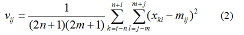
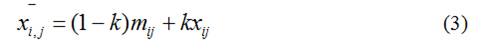
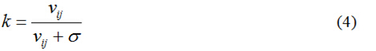
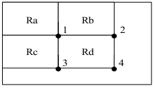
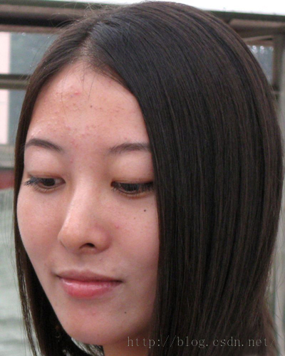
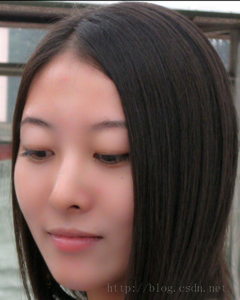

# Android平台Camera实时滤镜实现方法探讨(九)--磨皮算法探讨(一)

来源:[csdn](http://blog.csdn.net/oshunz/article/details/50372968)

上一篇开头提到了一些可用于磨皮的去噪算法，下面我们实现这些算法并且观察效果，咱不考虑实时性的问题

本文首先探讨的首先是[《基于局部均方差相关信息的图像去噪及其在实时磨皮美容算法中的应用》](http://www.cnblogs.com/Imageshop/p/4679065.html)

该算法利用图像局部统计特性进行滤波处理，例如NXM像素的灰度图，首先计算点(i,j)所在窗口内（大小为(2n+1)(2m+1))的平均值m(i,j)


以及均方差：



得到加性去噪后的结果为：



其中：




1.根据原文提出的优化方法，首先是建立两个积分图，如图所示，点4的积分即为`Sum(Ra)+Sum(Rb)+Sum(Rc)+Sum(Rd)`。积分图的建立算法可以参考[这篇文章](http://blog.csdn.net/xiaowei_cqu/article/details/17928733)进行简单优化，然后即可根据积分图计算公式中的m值和v值。



例如半径为r的窗口的m(i,j)为Integral(i+r,j+r) + Integral(i-r-1,j-r-1)-Integral(i+r,j-r-1)-Integral(i-r-1,j+r)。代码如下，分别求1次方和平方的积分图。

```
void MagicBeauty::initIntegral(uint8_t* inputMatrix){  
    LOGE("initIntegral start");  
    if(mIntegralMatrix == NULL)  
        mIntegralMatrix = new uint64_t[mImageWidth * mImageHeight];  
    if(mIntegralMatrixSqr == NULL)  
        mIntegralMatrixSqr = new uint64_t[mImageWidth * mImageHeight];  
  
    uint64_t *columnSum = new uint64_t[mImageWidth];  
    uint64_t *columnSumSqr = new uint64_t[mImageWidth];  
  
    columnSum[0] = inputMatrix[0];  
    columnSumSqr[0] = inputMatrix[0] * inputMatrix[0];  
  
    mIntegralMatrix[0] = columnSum[0];  
    mIntegralMatrixSqr[0] = columnSumSqr[0];  
  
    for(int i = 1;i < mImageWidth;i++){  
  
        columnSum[i] = inputMatrix[i];  
        columnSumSqr[i] = inputMatrix[i] * inputMatrix[i];  
  
        mIntegralMatrix[i] = columnSum[i];  
        mIntegralMatrix[i] += mIntegralMatrix[i-1];  
        mIntegralMatrixSqr[i] = columnSumSqr[i];  
        mIntegralMatrixSqr[i] += mIntegralMatrixSqr[i-1];  
    }  
    for (int i = 1;i < mImageHeight; i++){  
        int offset = i * mImageWidth;  
  
        columnSum[0] += inputMatrix[offset];  
        columnSumSqr[0] += inputMatrix[offset] * inputMatrix[offset];  
  
        mIntegralMatrix[offset] = columnSum[0];  
        mIntegralMatrixSqr[offset] = columnSumSqr[0];  
         // other columns  
        for(int j = 1; j < mImageWidth; j++){  
            columnSum[j] += inputMatrix[offset+j];  
            columnSumSqr[j] += inputMatrix[offset+j] * inputMatrix[offset+j];  
  
            mIntegralMatrix[offset+j] = mIntegralMatrix[offset+j-1] + columnSum[j];  
            mIntegralMatrixSqr[offset+j] = mIntegralMatrixSqr[offset+j-1] + columnSumSqr[j];  
        }  
    }  
    delete[] columnSum;  
    delete[] columnSumSqr;  
    LOGE("initIntegral end");  
}  

```

2.根据网上抄来的RGB肤色检测计算肤色区域

```
void MagicBeauty::initSkinMatrix(){  
    LOGE("start - initSkinMatrix");  
    if(mSkinMatrix == NULL)  
        mSkinMatrix = new uint8_t[mImageWidth * mImageHeight];  
    for(int i = 0; i < mImageHeight; i++){  
        for(int j = 0; j < mImageWidth; j++){  
            int offset = i*mImageWidth+j;  
            ARGB RGB;  
            BitmapOperation::convertIntToArgb(mImageData_rgb[offset],&RGB);  
            if ((RGB.blue>95 && RGB.green>40 && RGB.red>20 &&  
                    RGB.blue-RGB.red>15 && RGB.blue-RGB.green>15)||//uniform illumination  
                    (RGB.blue>200 && RGB.green>210 && RGB.red>170 &&  
                    abs(RGB.blue-RGB.red)<=15 && RGB.blue>RGB.red&& RGB.green>RGB.red))//lateral illumination  
                mSkinMatrix[offset] = 255;  
            else  
                mSkinMatrix[offset] = 0;  
        }  
    }  
    LOGE("end - initSkinMatrix");  
}  

```

3.根据公式对RGB通道或者将RGB通道转化为YCbCr格式单独对Y通道进行滤波

```
void MagicBeauty::startLocalStatisticsSmooth(float sigema){  
    if(mIntegralMatrix == NULL || mIntegralMatrixSqr == NULL ||  
            mImageData_yuv_y == NULL || mSkinMatrix == NULL || mImageData_yuv == NULL){  
        LOGE("not init correctly");  
        return;  
    }  
    int radius = mImageWidth > mImageHeight ? mImageWidth * 0.02 : mImageHeight * 0.02;  
  
    LOGE("startSmooth");  
    for(int i = 1; i < mImageHeight; i++){  
        for(int j = 1; j < mImageWidth; j++){  
            int offset = i * mImageWidth + j;  
            if(mSkinMatrix[offset] == 255){  
                int iMax = i + radius >= mImageHeight-1 ? mImageHeight-1 : i + radius;  
                int jMax = j + radius >= mImageWidth-1 ? mImageWidth-1 :j + radius;  
                int iMin = i - radius <= 1 ? 1 : i - radius;  
                int jMin = j - radius <= 1 ? 1 : j - radius;  
  
                int squar = (iMax - iMin + 1)*(jMax - jMin + 1);  
                int i4 = iMax*mImageWidth+jMax;  
                int i3 = (iMin-1)*mImageWidth+(jMin-1);  
                int i2 = iMax*mImageWidth+(jMin-1);  
                int i1 = (iMin-1)*mImageWidth+jMax;  
  
                float m = (mIntegralMatrix[i4]  
                        + mIntegralMatrix[i3]  
                        - mIntegralMatrix[i2]  
                        - mIntegralMatrix[i1]) / squar;  
  
                float v = (mIntegralMatrixSqr[i4]  
                        + mIntegralMatrixSqr[i3]  
                        - mIntegralMatrixSqr[i2]  
                        - mIntegralMatrixSqr[i1]) / squar - m*m;  
                float k = v / (v + sigema);  
                    mImageData_yuv[offset*3] = m - k * m + k * mImageData_yuv_y[offset];</span>  
            }  
        }  
    }  
    endLocalStatisticsSmooth();  
}  
```

效果图：磨皮强度为最大10.

 


