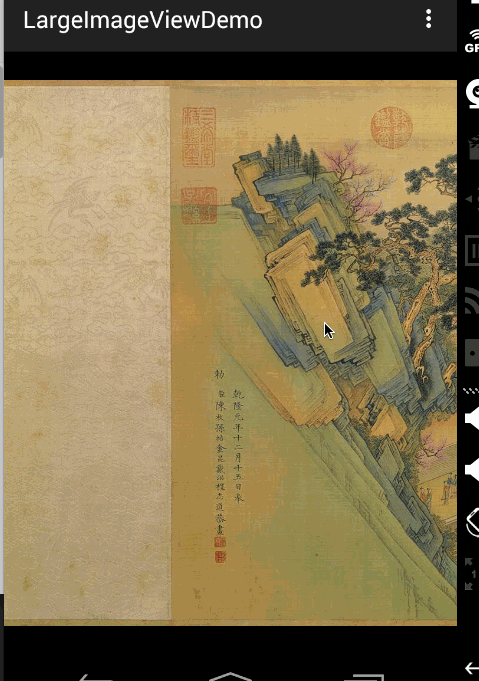
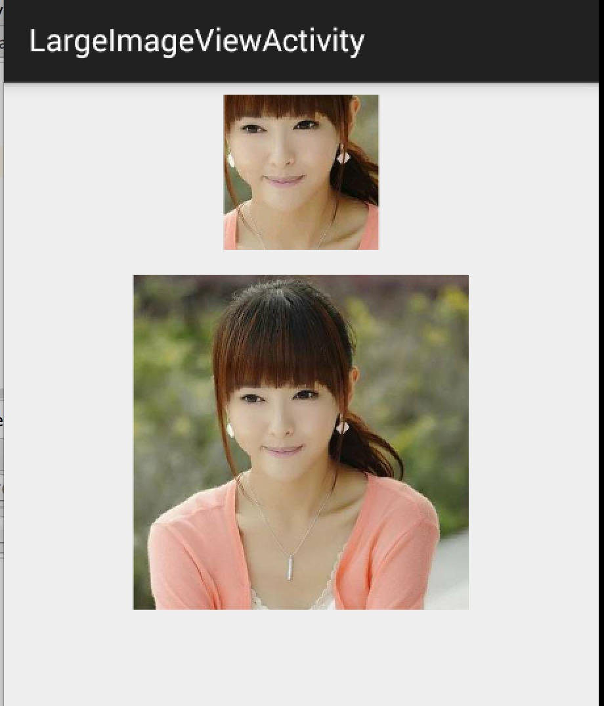
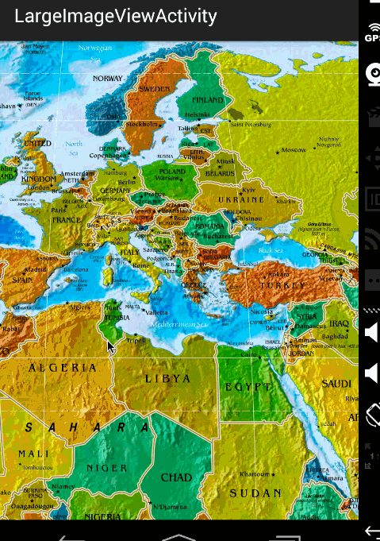

# Android 高清加载巨图方案 拒绝压缩图片

来源:[CSDN](http://blog.csdn.net/lmj623565791/article/details/49300989)

## 一、概述

距离上一篇博客有段时间没更新了，主要是最近有些私事导致的，那么就先来一篇简单一点的博客脉动回来。

对于加载图片，大家都不陌生，一般为了尽可能避免OOM都会按照如下做法：

* 对于图片显示：根据需要显示图片控件的大小对图片进行压缩显示。
* 如果图片数量非常多：则会使用LruCache等缓存机制，将所有图片占据的内容维持在一个范围内。

其实对于图片加载还有种情况，就是单个图片非常巨大，并且还不允许压缩。比如显示：世界地图、清明上河图、微博长图等。

那么对于这种需求，该如何做呢？

首先不压缩，按照原图尺寸加载，那么屏幕肯定是不够大的，并且考虑到内存的情况，不可能一次性整图加载到内存中，所以肯定是局部加载，那么就需要用到一个类：

* `BitmapRegionDecoder`

其次，既然屏幕显示不完，那么最起码要添加一个上下左右拖动的手势，让用户可以拖动查看。

那么综上，本篇博文的目的就是去自定义一个显示巨图的View，支持用户去拖动查看，大概的效果图如下：



好吧，这清明上河图太长了，想要观看全图，文末下载，图片在assets目录。当然如果你的图，高度也很大，肯定也是可以上下拖动的。

## 二、初识BitmapRegionDecoder

`BitmapRegionDecoder`主要用于显示图片的某一块矩形区域，如果你需要显示某个图片的指定区域，那么这个类非常合适。

对于该类的用法，非常简单，既然是显示图片的某一块区域，那么至少只需要一个方法去设置图片；一个方法传入显示的区域即可；详见：

`BitmapRegionDecoder`提供了一系列的`newInstance`方法来构造对象，支持传入文件路径，文件描述符，文件的inputstrem等。

例如：

```
BitmapRegionDecoder bitmapRegionDecoder =
		BitmapRegionDecoder.newInstance(inputStream, false);
```

上述解决了传入我们需要处理的图片，那么接下来就是显示指定的区域。

```
bitmapRegionDecoder.decodeRegion(rect, options);
```

参数一很明显是一个rect，参数二是`BitmapFactory.Options`，你可以控制图片的`inSampleSize`,`inPreferredConfig`等。

那么下面看一个超级简单的例子：

```
package com.zhy.blogcodes.largeImage;

import android.graphics.Bitmap;
import android.graphics.BitmapFactory;
import android.graphics.BitmapRegionDecoder;
import android.graphics.Rect;
import android.os.Bundle;
import android.support.v7.app.AppCompatActivity;
import android.widget.ImageView;

import com.zhy.blogcodes.R;

import java.io.IOException;
import java.io.InputStream;

public class LargeImageViewActivity extends AppCompatActivity{

    private ImageView mImageView;

    @Override
    protected void onCreate(Bundle savedInstanceState){
        super.onCreate(savedInstanceState);
        setContentView(R.layout.activity_large_image_view);

        mImageView = (ImageView) findViewById(R.id.id_imageview);
        try{
            InputStream inputStream = getAssets().open("tangyan.jpg");

            //获得图片的宽、高
            BitmapFactory.Options tmpOptions = new BitmapFactory.Options();
            tmpOptions.inJustDecodeBounds = true;
            BitmapFactory.decodeStream(inputStream, null, tmpOptions);
            int width = tmpOptions.outWidth;
            int height = tmpOptions.outHeight;

            //设置显示图片的中心区域
            BitmapRegionDecoder bitmapRegionDecoder = BitmapRegionDecoder
            						.newInstance(inputStream, false);
            						
            BitmapFactory.Options options = new BitmapFactory.Options();
            options.inPreferredConfig = Bitmap.Config.RGB_565;
            Bitmap bitmap = bitmapRegionDecoder.decodeRegion(
            		new Rect(width / 2 - 100, height / 2 - 100,
            				 width / 2 + 100, height / 2 + 100), options);
            mImageView.setImageBitmap(bitmap);

        } catch (IOException e){
            e.printStackTrace();
        }
    }
}
```

上述代码，就是使用·BitmapRegionDecoder·去加载assets中的图片，调用·bitmapRegionDecoder.decodeRegion·解析图片的中间矩形区域，返回bitmap，最终显示在ImageView上。

效果图：



上面的小图显示的即为下面的大图的中间区域。

ok，那么目前我们已经了解了`BitmapRegionDecoder`的基本用户，那么往外扩散，我们需要自定义一个控件去显示巨图就很简单了，首先Rect的范围就是我们View的大小，然后根据用户的移动手势，不断去更新我们的Rect的参数即可。

## 自定义显示大图控件

根据上面的分析呢，我们这个自定义控件思路就非常清晰了：

* 提供一个设置图片的入口
* 重写`onTouchEvent`，在里面根据用户移动的手势，去更新显示区域的参数
* 每次更新区域参数后，调用`invalidate`，`onDraw`里面去`regionDecoder.decodeRegion`拿到bitmap，去draw

理清了，发现so easy，下面上代码：

```
package com.zhy.blogcodes.largeImage.view;

import android.content.Context;
import android.graphics.Bitmap;
import android.graphics.BitmapFactory;
import android.graphics.BitmapRegionDecoder;
import android.graphics.Canvas;
import android.graphics.Rect;
import android.util.AttributeSet;
import android.view.MotionEvent;
import android.view.View;

import java.io.IOException;
import java.io.InputStream;

/**
 * Created by zhy on 15/5/16.
 */
public class LargeImageView extends View {
    private BitmapRegionDecoder mDecoder;
    /**
     * 图片的宽度和高度
     */
    private int mImageWidth, mImageHeight;
    /**
     * 绘制的区域
     */
    private volatile Rect mRect = new Rect();

    private MoveGestureDetector mDetector;


    private static final BitmapFactory.Options options = new BitmapFactory.Options();

    static {
        options.inPreferredConfig = Bitmap.Config.RGB_565;
    }

    public void setInputStream(InputStream is) {
        try {
            mDecoder = BitmapRegionDecoder.newInstance(is, false);
            BitmapFactory.Options tmpOptions = new BitmapFactory.Options();
            // Grab the bounds for the scene dimensions
            tmpOptions.inJustDecodeBounds = true;
            BitmapFactory.decodeStream(is, null, tmpOptions);
            mImageWidth = tmpOptions.outWidth;
            mImageHeight = tmpOptions.outHeight;

            requestLayout();
            invalidate();
        } catch (IOException e) {
            e.printStackTrace();
        } finally {

            try {
                if (is != null) is.close();
            } catch (Exception e) {
            }
        }
    }


    public void init() {
        mDetector = new MoveGestureDetector(getContext(), 
                new MoveGestureDetector.SimpleMoveGestureDetector() {
            @Override
            public boolean onMove(MoveGestureDetector detector) {
                int moveX = (int) detector.getMoveX();
                int moveY = (int) detector.getMoveY();

                if (mImageWidth > getWidth()) {
                    mRect.offset(-moveX, 0);
                    checkWidth();
                    invalidate();
                }
                if (mImageHeight > getHeight()) {
                    mRect.offset(0, -moveY);
                    checkHeight();
                    invalidate();
                }

                return true;
            }
        });
    }
    
    private void checkWidth() {

        Rect rect = mRect;
        int imageWidth = mImageWidth;
        int imageHeight = mImageHeight;

        if (rect.right > imageWidth) {
            rect.right = imageWidth;
            rect.left = imageWidth - getWidth();
        }

        if (rect.left < 0) {
            rect.left = 0;
            rect.right = getWidth();
        }
    }


    private void checkHeight() {

        Rect rect = mRect;
        int imageWidth = mImageWidth;
        int imageHeight = mImageHeight;

        if (rect.bottom > imageHeight) {
            rect.bottom = imageHeight;
            rect.top = imageHeight - getHeight();
        }

        if (rect.top < 0) {
            rect.top = 0;
            rect.bottom = getHeight();
        }
    }


    public LargeImageView(Context context, AttributeSet attrs) {
        super(context, attrs);
        init();
    }

    @Override
    public boolean onTouchEvent(MotionEvent event) {
        mDetector.onToucEvent(event);
        return true;
    }

    @Override
    protected void onDraw(Canvas canvas) {
        Bitmap bm = mDecoder.decodeRegion(mRect, options);
        canvas.drawBitmap(bm, 0, 0, null);
    }

    @Override
    protected void onMeasure(int widthMeasureSpec, int heightMeasureSpec) {
        super.onMeasure(widthMeasureSpec, heightMeasureSpec);

        int width = getMeasuredWidth();
        int height = getMeasuredHeight();

        int imageWidth = mImageWidth;
        int imageHeight = mImageHeight;

        //默认直接显示图片的中心区域，可以自己去调节
        mRect.left = imageWidth / 2 - width / 2;
        mRect.top = imageHeight / 2 - height / 2;
        mRect.right = mRect.left + width;
        mRect.bottom = mRect.top + height;

    }
}
```

根据上述源码:

* setInputStream里面去获得图片的真实的宽度和高度，以及初始化我们的mDecoder
* onMeasure里面为我们的显示区域的rect赋值，大小为view的尺寸
* onTouchEvent里面我们监听move的手势，在监听的回调里面去改变rect的参数，以及做边界检查，最后invalidate
* 在onDraw里面就是根据rect拿到bitmap，然后draw了

ok，上面并不复杂，不过大家有没有注意到，这个监听用户move手势的代码写的有点奇怪，恩，这里模仿了系统的`ScaleGestureDetector`，编写了`MoveGestureDetector`，代码如下：

* MoveGestureDetector

```

package com.zhy.blogcodes.largeImage.view;

import android.content.Context;
import android.graphics.PointF;
import android.view.MotionEvent;

public class MoveGestureDetector extends BaseGestureDetector {

    private PointF mCurrentPointer;
    private PointF mPrePointer;
    //仅仅为了减少创建内存
    private PointF mDeltaPointer = new PointF();

    //用于记录最终结果，并返回
    private PointF mExtenalPointer = new PointF();

    private OnMoveGestureListener mListenter;


    public MoveGestureDetector(Context context, OnMoveGestureListener listener) {
        super(context);
        mListenter = listener;
    }

    @Override
    protected void handleInProgressEvent(MotionEvent event) {
        int actionCode = event.getAction() & MotionEvent.ACTION_MASK;
        switch (actionCode) {
            case MotionEvent.ACTION_CANCEL:
            case MotionEvent.ACTION_UP:
                mListenter.onMoveEnd(this);
                resetState();
                break;
            case MotionEvent.ACTION_MOVE:
                updateStateByEvent(event);
                boolean update = mListenter.onMove(this);
                if (update) {
                    mPreMotionEvent.recycle();
                    mPreMotionEvent = MotionEvent.obtain(event);
                }
                break;

        }
    }

    @Override
    protected void handleStartProgressEvent(MotionEvent event) {
        int actionCode = event.getAction() & MotionEvent.ACTION_MASK;
        switch (actionCode) {
            case MotionEvent.ACTION_DOWN:
                resetState();//防止没有接收到CANCEL or UP ,保险起见
                mPreMotionEvent = MotionEvent.obtain(event);
                updateStateByEvent(event);
                break;
            case MotionEvent.ACTION_MOVE:
                mGestureInProgress = mListenter.onMoveBegin(this);
                break;
        }

    }

    protected void updateStateByEvent(MotionEvent event) {
        final MotionEvent prev = mPreMotionEvent;

        mPrePointer = caculateFocalPointer(prev);
        mCurrentPointer = caculateFocalPointer(event);

        //Log.e("TAG", mPrePointer.toString() + " ,  " + mCurrentPointer);

        boolean mSkipThisMoveEvent = prev.getPointerCount() != event.getPointerCount();

        //Log.e("TAG", "mSkipThisMoveEvent = " + mSkipThisMoveEvent);
        mExtenalPointer.x = mSkipThisMoveEvent ? 0 : mCurrentPointer.x - mPrePointer.x;
        mExtenalPointer.y = mSkipThisMoveEvent ? 0 : mCurrentPointer.y - mPrePointer.y;

    }

    /**
     * 根据event计算多指中心点
     *
     * @param event
     * @return
     */
    private PointF caculateFocalPointer(MotionEvent event) {
        final int count = event.getPointerCount();
        float x = 0, y = 0;
        for (int i = 0; i < count; i++) {
            x += event.getX(i);
            y += event.getY(i);
        }

        x /= count;
        y /= count;

        return new PointF(x, y);
    }


    public float getMoveX() {
        return mExtenalPointer.x;

    }

    public float getMoveY() {
        return mExtenalPointer.y;
    }


    public interface OnMoveGestureListener {
        public boolean onMoveBegin(MoveGestureDetector detector);

        public boolean onMove(MoveGestureDetector detector);

        public void onMoveEnd(MoveGestureDetector detector);
    }

    public static class SimpleMoveGestureDetector implements OnMoveGestureListener {

        @Override
        public boolean onMoveBegin(MoveGestureDetector detector) {
            return true;
        }

        @Override
        public boolean onMove(MoveGestureDetector detector) {
            return false;
        }

        @Override
        public void onMoveEnd(MoveGestureDetector detector) {
        }
    }

}
```

* BaseGestureDetector

```
package com.zhy.blogcodes.largeImage.view;

import android.content.Context;
import android.view.MotionEvent;


public abstract class BaseGestureDetector {

    protected boolean mGestureInProgress;

    protected MotionEvent mPreMotionEvent;
    protected MotionEvent mCurrentMotionEvent;

    protected Context mContext;

    public BaseGestureDetector(Context context) {
        mContext = context;
    }


    public boolean onToucEvent(MotionEvent event) {

        if (!mGestureInProgress) {
            handleStartProgressEvent(event);
        } else {
            handleInProgressEvent(event);
        }

        return true;

    }

    protected abstract void handleInProgressEvent(MotionEvent event);

    protected abstract void handleStartProgressEvent(MotionEvent event);

    protected abstract void updateStateByEvent(MotionEvent event);

    protected void resetState() {
        if (mPreMotionEvent != null) {
            mPreMotionEvent.recycle();
            mPreMotionEvent = null;
        }
        if (mCurrentMotionEvent != null) {
            mCurrentMotionEvent.recycle();
            mCurrentMotionEvent = null;
        }
        mGestureInProgress = false;
    }
}
```

你可能会说，一个move手势搞这么多代码，太麻烦了。的确是的，move手势的检测非常简单，那么之所以这么写呢，主要是为了可以复用，比如现在有一堆的`XXXGestureDetector`，当我们需要监听什么手势，就直接拿个detector来检测多方便。我相信大家肯定也郁闷过Google，为什么只有`ScaleGestureDetector`而没有`RotateGestureDetector`呢。

根据上述，大家应该理解了为什么要这么做，当时不强制，每个人都有个性。

[android-gesture-detectors]:https://github.com/rharter/android-gesture-detectors

[android-gesture-detectors-VibzzhArJXg]:http://code.almeros.com/android-multitouch-gesture-detectors#.VibzzhArJXg

> 不过值得一提的是：上面这个手势检测的写法，不是我想的，而是一个开源的项目[https://github.com/rharter/android-gesture-detectors][android-gesture-detectors]，里面包含很多的手势检测。对应的博文是：[http://code.almeros.com/android-multitouch-gesture-detectors#.VibzzhArJXg][android-gesture-detectors-VibzzhArJXg]那面上面两个类就是我偷学了的~ 哈

## 四、测试

测试其实没撒好说的了，就是把我们的LargeImageView放入布局文件，然后Activity里面去设置inputstream了。

```
<RelativeLayout xmlns:android="http://schemas.android.com/apk/res/android"
                xmlns:tools="http://schemas.android.com/tools"
                android:layout_width="match_parent"
                android:layout_height="match_parent">


    <com.zhy.blogcodes.largeImage.view.LargeImageView
        android:id="@+id/id_largetImageview"
        android:layout_width="match_parent"
        android:layout_height="match_parent"/>

</RelativeLayout>
```

然后在Activity里面去设置图片：

```
package com.zhy.blogcodes.largeImage;

import android.os.Bundle;
import android.support.v7.app.AppCompatActivity;

import com.zhy.blogcodes.R;
import com.zhy.blogcodes.largeImage.view.LargeImageView;

import java.io.IOException;
import java.io.InputStream;

public class LargeImageViewActivity extends AppCompatActivity{
    private LargeImageView mLargeImageView;

    @Override
    protected void onCreate(Bundle savedInstanceState){
        super.onCreate(savedInstanceState);
        setContentView(R.layout.activity_large_image_view);

        mLargeImageView = (LargeImageView) findViewById(R.id.id_largetImageview);
        try{
            InputStream inputStream = getAssets().open("world.jpg");
            mLargeImageView.setInputStream(inputStream);

        } catch (IOException e){
            e.printStackTrace();
        }
    }
}
```

效果图：



ok，那么到此，显示巨图的方案以及详细的代码就描述完成了，总体还是非常简单的。 
但是，在实际的项目中，可能会有更多的需求，比如增加放大、缩小；增加快滑手势等等，那么大家可以去参考这个库：[https://github.com/johnnylambada/WorldMap](https://github.com/johnnylambada/WorldMap)，该库基本实现了绝大多数的需求，大家根据本文这个思路再去看这个库，也会简单很多，定制起来也容易。我这个地图的图就是该库里面提供的。

哈，掌握了这个，以后面试过程中也可以悄悄的装一把了，当你优雅的答完android加载图片的方案以后，然后接一句，其实还有一种情况，就是高清显示巨图，那么我们应该…相信面试官对你的印象会好很多~ have a nice day ~

[源码点击下载](https://github.com/hongyangAndroid/Android_Blog_Demos)