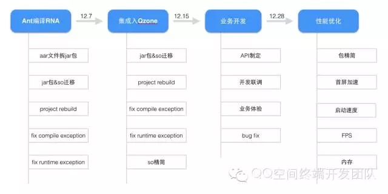
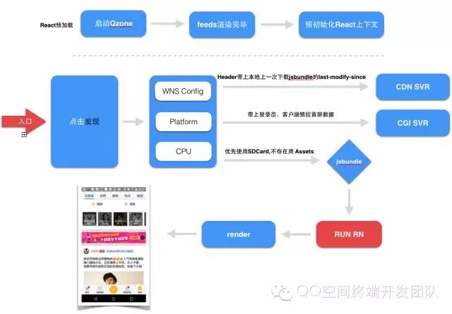
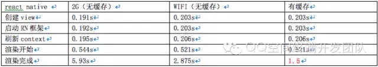
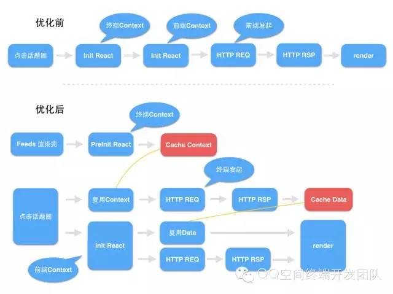
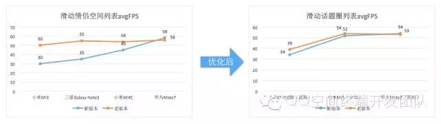
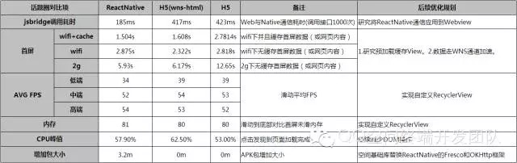

# ReactNative For Android 项目实战总结

来源:[QQ空间技术分享团队](http://mp.weixin.qq.com/s?__biz=MzI1MTA1MzM2Nw==&mid=401483604&idx=1&sn=399cdf7e13fe6125108de1bfd045f2cf&scene=23&srcid=0201U8NzoCuZREbSsv04jNRr#rd)

Android Qzone 6.1版本在情侣空间涉水React Native，以动态插件方式将情侣空间进行React Natived的改造。在情侣空间基础上，Android Qzone 6.2版本以融合的方式将话题圈进行React Native改造。本文主要讲述话题圈的开发改造流程，相关数据对比及性能优化，本次改造ReactNative基于15Release。

## 一、Android侧项目整体开发流程

## 二、ReactNative改造后话题圈整体流程

## 三、ReactNative性能优化之路

本次版本开发周期较赶，加上视频组件本身相对复杂，融入ReactNative耗时较多，部分优化规划在二期实施。

### 1、包精简
* 版本对比：
   * 情侣独立插件:7.2m。
   * 话题圈:本次ReactNative框架移植入Qzone整体仅加大了3.2m。
* 主要优化点：
   * 去除了小平台so库。
   * 复用Qzone support jar。
* 二期规划：
   * 在Qzone与ReactNative中间加Adapter，使ReactNative适配Qzone本身网络库及图片库，可以废弃ReactNative框架的okhttp库及fresco库，减少包大小。

### 2、首屏加速与启动速度
* 版本对比：

ReactNative改造后话题圈在wifi及缓存优化下，首屏相比H5快约 108ms，并且由于jsbundle缓存到本地，并且可以实现离线访问。

ReactNative话题圈数据:  

主要优化点：

* 更改源码，新增预初始化接口，在Qzone Feeds渲染完成预加载ReactNative上下文。
* 首屏数据需要等前端走网络请求拉取存本地，H5优先采用本地数据渲染。

优化前后流程对比：

* 二期规划：
   * 1.目前为控制内存预加载ReactNative仅是上下文，打开仍有一部分耗时，这里可以尝试缓存View，在打开时直接addview，达到秒开。
   * 2.数据预拉取走的为http通道，可以使用wns httpproxy加速。

### 3、FPS

* 版本对比：
   * H5话题圈:avgFPS=54
   * ReactNative话题圈:avgFPS=52
* 主要优化点：
   * JS层使Listview控件渲染数据，废弃使用ScrollView控件。
   * DOM元素设置透明背景。
* 二期规划：
   * 目前官方暂提供的listview未采用item复用逻辑，仅在item不可见时置空，RecyclerView仍是Test控件只支持横向滚动。listview性能仍需提高，下版本规划实现高可用RecyclerView。
   

### 4、内存
* 版本对比：
   * 情侣空间：无内存泄漏及浪费内存情况，比H5版本多约20%。
   * 话题圈：无内存泄漏及浪费内存情况，与H5版本基本持平。

话题圈详细数据:

* 主要优化点：
   * 1.JS层使Listview控件渲染数据，废弃使用ScrollView控件。
   * 2.视频VideoView拆分，VideoCover交由H5实现，Native对应Fresco管理，MideaPlayer由Native实现。
* 二期规划：
   * 目前官方暂提供的listview未采用item复用逻辑，仅在item不可见时置空，RecyclerView仍是Test控件只支持横向滚动。listview性能仍需提高，下版本规划实现高可用RecyclerView。

## 四、ReactNative话题圈与H5话题圈整体数据对比
目前ReactNative在Web与Native通信耗时明显优于webview的jsbridge方式(console.log)，在高中端机上如FPS及CPU上表现优于H5，但是从全局来看，目前crash，内存，FPS，首屏等均有优化空间，下面是整体对比数据。   

## 五、写在最后

React Native因你参与会更精彩，希望2016年能将更多的开发者加入React Native阵营，让更多的业务都是 Ｗeb的版本节奏，Native的流畅顺滑。

