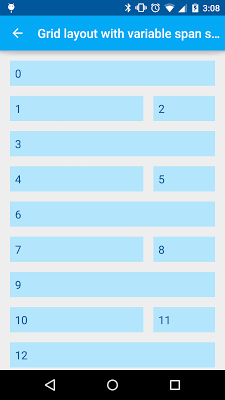

# RecyclerView:实现带header的grid

来源:[open-open.com](http://www.open-open.com/lib/view/open1437662138631.html)

原文:[RecyclerView: Grid with header ](http://blog.sqisland.com/2014/12/recyclerview-grid-with-header.html)

GridView和ListView有许多的相似之处，不过也有一个显著的不同：没有header和footer。现在它们两者都可以用RecyclerView实现，我想看看如何在grid上添加header。

## GridLayoutManager

我用GridLayoutManager创建了一个spanCount为2的RecylcerView。

注：spanCount即列数。这里GridLayoutManager的第二个参数就是spanCount。

```
RecyclerView recyclerView = (RecyclerView) findViewById(
    R.id.recycler_view);
recyclerView.addItemDecoration(new MarginDecoration(this));
recyclerView.setHasFixedSize(true);
recyclerView.setLayoutManager(new GridLayoutManager(this, 2));
recyclerView.setAdapter(new NumberedAdapter(30));
```

[NumberedAdapter](https://github.com/chiuki/android-recyclerview/blob/master/app/src/main/java/com/sqisland/android/recyclerview/NumberedAdapter.java) 以字符串的形式显示了每个item的position，在点击的时候显示一个toast。


[GridLayoutActivity.java](https://github.com/chiuki/android-recyclerview/blob/master/app/src/main/java/com/sqisland/android/recyclerview/GridLayoutActivity.java)

## 可变的span size

在上面的基本设置中，我们的spanCount为2，每个item的span size为1，因此一个header需要的span size则为2。在我尝试着添加header之前，我想先看看如何设置 span size。其实很简单。

注：span size表示一个item的跨度，跨度了多少个span。

```
GridLayoutManager manager = new GridLayoutManager(this, 3);
manager.setSpanSizeLookup(new GridLayoutManager.SpanSizeLookup() {
  @Override
  public int getSpanSize(int position) {
    return (3 - position % 3);
  }
});
recyclerView.setLayoutManager(manager);
```

setSpanSizeLookup可以让你根据position来设置 span size，上面代码中的公式所得到的 span size依次是3, 2, 1, 3, 2, 1...



[GridLayoutVariableSpanSizeActivity.java](https://github.com/chiuki/android-recyclerview/blob/master/app/src/main/java/com/sqisland/android/recyclerview/GridLayoutVariableSpanSizeActivity.java)

## 头部（header）
现在让我们来添加一个header！我们需要一个提供两种view类型的adapter，一个为header一个为普通的item。可以看看[HeaderNumberedAdapter](https://github.com/chiuki/android-recyclerview/blob/master/app/src/main/java/com/sqisland/android/recyclerview/HeaderNumberedAdapter.java)，它在构造函数中把一个view作为header，然后把它存在一个成员变量中。

```
package com.sqisland.android.recyclerview;
 
import android.support.v7.widget.RecyclerView;
import android.view.LayoutInflater;
import android.view.View;
import android.view.ViewGroup;
import android.widget.Toast;
 
import java.util.ArrayList;
import java.util.List;
 
public class HeaderNumberedAdapter extends RecyclerView.Adapter<TextViewHolder> {
  private static final int ITEM_VIEW_TYPE_HEADER = 0;
  private static final int ITEM_VIEW_TYPE_ITEM = 1;
 
  private final View header;
  private final List<String> labels;
 
  public HeaderNumberedAdapter(View header, int count) {
    if (header == null) {
      throw new IllegalArgumentException("header may not be null");
    }
    this.header = header;
    this.labels = new ArrayList<String>(count);
    for (int i = 0; i < count; ++i) {
      labels.add(String.valueOf(i));
    }
  }
 
  public boolean isHeader(int position) {
    return position == 0;
  }
 
  @Override
  public TextViewHolder onCreateViewHolder(ViewGroup parent, int viewType) {
    if (viewType == ITEM_VIEW_TYPE_HEADER) {
      return new TextViewHolder(header);
    }
    View view = LayoutInflater.from(parent.getContext()).inflate(R.layout.item, parent, false);
    return new TextViewHolder(view);
  }
 
  @Override
  public void onBindViewHolder(final TextViewHolder holder, final int position) {
    if (isHeader(position)) {
      return;
    }
    final String label = labels.get(position - 1);  // Subtract 1 for header
    holder.textView.setText(label);
    holder.textView.setOnClickListener(new View.OnClickListener() {
      @Override
      public void onClick(View v) {
        Toast.makeText(
            holder.textView.getContext(), label, Toast.LENGTH_SHORT).show();
      }
    });
  }
 
  @Override
  public int getItemViewType(int position) {
    return isHeader(position) ? ITEM_VIEW_TYPE_HEADER : ITEM_VIEW_TYPE_ITEM;
  }
 
  @Override
  public int getItemCount() {
    return labels.size() + 1;
  }
}
```

其中TextViewHolder的代码为：

```
package com.sqisland.android.recyclerview;
 
import android.support.v7.widget.RecyclerView;
import android.view.View;
import android.widget.TextView;
 
public class TextViewHolder extends RecyclerView.ViewHolder {
  public TextView textView;
  public TextViewHolder(View itemView) {
    super(itemView);
    textView = (TextView) itemView.findViewById(R.id.text);
  }
}
```

在RecyclerView新建一个view的时候，如果处于header的位置，我们用view holder来封装这个header。onBindViewHolder中不必对header做任何事情，因为它的逻辑是在activity中处理的。


回到activity。我们需要用一个header来初始化[HeaderNumberedAdapter](https://github.com/chiuki/android-recyclerview/blob/master/app/src/main/java/com/sqisland/android/recyclerview/HeaderNumberedAdapter.java)，同时重写setSpanSizeLookup，让header横跨所有列。

```
final GridLayoutManager manager = new GridLayoutManager(this, 2);
recyclerView.setLayoutManager(manager);
 
View header = LayoutInflater.from(this).inflate(
    R.layout.header, recyclerView, false);
header.setOnClickListener(new View.OnClickListener() {
  @Override
  public void onClick(View v) {
    Toast.makeText(v.getContext(), R.string.grid_layout_header, 
        Toast.LENGTH_SHORT).show();
  }
});
final HeaderNumberedAdapter adapter 
    = new HeaderNumberedAdapter(header, 30);
recyclerView.setAdapter(adapter);
 
manager.setSpanSizeLookup(new GridLayoutManager.SpanSizeLookup() {
  @Override
  public int getSpanSize(int position) {
    return adapter.isHeader(position) ? manager.getSpanCount() : 1;
  }
});
```

我们inflate header，定义它的点击事件，使用它去构造adapter。然后再setSpanSizeLookup中，我们在header所处的位置返回和span count （列数）相等的 span size。


## 总结

为了用RecyclerView创建一个带header的grid：

* 1、 定义一个具有两种view类型的adapter，一个为header一个为普通item。
* 2、 inflate一个header，把它传递给adapter。
* 3、 重写GridLayoutManager中的setSpanSizeLookup，在header所处的位置返回和span count （列数）相等的 span size。

源码: [https://github.com/chiuki/android-recyclerview](https://github.com/chiuki/android-recyclerview)

ps：在我的g＋上有人评论说如果你不需要RecyclerView的功能，比如animation，reordering，staggering等，你也可以从AOSP中拷贝[HeaderGridView.java](http://grepcode.com/file/repository.grepcode.com/java/ext/com.google.android/android-apps/5.0.0_r1/com/android/photos/views/HeaderGridView.java)。 

来自：http://www.jcodecraeer.com/a/anzhuokaifa/androidkaifa/2015/0722/3214.html
