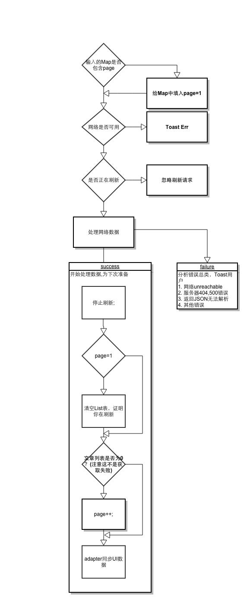

# RecyclerView 实现下拉刷新和自动加载

来源:[简书](http://www.jianshu.com/p/4feb0c16d1b5)

> RecyclerView是 Android 兼容包V21中新推出的列表类，它的自定义化强的优点足以让它能够取代GridView和ListView，本文将结合SwipeRefreshLayout与RecyclerView讲解如何实现下拉刷新和自动加载的代码

## 需要的依赖

以下版本自行更新

```
compile 'com.android.support:appcompat-v7:21.0.0'
compile 'com.android.support:recyclerview-v7:21.0.0'
compile 'com.android.support:cardview-v7:21.0.0'
compile 'com.android.support:support-v4:21.0.0'
```

## 需要解决的问题

* 下拉刷新
* 自动加载
* 网络请求异步加载

## 技术处理
### 下拉刷新

采用`android.support.v4.widget.SwipeRefreshLayout`来实现

具体可以搜索这个class，我们按照官方文档，布局如下

```
<view xmlns:android="http://schemas.android.com/apk/res/android"
android:id="@+id/swipeRefreshLayout"
class="android.support.v4.widget.SwipeRefreshLayout"
android:layout_width="match_parent"
android:layout_height="match_parent">

    <view xmlns:android="http://schemas.android.com/apk/res/android"
        android:id="@+id/recylerView"
        class="android.support.v7.widget.RecyclerView"
        android:layout_width="wrap_content"
        android:layout_height="wrap_content"></view>
</view>
```

然后对`swipeRefreshLayout`设置监听即可

```
swipeRefreshLayout.setOnRefreshListener(new SwipeRefreshLayout.OnRefreshListener() {
        @Override
        public void onRefresh() {
            if(isrefreshing){
                Log.d(TAG,"ignore manually update!")；
            } else{
                 loadPage();
            }
        }
    });
```

### 自动加载

RecyclerView是一个新兴事物，伸手党们还找不到`endless-RecyclerView`这样的开源神器，只好自己找方法了，同ListView一样，还是重写`OnScrollListener`这个方法

```
recyclerView.setOnScrollListener(new RecyclerView.OnScrollListener() {
            @Override
            public void onScrolled(RecyclerView recyclerView, int dx, int dy) {
                super.onScrolled(recyclerView, dx, dy);
                int lastVisibleItem = ((LinearLayoutManager) mLayoutManager).findLastVisibleItemPosition();
                int totalItemCount = mLayoutManager.getItemCount();
                //lastVisibleItem >= totalItemCount - 4 表示剩下4个item自动加载，各位自由选择
                // dy>0 表示向下滑动
                if (lastVisibleItem >= totalItemCount - 4 && dy > 0) {
                    if(isLoadingMore){
                         Log.d(TAG,"ignore manually update!");
                    } else{
                         loadPage();//这里多线程也要手动控制isLoadingMore
                        isLoadingMore = false;
                    }
                }
            }
        });
```

如果想用GridView，可以试试这个，注意例子里的span_count =2

```
@Override
public void onScrolled(RecyclerView recyclerView, int dx, int dy) {
	super.onScrolled(recyclerView, dx, dy);
	
	int[] visibleItems = mLayoutManager.findLastVisibleItemPositions(null);
	int lastitem = Math.max(visibleItems[0],visibleItems[1]);
	
	Log.d(TAG,"visibleItems =" + visibleItems);
	Log.d(TAG,"lastitem =" + lastitem);
	Log.d(TAG,"adapter.getItemCount() =" + adapter.getItemCount());
	
	if (dy > 0 && lastitem > adapter.getItemCount() - 5 && !isLoadingMore) {
		Log.d(TAG,"will loadNewFeeds");
	}
}
```

### 网络请求异步加载
我这里的 loadPage 是基于[Retrofit](http://www.jianshu.com/p/87c36d8dabce)构建的，输入参数是一个Map,它的回调功能非常实用,可以直接控制UI更新,流程图如下,大家可以参考一下设计



## 参考文献
* [俄国佬代码](http://habrahabr.ru/company/surfingbird/blog/244387/)
* [ListView祖传代码](https://github.com/baoyongzhang/android-PullRefreshLayout)


## 纠正

`int totalItemCount = mLayoutManager.getItemCount();`这样的取法是有误的，返回的是第一次加载的固定值。应该从`adater.getItemCount()`取才对。


