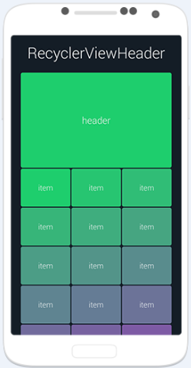

# 超快和轻松为RecyclerView添加头部：RecyclerViewHeader

来源:[open-open.com](http://www.open-open.com/lib/view/open1434422599926.html)

超快和简便地方式为Android RecyclerView添加头部。调用简单的代码就可以为LinearLayoutManager，GridLayoutManager ，StaggeredGridLayoutManager布局的RecyclerView添加header。

运行效果：



## 使用说明：

有两种使用RecyclerViewHeader的方法：

### 普通方法

(使用起来非常简单，但是它会添加额外的布局，因此效率略低于第二种方法):

为header创建一个xml布局（可以包括任意view或者ViewGroup）

```
<FrameLayout
    android:layout_width="match_parent"
    android:layout_height="100dp">
 
    <TextView
        android:layout_width="wrap_content"
        android:layout_height="wrap_content"
        android:layout_gravity="center"
        android:text="header"/>
 
</FrameLayout>
```

使用静态初始方法从xml中创建RecyclerViewHeader

```
RecyclerViewHeader header = RecyclerViewHeader.fromXml(context, R.layout.header);
```
将RecyclerViewHeader Attach 到RecyclerView，搞定！

```
RecyclerView recyclerView = (RecyclerView) findViewById(R.id.recycler_view);
// set LayoutManager for your RecyclerView
header.attachTo(recyclerView);
Header-already-aligned approach (不会引入任何额外布局):
```

### 将RecyclerViewHeader布局放在RecyclerView的上层

```
<FrameLayout
    android:layout_width="match_parent"
    android:layout_height="wrap_content">
 
    <android.support.v7.widget.RecyclerView
        android:id="@+id/recycler"
        android:layout_width="match_parent"
        android:layout_height="wrap_content"
        android:layout_gravity="center_horizontal|top" />
 
    <com.bartoszlipinski.recyclerviewheader.RecyclerViewHeader
        android:id="@+id/header"
        android:layout_width="match_parent"
        android:layout_height="100dp"
        android:layout_gravity="center_horizontal|top">
 
        <TextView
            android:layout_width="wrap_content"
            android:layout_height="wrap_content"
            android:layout_centerInParent="true"
            android:text="header"/>
 
    </com.bartoszlipinski.recyclerviewheader.RecyclerViewHeader>
 
</FrameLayout>
```

获得RecyclerViewHeader对象：

```
RecyclerViewHeader header = (RecyclerViewHeader) findViewById(R.id.header);
```

把RecyclerViewHeader赋予RecyclerView

```
RecyclerView recyclerView = (RecyclerView) findViewById(R.id.recycler_view);
// set LayoutManager for your RecyclerView
header.attachTo(recyclerView, true);
```

## 注意事项

* RecyclerViewHeader必须在RecyclerView设置了LayoutManager之后调用。
* 目前该库适用于LinearLayoutManager,GridLayoutManager和StaggeredGridLayoutManager布局的RecyclerViews。
* 只支持垂直布局LayoutManager
* 如果你打算在RecyclerView中使用setOnScrollListener(...)方法，确保在setOnScrollListener(...)的attachTo(...)方法之前使用。


## 导入项目

build.gradle

```
dependencies {
    compile 'com.bartoszlipinski.recyclerviewheader:library:1.2.0'
}
```

项目主页:[https://github.com/blipinsk/RecyclerViewHeader](https://github.com/blipinsk/RecyclerViewHeader)
