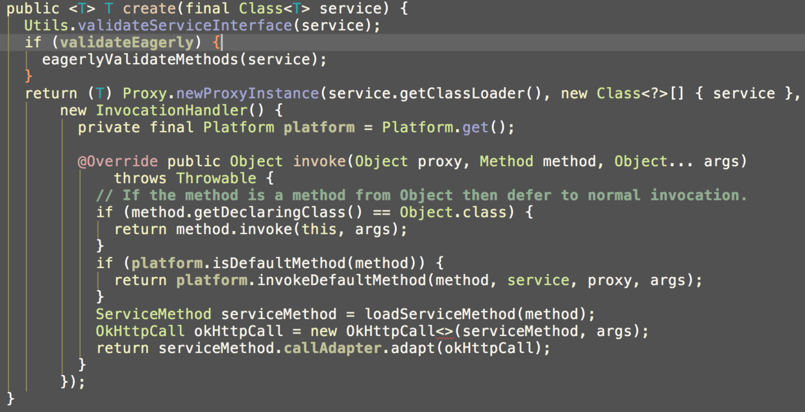
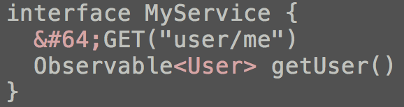
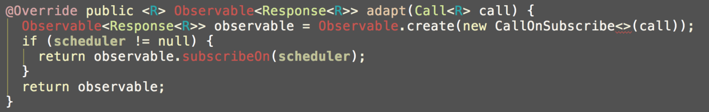

# Retrofit分析-漂亮的解耦套路

来源:[简书](http://www.jianshu.com/p/45cb536be2f4#rd)

> 没耐心自己分析源码的同学，还可以参考Stay录制的视频版[Retrofit分析-漂亮的解耦套路(视频版)](http://www.stay4it.com/course/22/info)

万万没想到Retrofit会这么火，在没看源码之前，我简单的认为是因为它跟OkHttp同出一源(Square)，所以才会炒的那么热。又或者是因为它能支持RxJava，所以火上浇油，一发不可收拾。

后来看过Retrofit源码之后，我才理解为什么它倍受关注，是因为它集诸优点于一身，并且炒鸡解耦。你能预见的特殊需求，都能非常容易的扩展。

## 没有HTTP框架的日子

我们先来看一下没有HTTP框架以前，我们是如何做请求的。

* 首先build request参数
* 因为不能在主线程请求HTTP，所以你得有个Executer或者线程
* enqueue后，通过线程去run你的请求
* 得到服务器数据后，callback回调给你的上层。

大概是以上4大步骤，在没有框架的年代，想要做一次请求，是万分痛苦的，你需要自己管理线程切换，需要自己解析读取数据，解析数据成对象，切换回主线程，回调给上层。

这段空白的时间持续了很久。从我10年工作起到12年，因为写烦了重复的代码，所以就得想办法，把那些变化的地方封装起来，也只是简单的封装。好在官方出了AsyncTask，虽然坑很多，但如果再自己维护一个队列，基本不会出现问题。更好的地方是数据格式从xml变成json了。gson解放了双手，再也不用解析dom了。

## 早些时期的HTTP框架

后来慢慢出了不少真正的HTTP框架。Stay也借鉴了很多文章，封装了一套适用于自身业务需求的框架。

这个时期的框架有个特点，就是拼了命去支持所有类型。比方说Volley支持直接返回Bitmap。xUtils不仅大而全，而且连多线程下载也要支持。在资源匮乏的时代，它们的存在有它们的道理。但如果说现在还用Volley做图片请求，还在用xUtils或Afinal里的各个模块。那就说不过去了。术业有专攻，百家争鸣的时期，难道不该选择最好的那一个吗？(Stay没真的用过xUtils和Afinal这种组合框架，潜意识告诉我，它们有毒，一旦某个环节出问题或者需要扩展，那代价就太大了)

## Retrofit

好吧，介绍完HTTP框架的发展，让我们单纯的说说Retrofit吧。

tips：本文以retrofit最新版本2.0.1为例，大家也可以去github下源码，找tag为'parent-2.0.1'就可以。目前代码变动比较大。2.0.1已经使用okhttp3了，而我项目中2.0.0-beta2还是okhttp2.5。

retrofit的最大特点就是解耦，要解耦就需要大量的设计模式，假如一点设计模式都不懂的人，可能很难看懂retrofit。

先来看一张Stay画的精简流程图(如有错误，请斧正)，类图就不画了。

Stay在一些设计模式很明确的地方做了标记。

外观模式，动态代理，策略模式，观察者模式。当然还有Builder模式，工厂等这些简单的我就没标。

先简述下流程吧：

* 1、通过门面Retrofit来build一个Service Interface的proxy

* 2、当你调用这个Service Interface中的某个请求方法，会被proxy拦截。

* 3、通过**ServiceMethod**来解析invoke的那个方法 ，通过**解析注解**，传参，将它们封装成我们所熟悉的request。然后通过具体的返回值类型，让之前配置的工厂生成具体的**CallAdapter，ResponseConverter**，这俩我们稍后再解释。
* 4、new一个OkHttpCall，这个OkHttpCall算是OkHttp的包装类，用它跟OkHttp对接，所有OkHttp需要的参数都可以看这个类。当然也还是可以扩展一个新的Call的，比如HttpUrlConnectionCall。但是有点耦合。看下图标注：

红框中显式的指明了OkHttpCall，而不是通过工厂来生成Call。所以如果你不想改源码，重新编译，那你就只能使用OkHttp了。不过这不碍事。(可能也是因为还在持续更新中，所以这块可能后面会改进的)

* 5、生成的CallAdapter有四个工厂，分别对应不同的平台，RxJava, Java8, Guava还有一个Retrofit默认的。这个CallAdapter不太好用中文解释。简单来说就是用来将Call转成T的一个策略。因为这里具体请求是耗时操作，所以你需要CallAdapter去管理线程。怎么管理，继续往下看。
* 6、比如RxJava会根据调用方法的返回值，如Response<'T> |Result<'T>|Observable<'T> ，生成不同的CallAdapter。实际上就是对RxJava的回调方式做封装。比如将response再拆解为success和error等。(这块还是需要在了解RxJava的基础上去理解，以后有时间可以再详细做分析)
* 7、在步骤5中，我们说CallAdapter还管理线程。比方说RxJava，我们知道，它最大的优点可以指定方法在什么线程下执行。如图

我们在子线程订阅(subscribeOn)，在主线程观察(observeOn)。具体它是如何做的呢。我们看下源码。

在adapt Call时，subscribeOn了，所以就切换到子线程中了。

* 8、在adapt Call中，具体的调用了Call execute()，execute()是同步的，enqueue()是异步的。因为RxJava已经切换了线程，所以这里用同步方法execute()。

* 9、接下来的具体请求，就是OkHttp的事情了，retrofit要做成的就是等待返回值。在步骤4中，我们说OkHttpCall是OkHttp的包装类，所以将OkHttp的response转换成我们要的T，也是在OkHttpCall中执行的。
* 10、当然具体的解析转换操作也不是OkHttpCall来做的，因为它也不知道数据格式是什么样的。所以它只是将response包装成retrofit标准下的response。
* 11、Converter->ResponseConverter，很明显，它是数据转换器。它将response转换成我们具体想要的T。Retrofit提供了很多converter factory。比如Gson，Jackson，xml，protobuff等等。你需要什么，就配置什么工厂。在Service方法上声明泛型具体类型就可以了。

* 12、最后，通过声明的observeOn线程回调给上层。这样上层就拿到了最终结果。至于结果再如何处理，那就是上层的事了。

再来回顾下Stay画的流程图：

这真是漫长的旅行，Stay也是debug一个个单步调试才梳理出来的流程。当然其中还有很多巧妙的解耦方式，我这里就不赘述了。大家可以看看源码分析下，当真是设计模式的经典示例。

我想现在大家应该对retrofit有所了解了。当你再给别人介绍retrofit的时候，就别只说它的注解方式多新颖，多炫技了。注解式框架有很多的，像j2ee中一大把。所以注解算不得多精湛的技艺。最牛逼的还是它的解耦方式，这个套路没有多年的实际架构经验是设计不出来的。

retrofit源码暂时分析到这里，如果大家想要听下文或者希望Stay录个视频带大家一步步解析，不妨关注我。

## 扩展阅读：

[OkHttp, Retrofit, Volley应该选择哪一个？](http://www.jianshu.com/p/77d418e7b5d6)

[Retrofit分析-谜之槽点](http://www.jianshu.com/p/96346ffb0c9f)

[这么多开源框架，该用哪个好？](http://www.jianshu.com/p/f3227c7008d4)

[Retrofit分析-漂亮的解耦套路(视频版)](http://www.stay4it.com/course/22/info)