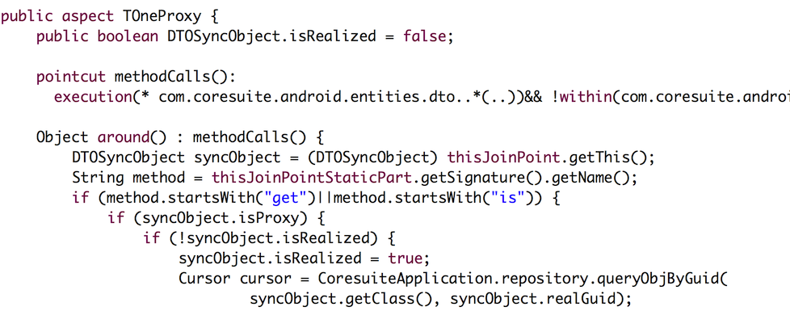

# Retrofit分析-经典设计模式案例

来源:[http://www.jianshu.com/p/fb8d21978e38](http://www.jianshu.com/p/fb8d21978e38)

> 如果你还不知道Retrofit，没关系，okhttp你总知道吧。retrofit就是对okhttp再做了一层封装。你只需要通过简单的配置就能顺利使用retrofit来做网络请求了。还没有使用过retrofit的小伙伴们，不妨尝尝鲜。
>
> 本篇是retrofit番外篇。只讲retrofit中的设计模式以及我个人的理解与延伸。如果你还没看过retrofit源码，不妨先看看这篇[Retrofit分析-漂亮的解耦套路](http://www.jianshu.com/p/45cb536be2f4)。

还是先上图：


以前用的volley, async-http-lib, xUtils。这些libs基本都是上图这个workflow。向服务器请求API总共分三步。

* build request(API参数配置)
* executor(这里可以有很多变体，比如有无队列，进出顺序，线程管理)
* parse callback(解析数据，返回T给上层)

如今的retrofit也是换汤不换药的。也是这三步:

* 通过注解配置API参数
* `CallAdapter`(你可以把它理解成executor)
* `Converter`(解析数据并转换成T)

本来还应该有个`CallFactory`来切换具体的`http client`的。就像`volley`那样>=9使用`HttpUrlConnection`， <9使用`HttpClient`。不过我想都是square出品，彼此互推也是理所当然的啊。我相信以后okhttp肯定是唯一的请求client。

上面说`CallAdapter`可以理解成`executor`，具体是什么，我们下面讲具体设计模式时再详细讨论。

好，铺垫了这么多，我要开车了。Stay先带你看看沿途一些的设计模式，等到终点了再来看整体的架构。

先来说个最简单的设计模式。

## 外观模式(门面模式)

Retrofit给我们暴露的方法和类不多。核心类就是Retrofit，我们只管配置Retrofit，然后做请求。剩下的事情就跟上层无关了，只需要等待回调。这样大大降低了系统的耦合度。对于这种写法，我们叫外观模式(门面模式)。

几乎所有优秀的开源library都有一个门面。比如`Glide.with()`,`ImageLoader.load()`,`Alamofire.request()`。有个门面方便记忆，学习成本低，利于推广品牌。Retrofit的门面就是`retrofit.create()`

当我们自己写的代码的时候尽量也要这样来做。

比如我们有一个独立并公用的模块，需要供其他模块来调用。比如`download`，`location`，`socialshare`等

最好我们写一个module，将所有相关的代码都放在这个module中。这是第一步。

第二步，为你的module提供一个漂亮的门面。比如下载的`DownloadManager`, 经纬度的`LocationTracker`, 社交分享的`SocialManager`。它们做为功能模块的入口，要尽量的简洁，方法命名好记易理解，类上要有完整的示例注释

第三步，闭门造车。不管你在里面干什么，外面都是不知道的，就像薛定谔的那只猫，外层不调用它，永远不知道它是否好用。

不过为了以后好维护，不给他人留坑，还是尽量写的工整一些。

## 装饰模式
装饰模式跟静态代理很像。

每次一说装饰模式，就想成decorator，实际上叫wrapper更直观些。既然是wrapper，那就得有源的句柄，在构造wrapper时得把source作为参数传进来。wrapper了source，同样还wrapper其他功能。

代理模式，Proxy Delegate，实际上Delegate也不知道自己被代理了，Proxy伪装成Delegate来执行，既然是proxy，那proxy不应该提供delegate没有的public方法，以免被认出来。

抛开理论的描述，我们直接来看下面的代码。


你可以将ExecutorCallbackCall当作是Wrapper，而真正去执行请求的源Source是OkHttpCall。之所以要有个Wrapper类，是希望在源Source操作时去做一些额外操作。这里的操作就是线程转换，将子线程切换到主线程上去。

> 简单的解释下，enqueue()方法是异步的，也就是说，当你调用OkHttpCall的enqueue方法，回调的callback是在子线程中的，如果你希望在主线程接受回调，那需要通过Handler转换到主线程上去。ExecutorCallbackCall就是用来干这个事。当然以上是原生retrofit使用的切换线程方式。如果你用rxjava，那就不会用到这个ExecutorCallbackCall而是RxJava的Call了。这里不展开。

## 动态代理

再来说动态代理。以往的动态代理和静态代理使用的场景是类似的。都想在delegate调用方法前后做一些操作。如果我的代理类有很多方法，那我得额外写很多代码，所以这时候就引入了动态代理。通过动态设置delegate，可以处理不同代理的不同方法。看不懂没关系，直接上代码：


简而言之，动态代理就是拦截调用的那个方法，在方法前后来做一些操作。Retrofit里的动态代理比较巧妙。实际上它根本就没有delegate。因为这个方法没有真正的实现。使用动态代理，只是单纯的为了拿到这个method上所有的注解。所有的工作都是由proxy做了。比起我们总说代理就是打log要高明多了。

我以前自己写数据库框架时，也碰到这样的场景。一个类里有很多一对一，一对多关系。如果从db里fetch出来都去做初始化，那会非常影响性能。但如果不初始化，到使用时再去手动初始化就更麻烦了。怎么办呢？

```
class A{
    private B b;
    private ArrayList<C> cs;

    public B getB(){
        return b;
    }

    public ArrayList<C> getCs(){
        return cs;
    }
}
```

当类A里的get方法被invoke时，我就判断，这个类有没有被初始化，如果有，那就不做任何操作。如果没有，那得等会，我把数据从数据库中fetch出来给你赋值后，再去invoke。这个场景可以叫懒加载，可以套用AOP面向切面编程。

动态代理能实现这个需求吗？可以，但是支持的很糟糕。因为动态代理依赖接口实现，总不能将所有的pojo中的方法都申明到接口里吧？那真是要命了。

所以我用了种替代方案，既然是AOP，有个面向切面的框架**AspectJ**。你可以通过它来切入这些get方法，先判断有没初始化，然后再返回。



差不多就是这样，没有Proxy的概念，只是在编译时，把这些切面织入进去。对于pojo而言完全是透明的。是不是很6。不过这里也有很多其他的性能瓶颈，比如说我在第一次调用时，要先去数据库fetch，这也是耗时操作。这个先跳过，有机会再跟大家八一八，我那数据库框架是怎么撸出来的。

## 适配器模式

如果你已经看过retrofit源码，很可能被CallAdapter玩坏。这个CallAdapter不是那么好理解。先抛开代码，我们来看看适配器模式。

Adapter简单来说，就是将一个已存在的东西转换成适合我们使用的东西。就比方说电源Adapter。出国旅游都要带转接头。比方说，`RecyclerView`里的`Adapter`是这么定义的。`Adapters provide a binding from an app-specific data set to views`。

再回来看看Retrofit，为什么我们需要转接头呢。那个被转换的是谁？我们看看CallAdapter的定义。`Adapts a {@link Call} into the type of {@code T}`. 这个Call是OkHttpCall，它不能被我们直接使用吗？被转换后要去实现什么特殊的功能吗？

我们假设下。一开始，retrofit只打算在android上使用，那就通过静态代理ExecutorCallbackCall来切换线程。但是后来发现rxjava挺好用啊，这样就不需要Handler来切换线程了嘛。想要实现，那得转换一下。将OkHttpCall转换成rxjava(Scheduler)的写法。再后来又支持了java8(CompletableFuture)甚至居然还有iOS支持。大概就是这样一个套路。当然我相信square的大神肯定一开始就考虑了这种情况，从而设计了CallAdapter。


适配器模式就是，已经存在的OkHttpCall，要被不同的标准，平台来调用。设计了一个接口CallAdapter，让其他平台都是做不同的实现来转换，这样不花很大的代价就能再兼容一个平台。666。

## 策略模式？

在retrofit里，这个适配器模式不是那么明显。而且和其他模式交错在一起，所以看起来很麻烦。比如这个CallAdapter又夹杂着策略模式(仅是个人看法)。你可以看看Rxjava里如何去创建adapter的，它是根据api方法声明的returnType来创建具体的CallAdapter实例的。上代码你就明白了。


是不是很像根据不同的策略使用不同的算法？不同的returnType声明就是set不同的Strategy。

## 总结

来张提纲挈领的流程图，没保存的赶紧存起来。以后就能照着它自己开车了。


好，大概就将这么多啦。这些就是retrofit的解耦套路了。通过一系列的设计模式，封装思想来解耦，看到现在，其实retrofit就是一个负责调度的controller。先给retrofit配置好，让它能够正常工作。你给它一个方法调用，它就在内部开始运转。这个方法以前我消化过吗，没消化那就用一个ServiceMethod来解析它。解析后要用来配置一个request请求。但它自己搞不定这事啊，所以需要给它一个转接头，通过转接头来使用okhttpcall。请求是做好了，但是response它又不认识，
所以又请来convertor来帮忙，转换完毕之后才吐出一个我们最终要的那个对象。

终点站到啦，请下车。觉得老司机开的稳，坐的舒心。不妨再刷个卡吧。。滴滴。。

如果看文章不够过瘾，可以看Stay精心录制的视频[Retrofit分析-漂亮的解耦套路](http://stay4it.com/course/22)，看完你再也不怕看不懂retrofit了。而且你还可以用Stay这种分析套路来轻松看懂其他源码。

## 扩展阅读：

* 关于Retrofit源码分析可以看我另外一篇文章:[Retrofit分析-漂亮的解耦套路](http://www.jianshu.com/p/45cb536be2f4)

* 没耐心自己分析源码的同学，还可以参考Stay录制的视频版，包学包会: ):[Retrofit分析-漂亮的解耦套路(视频版)](http://stay4it.com/course/22)

* 另外怎么选择开源library，可以参考[这么多开源框架，该用哪个好？](http://www.jianshu.com/p/f3227c7008d4)

