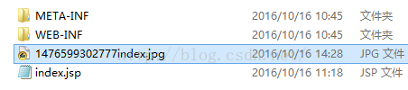

#  Retrofit实现文件上传

来源:[zhangxing的博客](http://blog.csdn.net/zhangxing52077/article/details/52830045)

## 1.序言

这几天一直在忙其他乱七八糟的事情，都没能好好敲我的代码呢？昨天，在大力大神的指点下，我对Retrofit的文件上传开悟了；在上节的解析中，我只是蜻蜓点水的提了一下Retrofit的文件上传，这不，为今天的进阶埋下伏笔么？哈哈,没有看第一节的赶紧去打打基础哈：[http://blog.csdn.net/zhangxing52077/article/details/52802069](http://blog.csdn.net/zhangxing52077/article/details/52802069)

## 2.文件上传难点解析

* 1.文件上传一般用post请求

* 2.文件上传的API接口中不能带@FormUrlEncoded参数

* 3.一般要携带@Multipart(上传文件的标志)

* 4.接口范例：

```
@Multipart
@POST("UploadServlet")
Call<String> uploadFile(@PartMap Map<String, RequestBody> params);
```

或

```
@Multipart
@POST("UploadServlet")
Call<ResponseBody> upload(@Part("description") RequestBody description,
                          @Part MultipartBody.Part file);
```

`@PartMap`是包括多个part,这应该很好理解，`MultipartBody.Part`的作用是将数据封装成表单的形式提交给服务器；一般 post 的引号中都是服务器端的serlvet或php，这里我们只管调用服务器端的接口，至于具体上传代码实现就不是我们该管的呢？那么对于好学的同学，我还是把我的服务器端的servlet代码贴出来：

```
public void doPost(HttpServletRequest request, HttpServletResponse response)
			throws ServletException, IOException {
		response.setContentType("text/html");
		PrintWriter out = response.getWriter();

		// 创建文件项目工厂对象
		DiskFileItemFactory factory = new DiskFileItemFactory();

		// 设置文件上传路径
		String upload = this.getServletContext().getRealPath("/");
		// 获取系统默认的临时文件保存路径，该路径为Tomcat根目录下的temp文件夹
		String temp = System.getProperty("java.io.tmpdir");
		// 设置缓冲区大小为 5M
		factory.setSizeThreshold(1024 * 1024 * 5);
		// 设置临时文件夹为temp
		factory.setRepository(new File(temp));
		// 用工厂实例化上传组件,ServletFileUpload 用来解析文件上传请求
		ServletFileUpload servletFileUpload = new ServletFileUpload(factory);

		// 解析结果放在List中
		try {
			List<FileItem> list = servletFileUpload.parseRequest(request);

			for (FileItem item : list) {
				String name = item.getFieldName();
				InputStream is = item.getInputStream();

				System.out.println("the current name is " + name);

				if (name.contains("file")) {
					try {
						inputStream2File(is,
								upload + "\\" + System.currentTimeMillis()
										+ item.getName());
					} catch (Exception e) {
						e.printStackTrace();
					}
				} else {
					String key = item.getName();
					String value = item.getString();
					System.out.println(key + "---" + value);
				}
			}

			out.write("success");
		} catch (FileUploadException e) {
			e.printStackTrace();
			out.write("failure");
		}

		out.flush();
		out.close();

	}

	// 流转化成字符串
	public static String inputStream2String(InputStream is) throws IOException {
		ByteArrayOutputStream baos = new ByteArrayOutputStream();
		int i = -1;
		while ((i = is.read()) != -1) {
			baos.write(i);
		}
		return baos.toString();
	}

	// 流转化成文件
	public static void inputStream2File(InputStream is, String savePath)
			throws Exception {
		System.out.println("the file path is  :" + savePath);
		File file = new File(savePath);
		InputStream inputSteam = is;
		BufferedInputStream fis = new BufferedInputStream(inputSteam);
		FileOutputStream fos = new FileOutputStream(file);
		int f;
		while ((f = fis.read()) != -1) {
			fos.write(f);
		}
		fos.flush();
		fos.close();
		fis.close();
		inputSteam.close();
	}
```

这里面要导入两个包：


## 3.实现单文件上传

* 1.AP接口

```
@Multipart
@POST("UploadServlet")
Call<ResponseBody> upload(@Part("description") RequestBody description,
                          @Part MultipartBody.Part file);
```

* 2.具体实现请求代码：

```
Retrofit retrofit = new Retrofit.Builder()
        .addConverterFactory(GsonConverterFactory.create())
        .baseUrl("http://192.168.12.101:8080/happy/")
        .build();
UploadFileService service = retrofit.create(UploadFileService.class);
File file = new File("/sdcard/Pictures/myPicture/index.jpg");//访问手机端的文件资源，保证手机端sdcdrd中必须有这个文件
RequestBody requestFile =
        RequestBody.create(MediaType.parse("multipart/form-data"), file);

MultipartBody.Part body = MultipartBody.Part.createFormData("aFile", file.getName(), requestFile);

String descriptionString = "This is a description";
RequestBody description =
        RequestBody.create(MediaType.parse("multipart/form-data"), descriptionString);

Call<ResponseBody> call = service.upload(description, body);
call.enqueue(new Callback<ResponseBody>() {
    @Override
    public void onResponse(Call<ResponseBody> call,
                           Response<ResponseBody> response) {
        System.out.println("success");
    }

    @Override
    public void onFailure(Call<ResponseBody> call, Throwable t) {
        t.printStackTrace();
    }
});
```

multipart/form-data表示将数据以二进制的形式传入服务端中的request中，

```
MultipartBody.Part.createFormData("aFile", file.getName(), requestFile);
```

中第一个参数是数组名，第二个参数是文件名；将每条数据都必须封住到RequestBody中。如果你以一下方式创建上传文件：

```
String filePath = Environment.getExternalStorageDirectory()
											+File.separator+"love.txt";
File file = new File(filePath);
```

记得一定得配置用户权限，低级错误，咋就少犯点：

```
<uses-permission android:name="android.permission.INTERNET"/>
<uses-permission android:name="android.permission.WRITE_EXTERNAL_STORAGE"/>
<uses-permission android:name="android.permission.READ_EXTERNAL_STORAGE"/>
```

## 4.实现多文件上传

* 1.单文件上传搞定了，多文件也简单呢API接口无非添加一行

```
@Multipart
@POST("UploadServlet")
Call<ResponseBody> upload(@Part("description") RequestBody description,
                          @Part MultipartBody.Part file,
                          @Part MultipartBody.Part file2);
```

* 2.然后请求代码中也多了一行

```
File file = new File("/sdcard/Pictures/myPicture/index.jpg");
File file1 = new File("/sdcard/Picuures/myPicture/me.txt");
RequestBody requestFile =
        RequestBody.create(MediaType.parse(
        			"applicaiton/otcet-stream"), file);

RequestBody requestFile1 =
        RequestBody.create(MediaType.parse(
        			"applicaiton/otcet-stream"), file1);

MultipartBody.Part body1 =
        MultipartBody.Part.createFormData(
        		"aFile", file.getName(), requestFile);

MultipartBody.Part body2 =
        MultipartBody.Part.createFormData(
        		"aFile", file.getName(), requestFile1);

String descriptionString = "This is a description";
RequestBody description = RequestBody.create(
        MediaType.parse("multipart/form-data"), descriptionString);

Call<ResponseBody> call = service.upload(description, body1,body2);
```

* 3.或者以@PartMap的形式实现多文件上传

①API

```
@Multipart
@POST("UploadServlet")
Call<String> uploadFile(@PartMap Map<String, RequestBody> params);
```

②请求代码：

```
Retrofit retrofit = new Retrofit.Builder()
         .addConverterFactory(GsonConverterFactory.create())
         .baseUrl("http://192.168.12.101:8080/happy/")
         .build();
 UploadFileService service = retrofit.create(UploadFileService.class);
 File file = new File("/sdcard/Pictures/myPicture/index.jpg");
 File file1 = new File("/sdcard/Picuures/myPicture/me.txt");
 RequestBody requestBody = RequestBody.create(
 				MediaType.parse("multipart/form-data"), file);
 RequestBody requestBody1 = RequestBody.create(
 				MediaType.parse("multipart/form-data"), file1);
 Map<String, RequestBody> params = new HashMap<>();

 params.put("file\"; filename=\""+ file.getName(), requestBody);
 params.put("file\"; filename=\""+ file1.getName(), requestBody1);

 Call<String> model = service.uploadFile(params);
 model.enqueue(new Callback<String>() {
     @Override
     public void onResponse(Call<String> call, Response<String> response) {
        Log.i("MainActivity",response.body().toString());
     }

     @Override
     public void onFailure(Call<String> call, Throwable t) {
      Log.i("错误信息：",t.getMessage());
     }
 });
```

其中：

```
params.put("file\"; filename=\""+ file.getName(), requestBody);
```
这是个固定形式，请求文件的名字。记住不要写错了，记住就万事大吉了，不要问那么多为什么，ok?请求结果：



文件已经上传成功：


好了，Retrofit的文件上传就讲到这里，蓦然回首，觉得这个家伙真的蛮简单；如果你觉得还有问题的话，多敲哈，骚年，熟能生巧；万一不行的话，私信我，我是张星，欢迎关注哟！！
