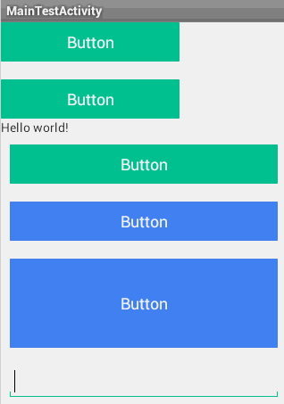

# Android L中水波纹点击效果的实现

来源:[singwhatiwanna-csdn](http://blog.csdn.net/singwhatiwanna/article/details/42614953?utm_source=tuicool&utm_medium=referral)

## 前言

前段时间**android L（android 5.0）**出来了，界面上做了一些改动，主要是添加了若干动画和一些新的控件，相信大家对view的点击效果-水波纹很有印象吧，点击一个view，然后一个水波纹就会从点击处扩散开来，本文就来分析这种效果的实现。首先，先说下L上的实现，这种波纹效果，L上提供了一种动画，叫做Reveal效果，其底层是通过拿到view的canvas然后不断刷新view来完成的，这种效果需要view的支持，而在低版本上没有view的支持，因此，Reveal效果没法直接在低版本运行。但是，我们了解其效果、其原理后，还是可以通过模拟的方式去实现这种效果，平心而论，写出一个具有波纹效果的自定义view不难，或者说很简单，但是，view的子类很多，如果要一一去实现button、edit等控件，这样比较繁琐，于是，我们想是否有更简单的方式呢？其实是有的，我们可以写一个自定义的layout，然后让layout中所有可点击的元素都具有波纹效果，这样做，就大大简化了整个过程。接下来本文就会分析这个layout的实现，在此之前，我们先看下效果。



## 实现思想

首先我们自定义一个layout，这里我们选取`LinearLayout`，至于原因，文章下面会进行分析。当用户点击一个可点击的元素时，比如button，我们需要得到用户点击的元素的信息，包含：**用户点击了哪个元素**、**用户点击的那个元素的宽、高、位置信息**等。得到了button的信息后，我就可以确定水波纹的范围，然后通过layout进行重绘去绘制水波纹，这样水波纹效果就实现了，当然，这只是大概步骤，中间还是有一些细节需要处理的。

## layout的选取

既然我们打算实现一个自定义layout，那我们要选取那个layout呢，LinearLayout、RelativeLayout、FrameLayout？我这里选用LinearLayout。为什么呢？也许有人会问，不应该用RelativeLayout吗？因为RelativeLayout比较强大，可以实现复杂的布局，但LinearLayout和FrameLayout就不行。没错，RelativeLayout是强大，但是考虑到水波效果是通过频繁刷新layout来实现的，由于频繁重绘，因此，我们要考虑性能问题，RelativeLayout的性能是最差的（因为做的事情多），因为，为了性能，我们选择LinearLayout，至于FrameLayout，它功能太简单了，不太适合使用。当实现复杂布局的时候，我们可以在具有波纹效果的元素外部包裹LinearLayout，这样重绘的时候不至于有过重的任务。
根据上面的分析，我们定义如下的layout：

```
public class RevealLayout extends LinearLayout implements Runnable
```

## 实现过程

实现过程主要是如下几个问题的解决：

* 1 如何得知用户点击了哪个元素
* 2 如何取得被点击元素的信息
* 3 如何通过layout进行重绘绘制水波纹
* 4 如果延迟up事件的分发

下面一一进行分析

### 如何得知用户点击了哪个元素

这个问题好弄，为了得知用户点击了哪个元素（这个元素一般来说要是可点击的，否则是无意义的），我们要提前拦截所有的点击事件，于是，我们应该重写layout中的dispatchTouchEvent方法，注意，这里不推荐用onInterceptTouchEvent，因为onInterceptTouchEvent不是一直会被回调的，具体原因请参看我之前写的[view系统解析系列](http://blog.csdn.net/singwhatiwanna/article/details/38426471)。然后当用户点击的时候，会有一系列的down、move、up事件，我们要在down的时候来确定事件落在哪个元素上，down的元素就是用户点击的元素，当然为了严谨，我们还要判断up的时候是否也落在同一个元素上面，因为，系统click事件的判断规则就是：down和up同时落在同一个可点击的元素上。

```
@Override  
public boolean dispatchTouchEvent(MotionEvent event) {  
    int x = (int) event.getRawX();  
    int y = (int) event.getRawY();  
    int action = event.getAction();  
    if (action == MotionEvent.ACTION_DOWN) {  
        View touchTarget = getTouchTarget(this, x, y);  
        if (touchTarget.isClickable() && touchTarget.isEnabled()) {  
            mTouchTarget = touchTarget;  
            initParametersForChild(event, touchTarget);  
            postInvalidateDelayed(INVALIDATE_DURATION);  
        }  
    } else if (action == MotionEvent.ACTION_UP) {  
        mIsPressed = false;  
        postInvalidateDelayed(INVALIDATE_DURATION);  
        mDispatchUpTouchEventRunnable.event = event;  
        postDelayed(mDispatchUpTouchEventRunnable, 400);  
        return true;  
    } else if (action == MotionEvent.ACTION_CANCEL) {  
        mIsPressed = false;  
        postInvalidateDelayed(INVALIDATE_DURATION);  
    }  
  
    return super.dispatchTouchEvent(event);  
}  
```

通过上述代码，我们可以知道，当down的时候，我们取出点击事件的屏幕坐标，然后去遍历view树找到用户所点击的那个view，代码如下，就是判断事件的坐标是否落在view的范围内，这个不再多说了，比较好理解。需要注意的是，事件的坐标我们不能用getX和getY，而要用getRawX和getRawY，二者的区别是：前者是相对于被点击view的坐标，后者是相对于屏幕的坐标，而我们的目标view具体位于layout的哪一层我们无法知道，所以，必须用屏幕的绝对坐标来进行计算。而有了事件的坐标，再根据view在屏幕中的绝对坐标，只要判断事件的xy是否落在view的上下左右四个角之内，就可以知道事件是否落在view上，从而取出用户所点击的那个view。

```
private View getTouchTarget(View view, int x, int y) {  
    View target = null;  
    ArrayList<View> TouchableViews = view.getTouchables();  
    for (View child : TouchableViews) {  
        if (isTouchPointInView(child, x, y)) {  
            target = child;  
            break;  
        }  
    }  
  
    return target;  
}  
  
private boolean isTouchPointInView(View view, int x, int y) {  
    int[] location = new int[2];  
    view.getLocationOnScreen(location);  
    int left = location[0];  
    int top = location[1];  
    int right = left + view.getMeasuredWidth();  
    int bottom = top + view.getMeasuredHeight();  
    if (view.isClickable() && y >= top && y <= bottom  
            && x >= left && x <= right) {  
        return true;  
    }  
    return false;  
}  
```

### 如何取得被点击元素的信息

这个比较简单，被点击元素的信息有：宽、高、left、top、right、bottom，获取它们的代码如下：

```
int[] location = new int[2];  
mTouchTarget.getLocationOnScreen(location);  
int left = location[0] - mLocationInScreen[0];  
int top = location[1] - mLocationInScreen[1];  
int right = left + mTouchTarget.getMeasuredWidth();  
int bottom = top + mTouchTarget.getMeasuredHeight();  
```

说明：mTouchTarget指的是用户点击的那个view
### 如何通过layout进行重绘绘制水波纹

这个会水波纹比较简单，只要用drawCircle绘制一个半透明的圆环即可，这里主要说下绘制时机。一般来说，我们会选择在onDraw中去进行绘制，这是没错的，但是对于L中的效果不太适合，查看view的绘制过程，我们会明白，view的绘制大致遵循如下流程：先绘制背景，再绘制自己（onDraw），接着绘制子元素（dispatchDraw），最后绘制一些装饰等比如滚动条（onDrawScrollBars），因此，如果我们在onDraw中绘制波纹，那么由于子元素的绘制在onDraw之后，就会导致子元素盖住我们所绘制的圆环，这样，圆环就有可能看不全了，因为，把我绘制的时机很重要。根据view的绘制流程，我们选择dispatchDraw比较合适，当所有的子元素都绘制完成后，再进行波纹的绘制。读到这里，大家会更加明白，为什么我们要选择LinearLayout以及为什么不建议view的嵌套层级太深，因为如果view本身比较重或者嵌套层级太深，就会导致dispatchDraw执行的耗时增加，这样水波的绘制就会收到些许影响。因此，性能的平滑在代码中也很重要，也是需要考虑的。同时，为了不让绘制的圆环超出被点击元素的范围，我们需要对canvas进行clip。为了有波纹效果，我们需要频繁地进行layout重绘，并且在重绘的过程中改变圆环的半径，这样一个动态的水波纹就出来了。仍然，我来性能的考虑，我们选择用postInvalidateDelayed(long delayMilliseconds, int left, int top, int right, int bottom)来进行view的部分重绘，因为，其他区域是不需要重绘的，仅仅是被点击的元素所在的区域需要重绘。为什么要采用Delayed这个方法，原因是我们不能一直进行刷新，必须有一点点时间间隔，这样做的好处是：避免view的重绘抢占过多时间片从而造成潜在的间接栈溢出，因为invalidate会直接导致draw的调用。

具体代码如下：

```
protected void dispatchDraw(Canvas canvas) {  
    super.dispatchDraw(canvas);  
    if (!mShouldDoAnimation || mTargetWidth <= 0 || mTouchTarget == null) {  
        return;  
    }  
  
    if (mRevealRadius > mMinBetweenWidthAndHeight / 2) {  
        mRevealRadius += mRevealRadiusGap * 4;  
    } else {  
        mRevealRadius += mRevealRadiusGap;  
    }  
    int[] location = new int[2];  
    mTouchTarget.getLocationOnScreen(location);  
    int left = location[0] - mLocationInScreen[0];  
    int top = location[1] - mLocationInScreen[1];  
    int right = left + mTouchTarget.getMeasuredWidth();  
    int bottom = top + mTouchTarget.getMeasuredHeight();  
  
    canvas.save();  
    canvas.clipRect(left, top, right, bottom);  
    canvas.drawCircle(mCenterX, mCenterY, mRevealRadius, mPaint);  
    canvas.restore();  
  
    if (mRevealRadius <= mMaxRevealRadius) {  
        postInvalidateDelayed(INVALIDATE_DURATION, left, top, right, bottom);  
    } else if (!mIsPressed) {  
        mShouldDoAnimation = false;  
        postInvalidateDelayed(INVALIDATE_DURATION, left, top, right, bottom);  
    }  
}  
```

到此为止，这个layout我们已经实现了，但是细心的你，一定会发现，还有什么不妥的地方。比如，你可以给button加一个点击事件，当button被点击的时候起一个activity，很快你就会发现问题所在了：水波还没播完呢，activity就起来了，导致水波效果大打折扣，而仔细观察android L的效果，我们发现，L中总是要等到水波效果播放完毕才会进行下一步的行为。所以，最后一个待解决的问题也就出来了，请看下面的分析

### 如何延迟up事件的分发

针对上面所说的问题，如果我们能够延迟up时间的分发，比如延迟400ms，这样水波就有足够的时间去播放完毕，然后再分发up事件，这样就可以解决问题。最开始，我的确是这样做的，先看如下的代码：

```
else if (action == MotionEvent.ACTION_UP) {  
	mIsPressed = false;  
    postInvalidateDelayed(INVALIDATE_DURATION);  
    mDispatchUpTouchEventRunnable.event = event;  
    postDelayed(mDispatchUpTouchEventRunnable, 400);  
    return true;  
}   
```

可以发现，当up的时候，我并没有直接走系统的分发流程，只是强行消耗点up事件然后再延迟分发，请看代码：

```
private class DispatchUpTouchEventRunnable implements Runnable {  
    public MotionEvent event;  
  
    @Override  
    public void run() {  
        if (mTouchTarget == null || !mTouchTarget.isEnabled()) {  
            return;  
        }  
  
        if (isTouchPointInView(mTouchTarget, (int)event.getRawX(), (int)event.getRawY())) {  
            mTouchTarget.dispatchTouchEvent(event);  
        }  
    }  
};  

```

到此为止，上述几个问题都已经分析完毕了，我们就可以轻易地实现水波纹的点击效果了。

------

重要的评论:

* 给大神点个赞,效果蛮好的，但是似乎有个bug。就是波纹最大半径的计算那块，只考虑了宽度没有考虑高度。如果target view的高度大于宽度，波纹就无法渲染整个view了。可以在那个initParametersForChild方法中加入如下代码：

```
int top = location[1]-mLocationInScreen[1];
int transformedCenterY = (int)mCenterY-top;
mMaxRevealRadius = Math.max(mMaxRevealRadius,Math.max(
		transformedCenterY,mTargetHeight-transformedCenterY));
```

* 感谢任老师分享~学到东西了~

发现的bug反馈下：

点击EditText会出现bug~因为弹出了输入法，重新调用了onLayout，造成mLocationInScreen赋值发生了变化~还有一个问题，如果布局在ScrollView中mLocationInScreen会变化，也会造成bug，建议在dispatchDraw中添加getLocationOnScreen(mLocationInScreen);重新获取下screenLayout即可修复。

* 此博客是RippleEffect效果的实现思路，可以参考实现，如果想要直接使用，可以使用[github上的开源项目——RippleEffect](https://github.com/traex/RippleEffect)


* 此博客对应的源代码:

```
package com.ryg.reveallayout.ui;

import android.annotation.TargetApi;
import android.content.Context;
import android.graphics.Canvas;
import android.graphics.Paint;
import android.os.Build;
import android.util.AttributeSet;
import android.util.Log;
import android.view.MotionEvent;
import android.view.View;
import android.widget.LinearLayout;

import java.util.ArrayList;

import com.ryg.reveallayout.R;

/**
 * 一个特殊的LinearLayout,任何放入内部的clickable元素都具有波纹效果，当它被点击的时候，
 * 为了性能，尽量不要在内部放入复杂的元素
 * note: long click listener is not supported current for fix compatible bug.
 */
public class RevealLayout extends LinearLayout implements Runnable {

    private static final String TAG = "DxRevealLayout";
    private static final boolean DEBUG = true;

    private Paint mPaint = new Paint(Paint.ANTI_ALIAS_FLAG);

    private int mTargetWidth;
    private int mTargetHeight;
    private int mMinBetweenWidthAndHeight;
    private int mMaxBetweenWidthAndHeight;
    private int mMaxRevealRadius;
    private int mRevealRadiusGap;
    private int mRevealRadius = 0;
    private float mCenterX;
    private float mCenterY;
    private int[] mLocationInScreen = new int[2];

    private boolean mShouldDoAnimation = false;
    private boolean mIsPressed = false;
    private int INVALIDATE_DURATION = 40;

    private View mTouchTarget;
    private DispatchUpTouchEventRunnable mDispatchUpTouchEventRunnable = new DispatchUpTouchEventRunnable();

    public RevealLayout(Context context) {
        super(context);
        init();
    }

    public RevealLayout(Context context, AttributeSet attrs) {
        super(context, attrs);
        init();
    }

    @TargetApi(Build.VERSION_CODES.HONEYCOMB)
    public RevealLayout(Context context, AttributeSet attrs, int defStyleAttr) {
        super(context, attrs, defStyleAttr);
        init();
    }

    private void init() {
        setWillNotDraw(false);
        /** 颜色#1b000000 **/
        mPaint.setColor(getResources().getColor(R.color.reveal_color));
    }

    @Override
    protected void onLayout(boolean changed, int l, int t, int r, int b) {
        super.onLayout(changed, l, t, r, b);
        this.getLocationOnScreen(mLocationInScreen);
    }

    private void initParametersForChild(MotionEvent event, View view) {
        mCenterX = event.getX() ;
        mCenterY = event.getY() ;
        mTargetWidth = view.getMeasuredWidth();
        mTargetHeight = view.getMeasuredHeight();
        mMinBetweenWidthAndHeight = Math.min(mTargetWidth, mTargetHeight);
        mMaxBetweenWidthAndHeight = Math.max(mTargetWidth, mTargetHeight);
        mRevealRadius = 0;
        mShouldDoAnimation = true;
        mIsPressed = true;
        mRevealRadiusGap = mMinBetweenWidthAndHeight / 8;

        int[] location = new int[2];
        view.getLocationOnScreen(location);
        int left = location[0] - mLocationInScreen[0];
        int transformedCenterX = (int)mCenterX - left;
        mMaxRevealRadius = Math.max(transformedCenterX, mTargetWidth - transformedCenterX);
    }

    protected void dispatchDraw(Canvas canvas) {
        super.dispatchDraw(canvas);
        if (!mShouldDoAnimation || mTargetWidth <= 0 || mTouchTarget == null) {
            return;
        }

        if (mRevealRadius > mMinBetweenWidthAndHeight / 2) {
            mRevealRadius += mRevealRadiusGap * 4;
        } else {
            mRevealRadius += mRevealRadiusGap;
        }
        this.getLocationOnScreen(mLocationInScreen);
        int[] location = new int[2];
        mTouchTarget.getLocationOnScreen(location);
        int left = location[0] - mLocationInScreen[0];
        int top = location[1] - mLocationInScreen[1];
        int right = left + mTouchTarget.getMeasuredWidth();
        int bottom = top + mTouchTarget.getMeasuredHeight();

        canvas.save();
        canvas.clipRect(left, top, right, bottom);
        canvas.drawCircle(mCenterX, mCenterY, mRevealRadius, mPaint);
        canvas.restore();

        if (mRevealRadius <= mMaxRevealRadius) {
            postInvalidateDelayed(INVALIDATE_DURATION, left, top, right, bottom);
        } else if (!mIsPressed) {
            mShouldDoAnimation = false;
            postInvalidateDelayed(INVALIDATE_DURATION, left, top, right, bottom);
        }
    }

    @Override
    public boolean dispatchTouchEvent(MotionEvent event) {
        int x = (int) event.getRawX();
        int y = (int) event.getRawY();
        int action = event.getAction();
        if (action == MotionEvent.ACTION_DOWN) {
            View touchTarget = getTouchTarget(this, x, y);
            if (touchTarget != null && touchTarget.isClickable() && touchTarget.isEnabled()) {
                mTouchTarget = touchTarget;
                initParametersForChild(event, touchTarget);
                postInvalidateDelayed(INVALIDATE_DURATION);
            }
        } else if (action == MotionEvent.ACTION_UP) {
            mIsPressed = false;
            postInvalidateDelayed(INVALIDATE_DURATION);
            mDispatchUpTouchEventRunnable.event = event;
            postDelayed(mDispatchUpTouchEventRunnable, 40);
            return true;
        } else if (action == MotionEvent.ACTION_CANCEL) {
            mIsPressed = false;
            postInvalidateDelayed(INVALIDATE_DURATION);
        }

        return super.dispatchTouchEvent(event);
    }

    private View getTouchTarget(View view, int x, int y) {
        View target = null;
        ArrayList<View> TouchableViews = view.getTouchables();
        for (View child : TouchableViews) {
            if (isTouchPointInView(child, x, y)) {
                target = child;
                break;
            }
        }

        return target;
    }

    private boolean isTouchPointInView(View view, int x, int y) {
        int[] location = new int[2];
        view.getLocationOnScreen(location);
        int left = location[0];
        int top = location[1];
        int right = left + view.getMeasuredWidth();
        int bottom = top + view.getMeasuredHeight();
        if (view.isClickable() && y >= top && y <= bottom
                && x >= left && x <= right) {
            return true;
        }
        return false;
    }

    @Override
    public boolean performClick() {
        postDelayed(this, 400);
        return true;
    }

    @Override
    public void run() {
        super.performClick();
    }

    private class DispatchUpTouchEventRunnable implements Runnable {
        public MotionEvent event;

        @Override
        public void run() {
            if (mTouchTarget == null || !mTouchTarget.isEnabled()) {
                return;
            }

            if (isTouchPointInView(mTouchTarget, (int)event.getRawX(), (int)event.getRawY())) {
                mTouchTarget.performClick();
            }
        }
    };

}

```