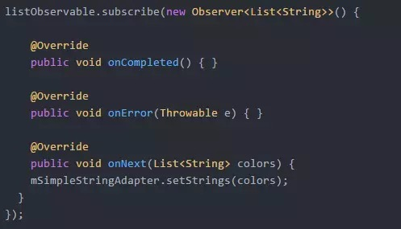
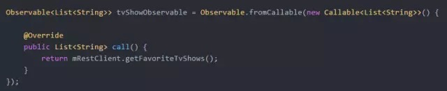
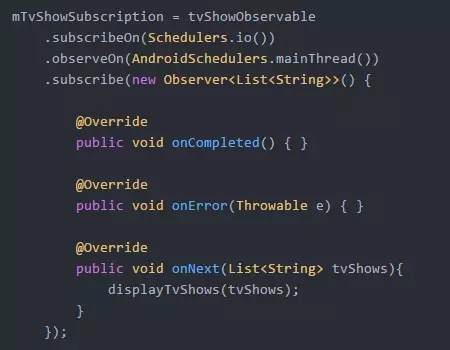
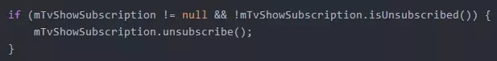
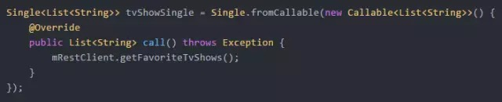
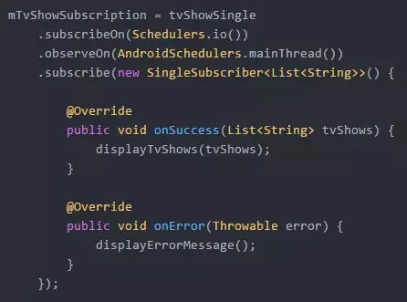

# 从案例学RxAndroid开发（上）

来源:[移动开发前线](http://mp.weixin.qq.com/s?__biz=MzA3ODg4MDk0Ng==&mid=403037654&idx=1&sn=721559537c02a11620445af442aa3a3f&scene=23&srcid=0325GSaCgnBuSttZdCitaEec#rd)

> 版权声明<br/>
> 原作者：Kurtis Nusbaum<br/>
> 译者：程大治<br/>
> 本文由作者授权翻译并发布，由译者投稿发布于本公众号，未经允许禁止转载。<br/>

RxJava最近很火，由代码家组织的Gank匠心写作上也分享了不少相关的好文章，RxAndroid是RxJava在Android平台的扩展，将一些类绑定到RxJava，使得在Android应用中编写响应式组件变得非常简单。本文将从一些小案例来讲解如何使用RxAndroid进行开发。

以下为正文：

为了不让你把我踩过的坑再踩一遍，我会基于我的学习成果写一些例子出来，让你能够对RxJava有足够的了解，并能在你的Android应用中使用它。

当我第一次使用RxJava的时候我只是在照搬代码，这些代码能跑起来，但是我对RxJava的基础部分仍然存在误解，而且我找不到好的源码来学习。所以为了理解RxJava，我不得不一点一点学习，踩了不少坑。

源码见[这里](https://github.com/klnusbaum/rxandroidexamples)。在每个例子的开始，我会写清每个代码段是属于哪个Activity的。我会将本文分为两个部分，在第一部分里，我会着重讲解如何用RxJava异步加载数据；在第二部分里，我会探索一些更高级的用法。

## 几个概念
在开始说代码之前，先澄清几个概念。RxJava最核心的东西就是Observable和Observer。Observable会发出数据，而与之相对的Observer则会通过订阅Observable来进行观察。

Observer可以在Observable发出数据、报错或者声明没有数据可以发送时进行相应的操作。这三个操作被封装在Observer接口中，相应的方法为onNext()，onError()和onCompleted()。

明确了这些概念以后，让我们来看一些例子。

## 案例1：基础
现在我们要写一个用来展示一个颜色列表的Activity，源码见[这里](https://github.com/klnusbaum/rxandroidexamples/blob/master/app/src/main/java/kurtis/rx/androidexamples/Example1Activity.java)。我们要写一个能发送一个字符串列表、然后结束的Observeable。而后我们会通过这个字符串列表来填充颜色列表，这里要使用到Observable.just()方法。由这个方法创建的Observable对象的特点是：所有Observer一旦订阅这个Observable就会立即调用onNext()方法并传入Observable.just()的参数，而后因为Observable没有数据可以发送了，onComplete()方法会被调用。

```
Observable<List<String>> listObservable = Observable.just(getColorList());
```

注意这里的getColorList()是一个不耗时的方法。虽然现在看来这个方法无足轻重，但一会我们会回到这个方法。

下一步，我们写一个Observer来观察Observable。



而后神奇的事情就发生了。如我刚才所说，一旦通过subscribe()方法订阅Observable，就会发生一系列事情：

* 1.onNext()方法被调用，被发送的颜色列表会作为参数传入。
* 2.既然不再有数据可以发送（我们在Observable.just()中只让Observable发送一个数据），onComplete()方法会被调用。

请记住：**通过Observable被订阅后的行为来区分它们。**

在这个例子中我们不关心Observable何时完成数据的传输，所以我们不用在onComplete()方法里写代码。而且在这里不会有异常抛出，所以我们也不用管onError()方法。

写了这么多你可能觉得很多余，毕竟我们本可以在adapter中直接设置作为数据源的颜色列表。请带着这个疑问，和我看下面这个更有趣一些的例子。

## 案例2：异步加载

在这里我们要写一个显示电视剧列表的Activity，源码见[这里](https://github.com/klnusbaum/rxandroidexamples/blob/master/app/src/main/java/kurtis/rx/androidexamples/Example2Activity.java)。在Android中RxJava的主要用途就在于异步数据加载。首先让我们写一个Observable：



在刚才的例子中，我们使用Observable.just()来创建Observable，你可能认为在这里可以通过`Observable.just(mRestClient.getFavoriteTvShows())`来创建Observable。

但在这里我们不能这么做，因为`mRestClient.getFavoriteTvShows()`会发起网络请求。如果在这里我们使用`Observable.just()`，`mRestClient.getFavoriteTvShows()`会被立即执行并阻塞UI线程。

使用`Observable.fromCallable()`方法有两点好处：

* 1.获取要发送的数据的代码只会在有Observer订阅之后执行。
* 2.获取数据的代码可以在子线程中执行。

这两点好处有时可能非常重要。现在让我们订阅这个Observable。



让我们一个方法一个方法地来看这段代码。subscribeOn会修改我们刚刚创建的Observable。在默认情况下Observable的所有代码，包括刚才说到的只有在被订阅之后才会执行的代码，都会在主线程中运行。而通过subscribeOn()方法，这些代码可以在其他线程中执行。但具体是哪个线程呢？

在这个例子中我们让代码在"IO Scheduler"中执行（Schedulers.io()）。现在我们可以只把Scheduler当做一个可以工作的子线程，这个描述对于现在的我们已经足够了，不过这其中还有更深层次的内容。

不过我们的确遇到了一个小障碍。既然Observable会在IO Scheduler中运行，那么它与Observer的连接也会在IO Scheduler中完成。这就意味着Observer的onNext()方法也会在IO Scheduler中运行，而onNext()方法会操作UI中的View，但View只能在UI主线程中操作。

事实上解决这个问题也很简单，我们可以告诉RxJava我们要在UI线程中观察这个Observable，也就是，我们想让onNext()方法在UI线程中执行。这一点我们可以通过在observeOn()方法中指定另一个Scheduler来完成，在这里也就是AndroidSchedules.mainThread()所返回的Scheduler(UI线程的Scheduler)。

而后我们调用subscribe()方法。这个方法最重要，因为Callable只会在有Observer订阅后运行。还记得刚才我说Observable通过其被订阅后的行为来区分吗？这就是一个很好的例子。

还有最后一件事。这个mTvShowSubscription到底是什么？每当Observer订阅Observable时就会生成一个Subscription对象。一个Subscription代表了一个Observer与Observable之间的连接。有时我们需要操作这个连接，这里拿在Activity的onDestroy()方法中的代码举个例子：



如果你与多线程打过交道，你肯定会意识到一个大坑：当Activity执行onDestroy()后线程才结束（甚至永不结束）的话，就有可能发生内存泄漏与NullPointerException空指针异常。

Subscription就可以解决这个问题，我们可以通过调用unsubscribe()方法告诉Observable它所发送的数据不再被Observer所接收。在调用unsubscribe()方法后，我们创建的Observer就不再会收到数据了，同时也就解决了刚才说的问题。

说到这里难点已经过去，让我们来总结一下：

* Observable.fromCallable()方法可以拖延Observable获取数据的操作，这一点在数据需要在其他线程获取时尤其重要。
* subscribeOn()让我们在指定线程中运行获取数据的代码，只要不是UI线程就行。
* observeOn()让我们在合适的线程中接收Observable发送的数据，在这里是UI主线程。
* 记住要让Observer取消订阅以免Observable异步加载数据时发生意外。

## 案例3：使用Single
这次我们还是写一个展示电视剧列表的Activity，源码见[这里](https://github.com/klnusbaum/rxandroidexamples/blob/master/app/src/main/java/kurtis/rx/androidexamples/Example3Activity.java)，但这次我们走一种更简单的风格。Observable挺好用的，但在某些情况下过于重量级。比如说，你可能一经发现在过去的两个方法中我们只是让Observable发送一个数据，而且我们从来也没写过onComplete()回调方法。

其实呢，Observable还有一个精简版，叫做Single。Single几乎和Observable一模一样，但其回调方法不是onComplete()/onNext()/onError()，而是onSuccess()/onError()。

我们现在把刚才写过的Observable用Single重写一遍。首先我们要创建一个Single:



然后订阅一下：



这段代码和刚才很像，我们调用subscribeOn()方法以确保getFavoriteTvShows()在子线程中执行。而后我们调用observeOn()以确保Single的数据被发送到UI线程。

但这次我们不再使用Observer，而是使用一个叫SingleSubscriber的类。这个类和Observer非常像，只不过它只有上述两个方法：onSuccess()和onError()。SingleSubscriber之于Single就如Observer之于Observable。

订阅一个Single的同时也会自动创建一个Subscription对象。这里的Subscription和案例2中没有区别，一定要在onDestroy()中解除订阅。

最后一点：在这里我们添加了处理异常的代码，所以如果mRestClient出了问题，onError()就会被调用。建议你亲手写一个案例玩一玩，体验一下有异常时程序是怎么运行的。

## 结语

第一部分就说这么多了，希望这几个案例能对你有所帮助，不要忘了看看第二部分中更加高级的使用方法哦。

[原文链接](https://medium.com/@kurtisnusbaum/rxandroid-basics-part-1-c0d5edcf6850#.lgbec2yc1)

下一篇：https://medium.com/@kurtisnusbaum/rxandroid-basics-part-2-6e877af352#.emj4lkb8j