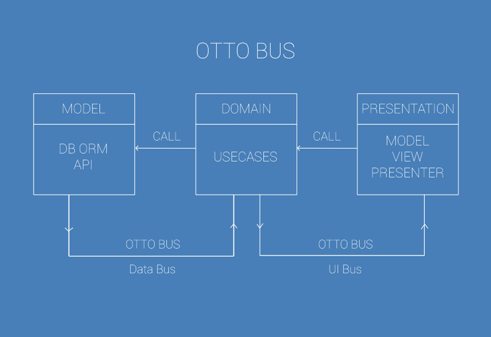

# 使用RxJava代替EventBus类库

来源:[简书](http://www.jianshu.com/p/b05b677f08c4)

如今的Android社区，人人都在讨论RxJava以及为什么我们应该在项目中使用RxJava。当我们开始在Android项目中使用RxJava的时候，就已经意识到了，我们的代码库可以不再需要Otto了（或其他事件总线类库）。

## 使用MVP构建代码库
当我们在开发一款叫做Radyoland的无线流媒体应用的时候，我们决定使用**MVP模式**来设计我们的代码库和项目架构等。于是我们把它分为几个层（**domain, model, app**等等）。



在model层中，存在一些类和接口用来处理RESTful。而domain层中，我们试图实现应用的业务逻辑，因此创建了一些usecase类。

## 为什么需要事件总线类库？
如果你的Android程序中有超过一个逻辑层，就意味着你有可能在层与层之间进行数据的传递。在我们的例子中，我们认为，为**DataBus**和**UIBus**创建一个**BusUtil**就能够轻松实现层与层之间的数据传递（**model, domain, presentation**）。

你可以“订阅”或者“取消订阅”从bus中所发送出的具体事件。这个方法的工作原理看起来就是这样。

在**UsecaseController**，**PresenterImp** 类之间，我们把REST实现类中得到的结果作为事件发送，然后订阅此事件。

```
@Override public void getRadioList() {
    Call<RadioWrapper> radioWrapperCall = restInterface.getRadioList();
    radioWrapperCall.enqueue(new Callback<RadioWrapper>() {
      @Override public void onResponse(Response<RadioWrapper> response, Retrofit retrofit) {
        dataBus.post(response.body());
      }

      @Override public void onFailure(Throwable t) {
        Timber.e(t.getMessage());
      }
    });
  }
```

当我们通过回调函数进行异步请求的时候，使用bus发送请求成功后的结果，然后订阅这个结果事件。

```
@Subscribe @Override public void onRadioListLoaded(RadioWrapper radioWrapper) {
    new SaveDatabase(radioWrapper, databaseSource).executeOnExecutor(AsyncTask.THREAD_POOL_EXECUTOR);
    uiBus.post(radioWrapper);
  }
```

然后再次发送这个事件至更新**UI**。**Activity** 或者**Fragment** 应该在**onResume()**方法中订阅需要的事件，相反地，在**onPause()**中对不需要的事件解除订阅。

```
@Subscribe @Override public void onRadioListLoaded(RadioWrapper radioWrapper) {
    radioListView.onListLoaded(radioWrapper);
    radioListView.dismissLoading();
  }
```

虽然，这种方案很有效。但是，作为优秀的Android工程师，应该尝试去发现更好的实现思路。因此，我们找到了一种摆脱所有回调函数和订阅方法的思路。那就是在Android应用的代码库中引入并使用**RxJava**和**RxAndroid**。


## 如何使用RxJava
首先，我们需要更改所有REST接口的返回类型。

不使用RxJava：

```
@GET("")
Call<RadioWrapper> getRadioList();
```

使用RxJava：

```
@GET("")
Observable<RadioWrapper> getRadioList();
```

在**REST**实现类中，我们持有很多API调用方法。在这里，我只举出其中一例。开始使用RxJava之后，我们需要修改所有方法的实现方式。返回类型将变为**Observable**，当做完必要的修改之后，方法看起来如下：

```
@RxLogObservable @Override public Observable<RadioWrapper> getRadioList() {
    return restInterface.getRadioList();
  }
```

我们已经完成了**REST**实现类的修改。接下来，我们要做的是修改usecase实现类和其中的方法。

```
@Override public Observable<RadioWrapper> getRadioList() {

    /**
     * Get radiolist observable from Cache
     */
    Observable<RadioWrapper> radioListDB = databaseSource.getRadioList().filter(new Func1<RadioWrapper, Boolean>() {
      @Override public Boolean call(RadioWrapper radioWrapper) {
        return radioWrapper.radioList.size() > 0;
      }
    }).subscribeOn(Schedulers.computation());

    /**
     * Load radiolist from api layer and save it to DB.
     */
    Observable<RadioWrapper> radioListApi = apiSource.getRadioList().doOnNext(new Action1<RadioWrapper>() {
      @Override public void call(final RadioWrapper radioWrapper) {
        Observable.create(new Observable.OnSubscribe<Object>() {
          @Override public void call(Subscriber<? super Object> subscriber) {
            databaseSource.save(radioWrapper);
            subscriber.onCompleted();
          }
        }).subscribeOn(Schedulers.computation()).subscribe();
      }
    }).subscribeOn(Schedulers.io());

    /**
     * concat db and api observables
     */
    return Observable.concat(radioListDB, radioListApi).observeOn(AndroidSchedulers.mainThread());
  }
```

现在，`getRadioList()`方法将返回**Observable**数据流传至UI。就如你所见到的一样，我们不再使用**Event bus**来发送事件了。可以通过对数据流的过滤，合并，缓存或者其他操作，来达到我们的目的了。


## 我们学到了什么
尽管RxJava用起来不是那么容易，但是当用RxJava替换掉Otto后，我们从代码库中成功移除了很多回调代码块。依我看来，RxJava最棒的地方就是能够对任何REST API进行异步请求。

**如果你有更好的方式能够实现它，请尽情在下方留言，或者把你认为优秀的示例分享出来。**

