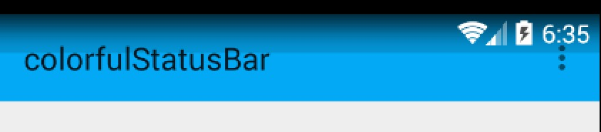
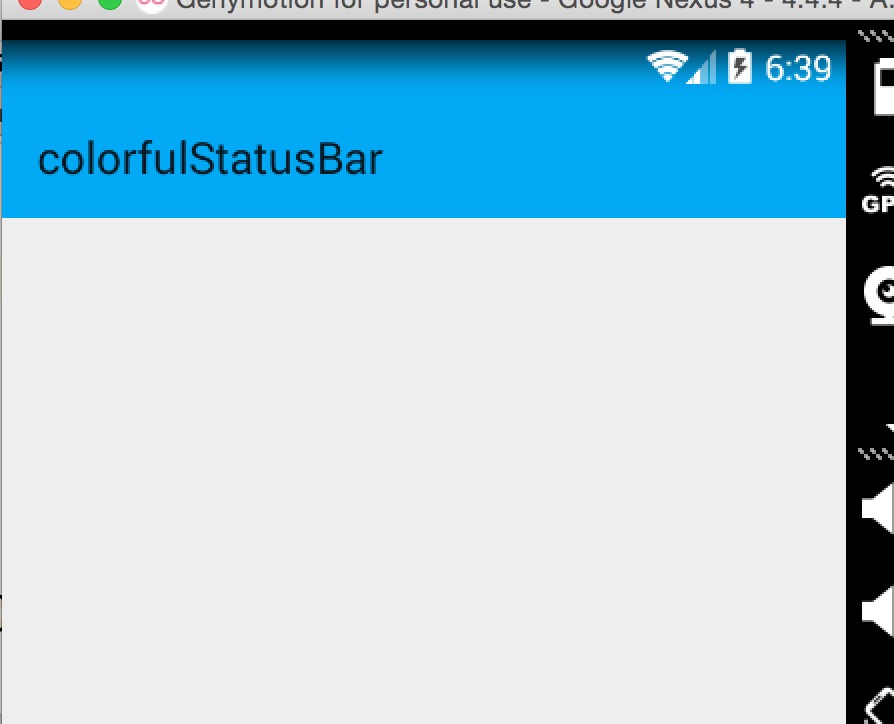
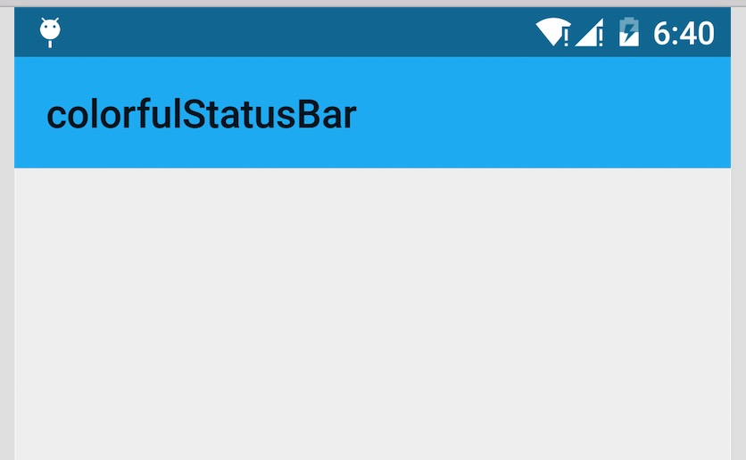

# Android 沉浸式状态栏攻略 让你的状态栏变色吧

来源:[CSDN](http://blog.csdn.net/lmj623565791/article/details/48649563)

## 一、概述

近期注意到QQ新版使用了沉浸式状态栏，ok，先声明一下：本篇博客效果下图：


关于这个状态栏变色到底叫「Immersive Mode」/「Translucent Bars」有兴趣可以去[为什么在国内会有很多用户把 ｢透明栏｣（Translucent Bars）称作 ｢沉浸式顶栏｣？](http://www.zhihu.com/question/27040217)上面了解了解，请勿指点我说的博文标题起得不对，thx。

恩，接下来正题。

首先只有大于等于4.4版本支持这个半透明状态栏的效果，但是4.4和5.0的显示效果有一定的差异，所有本篇博文内容为：

* 如何实现半透明状态栏效果在大于4.4版本之上。
* 如何让4.4的效果与5.0的效果尽可能一致。

看了不少参考文章，都介绍到这个库，大家可以了解：[SystemBarTint](https://github.com/jgilfelt/SystemBarTint)。

不过本篇博文并未基于此库，自己想了个hack，对于此库源码有空再看了。

## 二、效果图

先贴下效果图，以便和实现过程中做下对比

* 4.4 模拟器


* 5.x 真机


[new]贴个如果顶部是图片的效果图，其实是一样的，为了方便我就放侧栏的顶部了。

稍等，csdn图片服务器异常…

ok，有了效果图之后就开始看实现了。

## 三、实现半透明状态栏

因为本例使用了NavigationView，所以布局代码稍多，当然如果你不需要，可以自己进行筛减。

注意引入相关依赖：

```
compile 'com.android.support:appcompat-v7:22.2.1'
compile 'com.android.support:support-v4:22.2.1'
compile 'com.android.support:design:22.2.0'
```

### （一）colors.xml 和 styles.xml

首先我们定义几个颜色：

* res/values/color.xml

```
<?xml version="1.0" encoding="utf-8"?>
<resources>
    <color name="primary">#FF03A9F4</color>
    <color name="primary_dark">#FF0288D1</color>
    <color name="status_bar_color">@color/primary_dark</color>
</resources>
```

下面定义几个styles.xml

注意文件夹的路径：

* values/styles.xml

```
<resources>
    <style name="BaseAppTheme" parent="Theme.AppCompat.Light.NoActionBar">
        <!-- Customize your theme here. -->
        <item name="colorPrimary">@color/primary</item>
        <item name="colorPrimaryDark">@color/primary_dark</item>
        <item name="colorAccent">#FF4081</item>
    </style>

    <!-- Base application theme. -->
    <style name="AppTheme" parent="@style/BaseAppTheme">
    </style>
</resources>
```

* values-v19

```
<resources>

    <style name="AppTheme" parent="@style/BaseAppTheme">
        <item name="android:windowTranslucentStatus">true</item>
    </style>
</resources>
```

ok，这个没撒说的。注意我们的主题是基于NoActionBar的，android:windowTranslucentStatus这个属性是v19开始引入的。

### (二）布局文件

* activity_main.xml

```
<android.support.v4.widget.DrawerLayout
    xmlns:android="http://schemas.android.com/apk/res/android"
    xmlns:app="http://schemas.android.com/apk/res-auto"
    xmlns:tools="http://schemas.android.com/tools"
    android:layout_width="match_parent"
    android:layout_height="match_parent"
    >


    <LinearLayout
        android:id="@+id/id_main_content"
        android:layout_width="match_parent"
        android:layout_height="match_parent"
        android:orientation="vertical">

        <android.support.v7.widget.Toolbar
            android:id="@+id/id_toolbar"
            android:layout_width="match_parent"
            android:layout_height="wrap_content"
            android:background="?attr/colorPrimary"
            android:fitsSystemWindows="true"
            app:popupTheme="@style/ThemeOverlay.AppCompat.Light"/>


        <TextView
            android:id="@+id/id_tv_content"
            android:layout_width="match_parent"
            android:layout_height="0dp"
            android:layout_weight="1"
            android:gravity="center"
            android:text="HelloWorld"
            android:textSize="30sp"/>
    </LinearLayout>


    <android.support.design.widget.NavigationView
        android:id="@+id/id_nv_menu"
        android:layout_width="match_parent"
        android:layout_height="match_parent"
        android:layout_gravity="start"
        android:fitsSystemWindows="true"
        app:headerLayout="@layout/header_just_username"
        app:menu="@menu/menu_drawer"
        />
</android.support.v4.widget.DrawerLayout>
```

DrawerLayout内部一个LinearLayout作为内容区域，一个NavigationView作为菜单。 
注意下Toolbar的高度设置为wrap_content。

然后我们的NavigationView中又依赖一个布局文件和一个menu的文件。

* header_just_username.xml

```
<?xml version="1.0" encoding="utf-8"?>
<RelativeLayout xmlns:android="http://schemas.android.com/apk/res/android"
                android:layout_width="match_parent"
                android:layout_height="192dp"
                android:background="?attr/colorPrimaryDark"
                android:orientation="vertical"
                android:padding="16dp"
                android:fitsSystemWindows="true"
                android:theme="@style/ThemeOverlay.AppCompat.Dark">

    <TextView
        android:id="@+id/id_link"
        android:layout_width="wrap_content"
        android:layout_height="wrap_content"
        android:layout_alignParentBottom="true"
        android:layout_marginBottom="16dp"
        android:text="http://blog.csdn.net/lmj623565791"/>

    <TextView
        android:id="@+id/id_username"
        android:layout_width="wrap_content"
        android:layout_height="wrap_content"
        android:layout_above="@id/id_link"
        android:text="Zhang Hongyang"/>

    <ImageView
        android:layout_width="72dp"
        android:layout_height="72dp"
        android:layout_above="@id/id_username"
        android:layout_marginBottom="16dp"
        android:src="@mipmap/ic_launcher"/>


</RelativeLayout>
```

menu的文件就不贴了，更加详细的可以去参考Android[自己实现 NavigationView [Design Support Library(1)]](http://blog.csdn.net/lmj623565791/article/details/46405409)。

大体看完布局文件以后，有几个点要特别注意：

* ToolBar高度设置为wrap_content
* ToolBar添加属性android:fitsSystemWindows="true"
* header_just_username.xml的跟布局RelativeLayout，添加属性android:fitsSystemWindows="true"

android:fitsSystemWindows这个属性，主要是通过调整当前设置这个属性的view的padding去为我们的status_bar留下空间。

根据上面的解释，如果你不写，那么状态栏和Toolbar就会有挤一块的感觉了，类似会这样：



ok，最后看下代码。

### （三）Activity的代码

```
package com.zhy.colorfulstatusbar;

import android.os.Bundle;
import android.support.v7.app.AppCompatActivity;
import android.support.v7.widget.Toolbar;

public class MainActivity extends AppCompatActivity{
    @Override
    protected void onCreate(Bundle savedInstanceState){
        super.onCreate(savedInstanceState);
        setContentView(R.layout.activity_main);
        Toolbar toolbar = (Toolbar) findViewById(R.id.id_toolbar);
        setSupportActionBar(toolbar);
        //StatusBarCompat.compat(this, getResources().getColor(R.color.status_bar_color));
        //StatusBarCompat.compat(this);
    }

}
```

没撒说的，就是setSupportActionBar。

那么现在4.4的效果图是：



其实还不错，有个渐变的效果。

现在5.x的效果：



可以看到5.x默认并非是一个渐变的效果，类似是一个深一点的颜色。

在看看我们md的规范


状态栏应该是一个比Toolbar背景色，稍微深一点的颜色。

这么看来，我们还是有必要去为4.4做点适配工作，让其竟可能和5.x显示效果一致，或者说尽可能符合md的规范。

## 四、调整4.4的显示方案

那么问题来了？如何做呢？

咱们这么看，4.4之后加入windowTranslucentStatus的属性之后，也就是我们可以用到状态栏的区域了。

既然我们可以用到这块区域，那么我们只要在根布局去设置一个与状态栏等高的View，设置背景色为我们期望的颜色就可以了。

于是有了以下的代码：

```
package com.zhy.colorfulstatusbar;

import android.annotation.TargetApi;
import android.app.Activity;
import android.content.Context;
import android.graphics.Color;
import android.os.Build;
import android.view.View;
import android.view.ViewGroup;

/**
 * Created by zhy on 15/9/21.
 */
public class StatusBarCompat{
    private static final int INVALID_VAL = -1;
    private static final int COLOR_DEFAULT = Color.parseColor("#20000000");

    @TargetApi(Build.VERSION_CODES.LOLLIPOP)
    public static void compat(Activity activity, int statusColor){

        if (Build.VERSION.SDK_INT >= Build.VERSION_CODES.LOLLIPOP){
            if (statusColor != INVALID_VAL){
                activity.getWindow().setStatusBarColor(statusColor);
            }
            return;
        }

        if (Build.VERSION.SDK_INT >= Build.VERSION_CODES.KITKAT && Build.VERSION.SDK_INT < Build.VERSION_CODES.LOLLIPOP){
            int color = COLOR_DEFAULT;
            ViewGroup contentView = (ViewGroup) activity.findViewById(android.R.id.content);
            if (statusColor != INVALID_VAL){
                color = statusColor;
            }
            View statusBarView = new View(activity);
            ViewGroup.LayoutParams lp = new ViewGroup.LayoutParams(ViewGroup.LayoutParams.MATCH_PARENT,
                    getStatusBarHeight(activity));
            statusBarView.setBackgroundColor(color);
            contentView.addView(statusBarView, lp);
        }

    }

    public static void compat(Activity activity){
        compat(activity, INVALID_VAL);
    }


    public static int getStatusBarHeight(Context context){
        int result = 0;
        int resourceId = context.getResources().getIdentifier("status_bar_height", "dimen", "android");
        if (resourceId > 0){
            result = context.getResources().getDimensionPixelSize(resourceId);
        }
        return result;
    }
}

```

代码的思路很简单，根据Activity找到android.R.content，在其中添加一个View(高度为statusbarHeight，背景色为我们设置的颜色，默认为半透明的黑色)。

那么只需要在Activity里面去写上：

```
StatusBarCompat.compat(this);
```

就可以了。

如果你希望自己设置状态看颜色，那么就用这个方法：

```
StatusBarCompat.compat(this, getResources().getColor(R.color.status_bar_color));
```

这样的话我们就解决了4.4到5.x的适配问题，一行代码解决，感觉还是不错的。

最后提一下，对于5.0由于提供了setStatusBarColor去设置状态栏颜色，但是这个方法不能在主题中设置windowTranslucentStatus属性。所以，可以编写一个value-v21文件夹，里面styles.xml写入：

```
<resources>
    <!-- Base application theme. -->
    <style name="AppTheme" parent="@style/BaseAppTheme">
    </style>
</resources>
```

其实就是不要有windowTranslucentStatus属性。

接下来，对于默认的效果就不测试了，参考上面的效果图。

我们测试个设置状态栏颜色的，我们这里设置个红色。

* 4.4 模拟器


* 5.x真机


ok，这样就结束啦~~

源码地址:[https://github.com/hongyangAndroid/ColorfulStatusBar](https://github.com/hongyangAndroid/ColorfulStatusBar)


