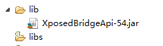
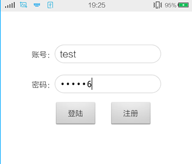
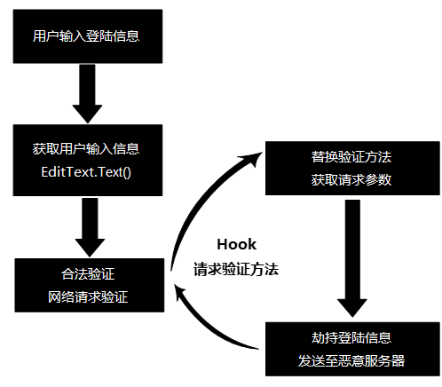
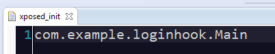
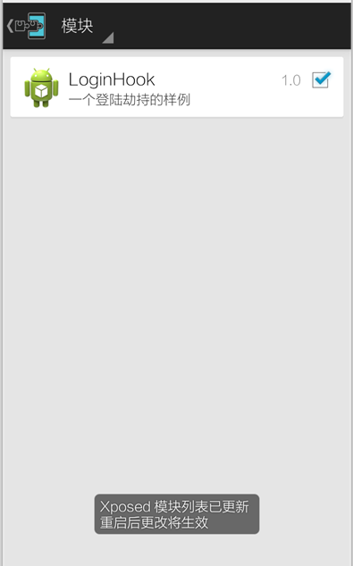
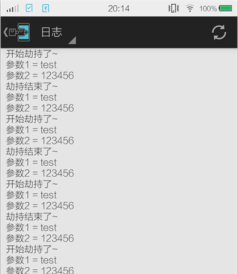

# Android Hook神器：XPosed入门与登陆劫持演示

来源:[CSDN](http://www.csdn.net/article/2015-08-14/2825462)

作者简介：周圣韬，百度高级Android开发工程师，博客地址：[http://blog.csdn.net/yzzst](http://blog.csdn.net/yzzst) 

前段时间写了一篇关于[Cydia Substrate](http://www.csdn.net/article/2015-08-07/2825405)广告注入的文章，大家都直呼过瘾。但是，真正了解这一方面的同学应该知道，其实还有一个比Cydia Substrate更出名的工具：XPosed。


不是因为Xposed比Cydia Substrate做的多好，而是Xposed是彻底开源的。今天，就向大家简单地介绍一下Xposed，并书写一个简单的登陆劫持Demo，让大家快速地入门学习Xposed。

## Xposed

Xposed框架是一款可以在不修改APK的情况下影响程序运行（修改系统）的框架服务，通过替换/system/bin/app_process程序控制zygote进程，使得app_process在启动过程中会加载XposedBridge.jar这个jar包，从而完成对Zygote进程及其创建的Dalvik虚拟机的劫持。

基于Xposed框架可以制作出许多功能强大的模块，且在功能不冲突的情况下同时运作。此外，Xposed框架中的每一个库还可以单独下载使用，如Per APP Setting（为每个应用设置单独的dpi或修改权限）、Cydia、XPrivacy（防止隐私泄露）、BootManager（开启自启动程序管理应用）对原生Launcher替换图标等应用或功能均基于此框架。

> 官网地址： [http://repo.xposed.info/](http://repo.xposed.info/)<br/> 
> 源码地址： [https://github.com/rovo89](https://github.com/rovo89)

Xposed框架是基于一个Android的本地服务应用XposedInstaller，与一个提供API 的jar文件来完成的。所以，安装使用Xposed框架我们需要完成以下几个步骤：

### 安装本地服务XposedInstaller

需要安装XposedInstall.apk本地服务应用，我们能够在其官网的framework栏目中找到，下载并安装。地址为： [http://repo.xposed.info/module/de.robv.android.xposed.installer](http://repo.xposed.info/module/de.robv.android.xposed.installer)。

安装好后进入XposedInstaller应用程序，会出现需要激活框架的界面，如下图所示。这里我们点击“安装/更新”就能完成框架的激活了。部分设备如果不支持直接写入的话，可以选择“安装方式”，修改为在Recovery模式下自动安装即可。


因为安装时会存在需要Root权限，安装后会启动Xposed的app_process，所以安装过程中会存在设备多次重新启动。

TIPS：由于国内的部分ROM对Xposed不兼容，如果安装Xposed不成功的话，强制使用Recovery写入可能会造成设备反复重启而无法正常启动。

### 下载使用API库

其API库XposedBridgeApi-.jar（version是XposedAPI的版本号，如我们这里是XposedBridgeApi-54.jar）文件，我们能够在Xposed的官方支持xda论坛找到，其地址为： [http://forum.xda-developers.com/xposed/xposed-api-changelog-developer-news-t2714067](http://forum.xda-developers.com/xposed/xposed-api-changelog-developer-news-t2714067)。

下载完毕后我们需要将Xposed Library复制到lib目录（注意是lib目录，不是Android提供的libs目录），然后将这个jar包添加到Build PATH中。



> 如果直接将jar包放置到了libs目录下，很可能会产生错误： 
“IllegalAccessError: Class ref in pre-verified class resolved to unexpected  implementation” 
估计Xposed作者在其框架内部也引用了BridgeApi，这样操作避免重复引用。


## 实战，登陆劫持（原理）

之前跟大家也说过使用CydiaSubstrate进行广告注入，很多网友问我，除了简单地注入一个广告，还能做什么吗？

登陆劫持！！！

你没听错，今天我们这里就简单地演示一下，如何对一个应用程序的登陆功能进行劫持，并把账号密码打印出来。

如我们常见的登陆劫持，就是使用了Hook技术来完成的。那么这个登陆劫持是如何完成的呢？下面我们就具体来看看一个在开发中常见到的登陆例子。首先，我们看看一个常见的登陆界面是什么样子的。



其对应的登陆流程代码如下所示：

```
// 登陆按钮的onClick事件  
mLoginButton.setOnClickListener(new OnClickListener() {  
  
@Override  
public void onClick(View v) {  
    // 获取用户名  
        String username = mUserEditText.getText() + "";  
        // 获取密码  
        String password = mPasswordEditText.getText() + "";  
  
        if (isCorrectInfo(username, password)) {  
            Toast.makeText(MainActivity.this, "登陆成功！", Toast.LENGTH_LONG).show();  
        } else {  
            Toast.makeText(MainActivity.this, "登陆失败！", Toast.LENGTH_LONG).show();  
        }  
    }  
});
```

我们会发现，登陆界面上面的用户信息都是存储在EditText控件上，然后通过用户手动点击“登陆”按钮才会将上面的信息发送至服务器端，去验证账号与密码是否正确。这样就很简单了，黑客们只需要找到开发者在使用EditText控件的getText方法后进行网络验证的方法，Hook该方法，就能劫持到用户的账户与密码劫了。

> TIPS：当然，我们也可以仿照上之前CydiaSubstrate的广告注入例子，做一个一模一样的Activity，在劫持原Activity优先弹出来，达到欺骗用户获取密码的目的。

具体流程如下：



### 实战，登陆劫持（编码）

明白了原理下面我们就实际的操作一次，这里我们选择使用Xposed框架来操作。使用Xposed进行Hook操作主要就是使用到了Xposed中的两个比较重要的方法，handleLoadPackage获取包加载时候的回调并拿到其对应的classLoader；findAndHookMethod对指定类的方法进行Hook。它们的详细定义如下所示：

```
/** 
 * 包加载时候的回调 
 */  
public void handleLoadPackage(final LoadPackageParam lpparam)  

/** 
     * Xposed提供的Hook方法 
     *  
     * @param className 待Hook的Class 
     * @param classLoader classLoader 
     * @param methodName 待Hook的Method 
     * @param parameterTypesAndCallback hook回调 
     * @return  
     */  
Unhook findAndHookMethod(String className, ClassLoader classLoader, String methodName, Object... parameterTypesAndCallback)
```

当然，我们使用Xposed进行Hook也分为如下几个步骤：

* 1、在AndroidManifest.xml文件中配置插件名称与Api版本号

```
<application  
        android:allowBackup="true"  
        android:icon="@drawable/ic_launcher"  
        android:label="@string/app_name"  
        android:theme="@style/AppTheme" >  
  
        <meta-data  
            android:name="xposedmodule"  
            android:value="true" />  
        
        <!-- 模块描述 -->
  
        <meta-data  
            android:name="xposeddescription"  
            android:value="一个登陆劫持的样例" />  
        
        <!-- 最低版本号 -->
  
        <meta-data  
            android:name="xposedminversion"  
            android:value="30" />  
</application>
```

* 2、 新建一个入口类并继承并实现IXposedHookLoadPackage接口

如下操作，我们新建了一个com.example.loginhook.Main的类，并实现IXposedHookLoadPackage接口中的handleLoadPackage方法，将非com.example.login包名的应用过滤掉，即我们只操作包名为com.example.login的应用。如下所示：

```
public class Main implements IXposedHookLoadPackage {  
  
    /** 
     * 包加载时候的回调 
     */  
    public void handleLoadPackage(final LoadPackageParam lpparam) throws Throwable {  
        // 将包名不是 com.example.login 的应用剔除掉  
        if (!lpparam.packageName.equals("com.example.login"))  
            return;  
        XposedBridge.log("Loaded app: " + lpparam.packageName);  
    }  
} 
```
 
* 3、声明主入口路径

需要在assets文件夹中新建一个xposed_init的文件，并在其中声明主入口类。如这里我们的主入口类为com.example.loginhook.Main。



* 4、使用findAndHookMethod方法Hook劫持登陆信息

这是最重要的一步，我们之前所分析的都需要到这一步进行操作。如我们之前所分析的登陆程序，我们需要劫持，就是需要Hook其com.example.login.MainActivity中的isCorrectInfo方法。我们使用Xposed提供的findAndHookMethod直接进行MethodHook操作（与Cydia很类似）。在其Hook回调中使用XposedBridge.log方法，将登陆的账号密码信息打印至Xposed的日志中。具体操作如下所示：

```
import static de.robv.android.xposed.XposedHelpers.findAndHookMethod;  
public class Main implements IXposedHookLoadPackage {  
  
    /** 
     * 包加载时候的回调 
     */  
    public void handleLoadPackage(final LoadPackageParam lpparam) throws Throwable {  
  
        // 将包名不是 com.example.login 的应用剔除掉  
        if (!lpparam.packageName.equals("com.example.login"))  
            return;  
        XposedBridge.log("Loaded app: " + lpparam.packageName);  
  
        // Hook MainActivity中的isCorrectInfo(String,String)方法  
        findAndHookMethod("com.example.login.MainActivity", lpparam.classLoader, "isCorrectInfo", String.class,  
                String.class, new XC_MethodHook() {  
  
                    @Override  
                    protected void beforeHookedMethod(MethodHookParam param) throws Throwable {  
                        XposedBridge.log("开始劫持了~");  
                        XposedBridge.log("参数1 = " + param.args[0]);  
                        XposedBridge.log("参数2 = " + param.args[1]);  
                    }  
  
                    @Override  
                    protected void afterHookedMethod(MethodHookParam param) throws Throwable {  
                        XposedBridge.log("劫持结束了~");  
                        XposedBridge.log("参数1 = " + param.args[0]);  
                        XposedBridge.log("参数2 = " + param.args[1]);  
  
                    }  
                });  
    }  
}
```

* 5、在XposedInstaller中启动我们自定义的模块

编译后安装在Android设备上的模块应用程序不会立即的生效，我们需要在XpasedInstaller模块选项中勾选待启用的模块才能让其正常的生效。如：



* 6、 重启验证

重启Android设备，进入XposedInstaller查看日志模块，因为我们之前使用的是XposedBridge.log方法打印log，所以log都会显示在此处。我们发现我们需要劫持的账号密码都显示再来此处。



> TIPS：这里我们是通过逆向分析该登陆页面的登录判断调用函数来完成Hook与劫持工作的。有些读者应该想出来了，我们能不能直接Hook系统中提供给我们的控件EditText（输入框控件）中的getText()方法进行Hook呢？这样我们就能够对系统中所有的输入进行监控劫持了。这里留给大家一个思考，感兴趣的读者可以尝试一下。
