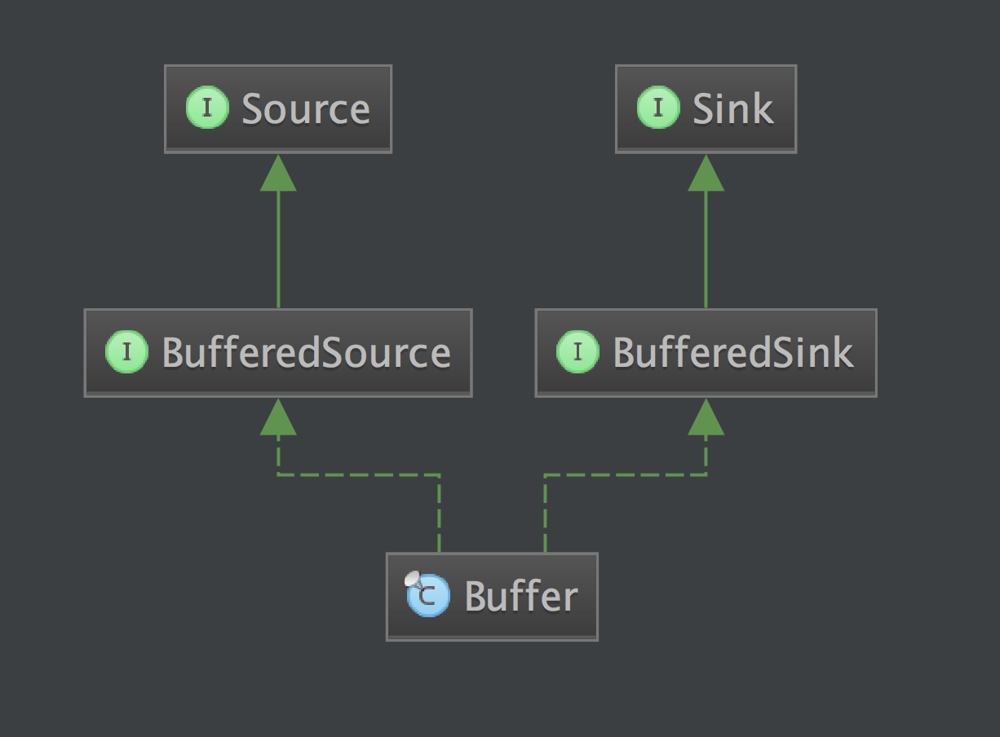
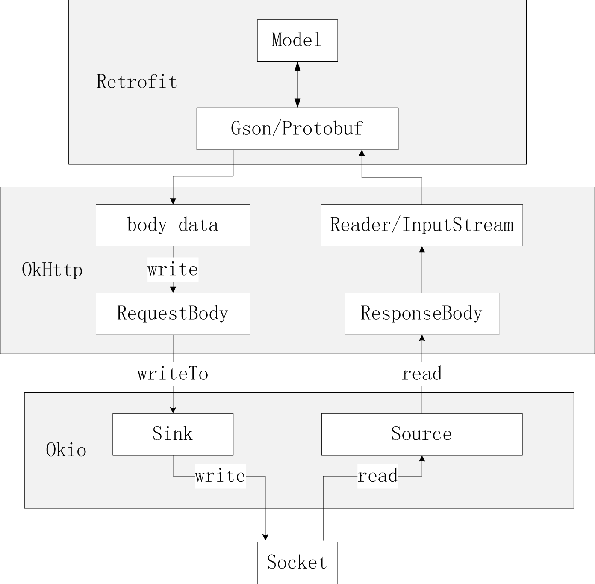

# 拆轮子系列：拆 Okio

来源:[http://blog.piasy.com/2016/08/04/Understand-Okio/](http://blog.piasy.com/2016/08/04/Understand-Okio/)

本文是 Piasy 原创，发表于 [http://blog.piasy.com](http://blog.piasy.com)，请阅读原文支持原创 [http://blog.piasy.com/2016/08/04/Understand-Okio/](http://blog.piasy.com/2016/08/04/Understand-Okio/)

[Retrofit](http://blog.piasy.com/2016/06/25/Understand-Retrofit/)，[OkHttp](http://blog.piasy.com/2016/07/11/Understand-OkHttp/)，[Okio](https://github.com/square/okio) 是 [Square](https://github.com/square/) 团队开源的安卓平台网络层三板斧，它们逐层分工，非常优雅地解决我们对网络请求甚至更广泛的 I/O 操作的需求。其中最底层的 Okio 堪称小而美，功能也更基础，应用更广泛。这次我们就对它进行一个详细的分析。本文的分析基于 [Okio 截至 2016.8.4 的最新源码](https://github.com/square/okio/tree/6b72ffd4137aa0a1f36b37b401ed3c10caeec50c)，非常建议大家下载 Okio 源码之后，跟着本文，过一遍源码。

## 1，概览

和分析 Retrofit 和 OkHttp 时不同，这次我们不是直接上来就开始看代码，我们先看一下它的官方介绍，对它有一个感性的认识，这也正是我们在进行技术选型时首先应该做的事情。

> Okio 补充了 `java.io` 和 `java.nio`的内容，使得数据访问、存储和处理更加便捷。

它的主要功能都被封装在`ByteString`和`Buffer`这两个类中，整个库也是围绕这两个类展开。

本文接下来的内容也将围绕这两个类来展开，先建立一个感性的认识，再详细分析它们的使用及原理，最后我们会看一下 Retrofit、OkHttp 是如何使用 Okio 的，以及 Gzip 压缩这个功能是如何设计实现的。

### 1.1，ByteString

`string`这个词本意是“串”，只不过在编程语言的世界中，我们基本都用它来指代“字符串”，其实字符串应该叫 `CharString`，因此`ByteString`的意义也就很好理解了，“字节串”。

`ByteString`代表一个`immutable`字节序列。对于字符数据来说，`String`是非常基础的，但在二进制数据的处理中，则没有与之对应的存在，`ByteString`应运而生。它为我们提供了对串操作所需要的各种 API，例如子串、判等、查找等，也能把二进制数据编解码为十六进制（hex），base64 和 UTF-8 格式。

它向我们提供了和`String`非常类似的 API：

* 获取字节：指定位置，或者整个数组；
* 编解码：hex，base64，UTF-8；
* 判等，查找，子串等操作；

### 1.2，Source 和 Sink
在看`Buffer`之前，我们先看一下`Source`和`Sink`。

`Okio`吸收了`java.io`一个非常优雅的设计：流（stream），流可以一层一层套起来，不断扩充能力，最终完成像加密和压缩这样复杂的操作。再次感谢 Stay 一针见血地指出这正是“装饰模式”的实践。

修饰模式，是面向对象编程领域中，一种动态地往一个类中添加新的行为的设计模式。就功能而言，修饰模式相比生成子类更为灵活，这样可以给某个对象而不是整个类添加一些功能。

Okio 有自己的流类型，那就是`Source`和`Sink`，它们和`InputStream`与`OutputStream`类似，前者为输入流，后者为输出流。

但它们还有一些新特性：

* 超时机制，所有的流都有超时机制；
* API 非常简洁，易于实现；
* `Source`和`Sink`的 API 非常简洁，为了应对更复杂的需求，`Okio`还提供了`BufferedSource`和`BufferedSink `接口，便于使用（按照任意类型进行读写，`BufferedSource`还能进行查找和判等）；
* 不再区分字节流和字符流，它们都是数据，可以按照任意类型去读写；
* 便于测试，`Buffer`同时实现了`BufferedSource`和`BufferedSink`接口，便于测试；
* `Source`和`InputStream`互相操作，我们可以把它们等同对待，同理`Sink`和`OutputStream`也可以等同对待。

### 1.3，Buffer

我们看一下`Buffer`的类图：



这里我们就可以看到，它集`BufferedSource`和`BufferedSink`的功能于一身，为我们提供了访问数据缓冲区所需要的一切 API。

`Buffer`是一个可变的字节序列，就像`ArrayList`一样。我们使用时只管从它的头部读取数据，往它的尾部写入数据就行了，而无需考虑容量、大小、位置等其他因素。

和`ByteString`一样，`Buffer`的实现也使用了很多高性能的技巧。它内部使用一个双向`Segment`链表来保存数据，Segment 是对一小段字节数组的封装，保存了这个字节数组的一些访问信息，数据的移动通过`Segment`的转让完成，避免了数据拷贝的开销。而且`Okio`还实现了一个`Segment`对象池，以提高我们分配和释放字节数组的效率。

## 2，ByteString 详解

`ByteString`整个类不到 500 行，完全可以通读，但我们还是从实际的使用例子出发。

我们来看一下[官方文档中 PNG 解码](https://github.com/square/okio#example-a-png-decoder)的例子：

```
private static final ByteString PNG_HEADER = ByteString.decodeHex("89504e470d0a1a0a");

public void decodePng(InputStream in) throws IOException {
  BufferedSource pngSource = Okio.buffer(Okio.source(in));

  ByteString header = pngSource.readByteString(PNG_HEADER.size());
  if (!header.equals(PNG_HEADER)) {
    throw new IOException("Not a PNG.");
  }
  // ...
  pngSource.close();
}
```

这里我们可以看到，我们可以直接从十六进制字符串得到它所表示的字节串，我们看看它的内部实现：

```
public static ByteString decodeHex(String hex) {
  // ...

  byte[] result = new byte[hex.length() / 2];
  for (int i = 0; i < result.length; i++) {
    int d1 = decodeHexDigit(hex.charAt(i * 2)) << 4;
    int d2 = decodeHexDigit(hex.charAt(i * 2 + 1));
    result[i] = (byte) (d1 + d2);
  }
  return of(result);
}

private static int decodeHexDigit(char c) {
  if (c >= '0' && c <= '9') return c - '0';
  if (c >= 'a' && c <= 'f') return c - 'a' + 10;
  if (c >= 'A' && c <= 'F') return c - 'A' + 10;
  throw new IllegalArgumentException("Unexpected hex digit: " + c);
}
```

我们可以看到，它其实就是把每个字符所对应的十六进制值，保存到一个字节数组中，然后利用 of 这个工厂方法构造一个 `ByteString`对象。

那我们再看一下它的判等是怎么实现的：

```
@Override public boolean equals(Object o) {
  if (o == this) return true;
  return o instanceof ByteString
      && ((ByteString) o).size() == data.length
      && ((ByteString) o).rangeEquals(0, data, 0, data.length);
}

public boolean rangeEquals(int offset, byte[] other, int otherOffset, int byteCount) {
  return offset >= 0 && offset <= data.length - byteCount
      && otherOffset >= 0 && otherOffset <= other.length - byteCount
      && arrayRangeEquals(data, offset, other, otherOffset, byteCount);
}

public static boolean arrayRangeEquals(
    byte[] a, int aOffset, byte[] b, int bOffset, int byteCount) {
  for (int i = 0; i < byteCount; i++) {
    if (a[i + aOffset] != b[i + bOffset]) return false;
  }
  return true;
}
```

不出所料，果然就是把指定范围内的字节逐个对比！当然就是这样，因为我们对串相等的定义本来就是这样的。

* 其他的方法这里就不一一展开，不过其中有两点高性能实现技巧值得一提：
* 把一个`String`编码为 *utf8* 时，会引用原 String，后面解码时就可以直接返回了
由于 immutable，所以不怕被篡改，所以`toAsciiLowercase`，`toAsciiUppercase`，`substring`等函数的实现中，如果需要返回的内容和自身一样，那就会直接返回 this

## 3，Buffer 详解

我们继续看 PNG 解码的例子：

```
public void decodePng(InputStream in) throws IOException {
  BufferedSource pngSource = Okio.buffer(Okio.source(in));

  ByteString header = pngSource.readByteString(PNG_HEADER.size());
  if (!header.equals(PNG_HEADER)) {
    throw new IOException("Not a PNG.");
  }

  while (true) {
    Buffer chunk = new Buffer();

    // Each chunk is a length, type, data, and CRC offset.
    int length = pngSource.readInt();
    String type = pngSource.readUtf8(4);
    pngSource.readFully(chunk, length);
    int crc = pngSource.readInt();

    decodeChunk(type, chunk);
    if (type.equals("IEND")) break;
  }

  pngSource.close();
}
```

我们先看看`Okio.buffer(Okio.source(in))`做了些什么：

```
public static Source source(InputStream in) {
  return source(in, new Timeout());
}

private static Source source(final InputStream in, final Timeout timeout) {
  // ...
  return new Source() {
    @Override public long read(Buffer sink, long byteCount) throws IOException {
      // ...
    }

    @Override public void close() throws IOException {
      in.close();
    }

    // ...
  };
}

public static BufferedSource buffer(Source source) {
  return new RealBufferedSource(source);
}
```

`Okio.source`最终创建了一个匿名的`Source`实现类，它就是把我们的读取请求转发给`InputStream`，代码这里我们省略了，大家可以自行阅读。而`Okio.buffer`则用这个匿名`Source`创建了一个`RealBufferedSource`。那么这里就涉及到`InputStream`，匿名 `Source`和`RealBufferedSource`这三个东西。

我们再看`RealBufferedSource#readByteString`相关的代码：

```
final class RealBufferedSource implements BufferedSource {
  public final Buffer buffer = new Buffer();
  public final Source source;

  RealBufferedSource(Source source) {
    if (source == null) throw new NullPointerException("source == null");
    this.source = source;
  }

  @Override public ByteString readByteString(long byteCount) throws IOException {
    require(byteCount);
    return buffer.readByteString(byteCount);
  }
  
  // ...
}
```

`require`函数代码这里就不贴了，它就是把`source`中的数据读到了`buffer`中，这样我们就可以从`buffer`中读出 `ByteString`了。

这里我们再整理一下，一共有四个东西：`RealBufferedSource`，和我们直接打交道的对象，为我们提供任意形式的读取操作、查找操作以及判等操作；`Buffer`成员；`Source`成员（前面创建的匿名`Source`对象）；`InputStream`，我们的文件输入流。

这里我们看到读取操作的实现绕了一大圈：先把数据从`InputStream`读到`Buffer`里（require），这个过程实际由匿名 `Source`完成（提供了超时控制），再把数据从`Buffer`中读出来返回。

其实我们如果粗略看一下`RealBufferedSource`和`RealBufferedSink`这两个类，我们就会发现，它们读写逻辑的实现都比较绕：读操作都是先把数据从`Source`读到`Buffer`，再把数据从`Buffer`读到输出（返回值或传入的输出参数）；写操作都是先把数据从输入写到`Buffer`，再把数据从`Buffer`写到`Sink`。

**为什么要这么倒腾？ **让我们从功能需求和设计方案来考虑。

`BufferedSource`要提供各种形式的读取操作，还有查找与判等操作。大家可能会想，那我就在实现类中自己实现不就好了吗？干嘛要经过`Buffer`中转呢？这里我们实现的时候，需要考虑效率的问题，而且不仅`BufferedSource`需要高效实现，`BufferedSink`也需要高效实现，这两者的高效实现技巧，很大部分都是共通的，所以为了避免同样的逻辑重复两遍，`Okio`就直接把读写操作都实现在` Buffer`这一个类中，这样逻辑更加紧凑，更加内聚。而且还能直接满足我们对于“两用数据缓冲区”的需求：既可以从头部读取数据，也能向尾部写入数据。至于我们单独的读写操作需求，`Okio` 就为 `Buffer` 分别提供了委托类：`RealBufferedSource` 和 `RealBufferedSink`，实现好 `Buffer` 之后，它们两者的实现将非常简洁（前者 450 行，后者 250 行）。

关于 `Segment` 的实现、`Buffer` 对 `Segment` 的管理、`Segment` 对象池的实现这些内容，这里不作展开，大家可以自行阅读，相信有了上面的认识之后，去理解这些细节的实现原理并不困难。


## 4，Retrofit，OkHttp 是如何利用 Okio 的？

在 Retrofit/OkHttp 中，IO 操作都是利用 Okio 实现的，像磁盘缓存，网络 IO 等。这里我们主要看看 HTTP/1.1 网络 IO 的实现。

在[拆 OkHttp 一文的 发送和接收数据：CallServerInterceptor 部分中](http://blog.piasy.com/2016/07/11/Understand-OkHttp/#callserverinterceptor)我们就接触过 Okio 相关的代码：

```
// CallServerInterceptor#intercept
// 发送请求 body
Sink requestBodyOut = httpCodec.createRequestBody(request, 
        request.body().contentLength());
BufferedSink bufferedRequestBody = Okio.buffer(requestBodyOut);
request.body().writeTo(bufferedRequestBody);
bufferedRequestBody.close();

// 读取响应 body
response = response.newBuilder()
    .body(httpCodec.openResponseBody(response))
    .build();
```

`httpCodec.createRequestBody`这个调用就不在这里逐步展开了，在 HTTP/1.1 的实现中就是利用`Okio`把`Socket` 包装成了`BufferedSource`和`BufferedSink`，这个函数返回的 Sink 也就是把对它的写调用转发给 `Socket`包装成的 `BufferedSink`。

而`request body`的发送逻辑就是由`RequestBody`负责把它的数据发送给`writeTo`函数传入的`BufferedSink`了，这里也就是写到了`Socket`中。

而 `response body`，虽然也提供了返回 `BufferedSource`的接口，但其实并没有被使用，因为`Retrofit`的 `converter` 目标（`Gson`，`Protobuf`等）都没有使用`Okio`实现`IO`操作，所以`ResponseBody`被使用的最多的还是普通的 java.io API。

最后这里我们补充一张 Retrofit，OkHttp，Okio 进行网络 IO 的流程图：



## 5，Gzip 压缩的实现

在官方示例工程 [okhttp/samples/recipes](https://github.com/square/okhttp/blob/master/samples/guide/src/main/java/okhttp3/recipes/RequestBodyCompression.java) 中有一个类 `RequestBodyCompression`，向我们展示了如何实现`RequestBody`的 Gzip 压缩。下面我们看一下它是怎么实现的。

首先，在 OkHttp 的架构下实现压缩，是通过自己实现一个`Interceptor`来完成的：

```
// 构造 OkHttpClient 时添加 GzipRequestInterceptor 即可
private final OkHttpClient client = new OkHttpClient.Builder()
    .addInterceptor(new GzipRequestInterceptor())
    .build();

static class GzipRequestInterceptor implements Interceptor {
  @Override public Response intercept(Chain chain) throws IOException {
    // ...
    Request compressedRequest = originalRequest.newBuilder()
        .header("Content-Encoding", "gzip")
        .method(originalRequest.method(), gzip(originalRequest.body()))
        .build();
    return chain.proceed(compressedRequest);
  }

  private RequestBody gzip(final RequestBody body) {
    return new RequestBody() {
      // ...
      @Override public void writeTo(BufferedSink sink) throws IOException {
        BufferedSink gzipSink = Okio.buffer(new GzipSink(sink));
        body.writeTo(gzipSink);
        gzipSink.close();
      }
    };
  }
}
```

在[分析 OkHttp 的文章中](http://blog.piasy.com/2016/07/11/Understand-OkHttp/#section-2)我们就提到：

> `Interceptor` 是最核心的一个东西…… 它把实际的网络请求、缓存、透明压缩等功能都统一了起来。

这里我们就再一次见证了这一设计的优雅之处，对网络请求的操作进行额外的处理，我们只需要自行实现一个`Interceptor`，然后添加进去就大功告成，OkHttp 的实现完全不用动，可扩展性非常好！

而这里我们 Gzip 的逻辑实现主要在这一行：`method(originalRequest.method(), gzip(originalRequest.body()))`，我们复制上层传过来的`Request`，并把它的 body 进行 Gzip 压缩，然后再发起新的`Request`。而 Gzip 压缩的实际实现则是由 GzipSink 实现。

那我们接着看`GzipSink`的实现：

```
public final class GzipSink implements Sink {
  // ...

  public GzipSink(Sink sink) {
    // ...
    this.deflater = new Deflater(DEFAULT_COMPRESSION, true);
    this.sink = Okio.buffer(sink);
    this.deflaterSink = new DeflaterSink(this.sink, deflater);

    writeHeader();
  }

  @Override public void write(Buffer source, long byteCount) throws IOException {
    // ...
    updateCrc(source, byteCount);
    deflaterSink.write(source, byteCount);
  }

  @Override public void close() throws IOException {
    // ...
    try {
      deflaterSink.finishDeflate();
      writeFooter();
    } catch (Throwable e) {
      thrown = e;
    }
    // ...
  }
  
  // ...
}
```

这里我们只关注主要流程，省略了很多代码，大家感兴趣可以自己去看。我们可以看到，构造`GzipSink`时，我们用传入的 `Sink`构造了一个`DeflaterSink`，后面的 write 操作我们都是转交给`DeflaterSink`做的。那这里就涉及到 GzipSink，DeflaterSink，和最初的 Sink，我们把数据写到`GzipSink `中，而它则把数据写到`DeflaterSink`中，后者又把数据最终写到目标`Sink`中。

这里就是对装饰模式很好的实践，我们逐层扩充了我们的 Sink 对象的功能，应用装饰模式的目的其实就是为了分而治之！前文就已经提到，`java.io`以及`Okio` 都有一个“流”的概念，“流”可以一层一层连接起来完成复杂的工作，这就是分治思想很好的实践，分治使得我们每一层都很简单，只聚焦于一件事情，它们协作完成一件很复杂的工作。非常优雅。

但分治也有很多种实现方式，例如建立一个分层的类继承体系，每层关注各自的事情，也有分治的效果，那装饰模式和继承相比优势何在呢？装饰模式使用更灵活，达到同样的效果，需要的类更少。例如我们有两种独立的需求，hash 和 gzip，这两种需求的各种组合方式我们都会用到，那这时就需要 4 个子类，但如果用装饰模式，我们就只需要 2 个类，在实际使用时添加需要的装饰即可。


## 6，总结

Okio 的分析就到此结束，本文首先根据 Okio 的文档对它形成了一个感性认识，了解它的设计思想，它的特性，然后我们从实际使用例子出发，以及结合 Retrofit，OkHttp，结合 Gzip 压缩的场景，对 Okio 的使用和原理进行了分析。代码并没有逐行讲解，但是相信跟着本文的思路，再自行阅读源码，理解起来应该会更加容易。

接下来我打算整理一下前面对 Retrofit，OkHttp，Okio 这三板斧的分析，结合我在工作中的实际网络层需求，梳理一套网络层的“微架构”，敬请期待。
